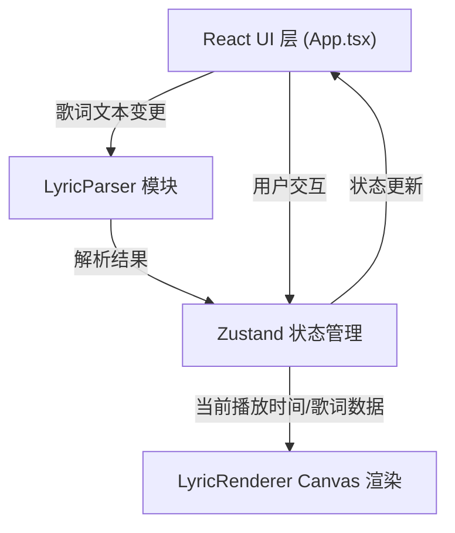
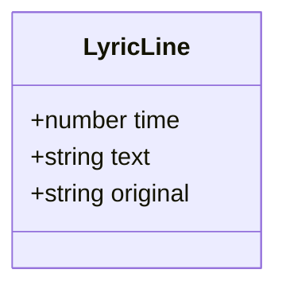

## 1. 架构设计



## 2. 技术说明

- **前端框架**：React@18 + TypeScript@5
- **构建工具**：Vite@5 + @vitejs/plugin-react
- **状态管理**：Zustand@4
- **渲染技术**：HTML5 Canvas 2D API
- **样式方案**：原生 CSS（使用 CSS 变量），无 UI 组件库

## 3. 文件结构

```
├── package.json
├── vite.config.js
├── tsconfig.json
├── index.html
└── src/
    ├── main.tsx              # React DOM 渲染入口
    ├── App.tsx               # 主组件，组合所有面板
    ├── LyricParser.ts        # LRC 歌词解析模块
    ├── LyricRenderer.tsx     # Canvas 卡拉OK渲染组件
    └── store.ts              # Zustand 状态管理
```

## 4. 核心模块设计

### 4.1 LyricParser.ts

```typescript
export interface LyricLine {
  time: number;       // 时间戳（秒）
  text: string;       // 歌词文本
  original: string;   // 原始行文本（用于编辑回写）
}

class LyricParser {
  static parse(text: string): LyricLine[];
  static serialize(lines: LyricLine[]): string;
  static formatTime(seconds: number): string;  // [mm:ss.xx]
  static parseTime(tag: string): number;
  static sortLines(lines: LyricLine[]): LyricLine[];
}
```

### 4.2 LyricRenderer.tsx

```typescript
interface LyricRendererProps {
  lines: LyricLine[];
  currentTime: number;
  isPlaying: boolean;
}
```

Canvas 渲染逻辑：
- 每帧通过 `requestAnimationFrame` 重绘
- 计算当前行和逐字高亮进度（基于相邻时间戳差值）
- 垂直滚动使用缓动算法（lerp）平滑过渡
- 当前行使用 Clip 路径实现底部向上扫过高亮效果

### 4.3 Zustand Store

```typescript
interface LyricState {
  rawText: string;
  lines: LyricLine[];
  currentTime: number;
  duration: number;
  isPlaying: boolean;
  
  // Actions
  setRawText: (text: string) => void;
  setCurrentTime: (t: number) => void;
  setPlaying: (p: boolean) => void;
  updateLineTime: (index: number, newTime: number) => void;
  exportLRC: () => void;
}
```

## 5. 数据模型

### 5.1 歌词行数据结构



### 5.2 数据流

1. 用户输入文本 → `setRawText` → `LyricParser.parse()` → 更新 `lines`
2. 播放计时器 → 每 16ms 更新 `currentTime` → 触发 Canvas 重绘
3. 用户编辑时间戳 → `updateLineTime` → `LyricParser.sortLines()` → 更新 `lines` 和 `rawText`
4. 用户点击导出 → `LyricParser.serialize()` → Blob → 触发下载
