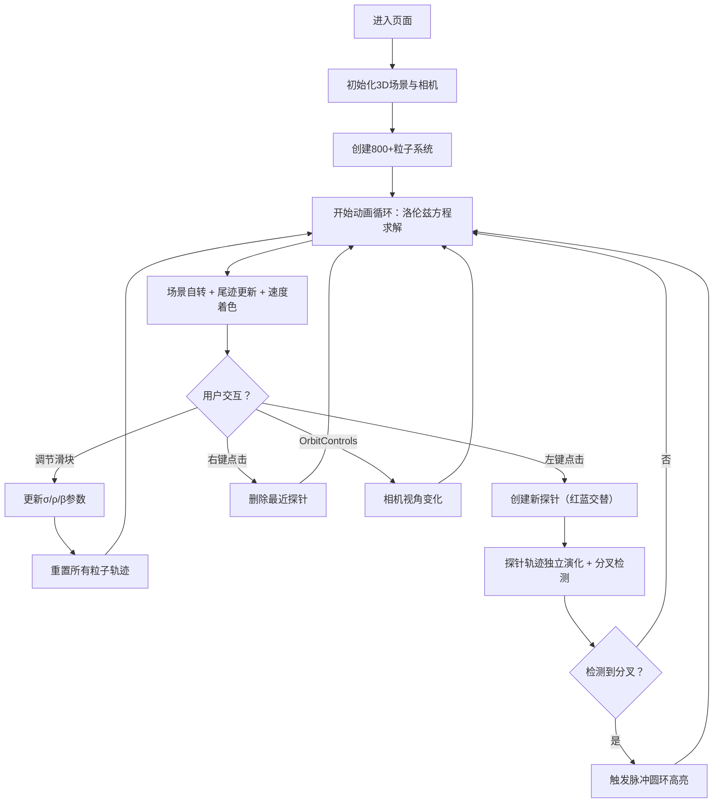

## 1. 产品概述
气象蝴蝶效应是一款基于Three.js的3D混沌系统可视化应用，通过洛伦兹吸引子模拟天气状态的分叉演化，直观展示"蝴蝶效应"——初始条件微小差异如何导致结果巨大不同。
- 核心目标：以交互式3D粒子流形式呈现混沌动力学理论，让用户直观感受非线性系统的演化特性
- 目标用户：科学爱好者、学生、教育工作者、对混沌理论感兴趣的开发者
- 产品价值：将抽象数学方程转化为可交互、可调节的视觉艺术体验

## 2. 核心功能

### 2.1 功能模块
1. **3D粒子系统**：800+彩色粒子模拟洛伦兹吸引子轨迹，支持速度着色与半透明尾迹
2. **参数控制面板**：实时调节σ、ρ、β三个核心参数，观察系统动力学变化
3. **探针标记系统**：点击创建/删除探针，追踪不同初始条件轨迹的分叉过程
4. **分叉可视化**：探针轨迹分离时脉冲圆环高亮，直观呈现分叉临界点

### 2.3 页面详情
| 页面名称 | 模块名称 | 功能描述 |
|-----------|-------------|---------------------|
| 主场景页 | 3D粒子系统 | 800+粒子按洛伦兹方程运动，速度渐变着色，20帧尾迹渲染 |
| 主场景页 | 场景自转 | 整个3D场景绕Y轴以0.003 rad/s缓慢自转 |
| 主场景页 | 交互控制 | OrbitControls支持拖拽旋转、滚轮缩放 |
| 主场景页 | 探针系统 | 左键创建探针（红蓝交替），右键删除最近探针 |
| 控制面板 | 参数滑块 | σ(5-15)、ρ(20-35)、β(2-5)三个微扰滑块，步长0.1 |
| 控制面板 | 重置响应 | 参数变更时立即重置粒子系统并重新演化 |
| 分叉效果 | 脉冲高亮 | 探针轨迹分叉时5→30px膨胀圆环，1→0透明度渐变，0.5s |

## 3. 核心流程
用户进入页面后，全屏展示3D洛伦兹吸引子粒子流；可通过右下角滑块调节系统参数观察动力学变化；可在场景中点击创建探针追踪微扰轨迹；当探针轨迹产生明显分叉时触发脉冲高亮效果。

## 4. 用户界面设计

### 4.1 设计风格
- **主色调**：深空暗色主题，背景渐变 #0A0A12 → #1A1A2E
- **强调色**：靛蓝 #4B0082（低速）、亮橙 #FF8C00（高速）、红 #FF4444、蓝 #4444FF（探针）、紫 #6C63FF（滑块）
- **视觉层次**：粒子流为主视觉，控制面板半透明浮动，不遮挡核心场景
- **质感**：柔光混合（Additive Blending）、半透明玻璃拟态UI、发光点探针
- **动效**：场景缓慢自转、粒子尾迹流动、脉冲圆环、滑块交互反馈

### 4.2 页面设计概述
| 页面名称 | 模块名称 | UI元素 |
|-----------|-------------|-------------|
| 主场景页 | 全屏Canvas | 100vw × 100vh，WebGL渲染，暗色渐变背景 |
| 主场景页 | 粒子系统 | 800+圆形粒子，3-5px动态大小，速度渐变着色，20帧尾迹 |
| 主场景页 | 探针标记 | 12×12px圆形发光点，红色/蓝色交替，外层辉光 |
| 主场景页 | 分叉脉冲 | 圆环5→30px膨胀，透明度1→0，0.5秒EaseOut动画 |
| 控制面板 | 右下角浮动 | 260px宽，#1E1E2E背景，0.92透明度，12px圆角，#3A3A5C边框 |
| 控制面板 | 滑块组件 | 轨道4px高#2A2A3E，圆钮12px#6C63FF，数值实时显示 |
| 左侧面板 | 信息展示 | 轻度渐变半透明，标题"气象蝴蝶效应"，参数说明文字 |

### 4.3 响应式
- 桌面优先设计，全屏Canvas自适应窗口
- 控制面板在窄屏下自动调整位置
- 触摸设备支持双指缩放、单指拖拽

### 4.4 3D场景指导
- **环境与氛围**：深空暗色渐变背景，营造宇宙/数据空间感，无HDRI
- **光照设置**：场景自发光材质为主，AmbientLight(0x404060, 0.5)提供基础环境光
- **相机设置**：PerspectiveCamera(60, aspect, 0.1, 2000)，初始位置(50, 30, 80)，LookAt(0,0,0)
- **构图与焦点**：洛伦兹吸引子位于场景中心，自转引导用户全方位观察
- **交互与动画**：OrbitControls拖拽缩放、Y轴自转0.003rad/s、探针脉冲动效
- **后处理效果**：粒子使用AdditiveBlending实现柔光效果，粒子材质透明+深度写入关闭
- **性能预算**：单帧<33ms（30FPS），粒子几何使用BufferGeometry，尾迹优化为LineSegments
