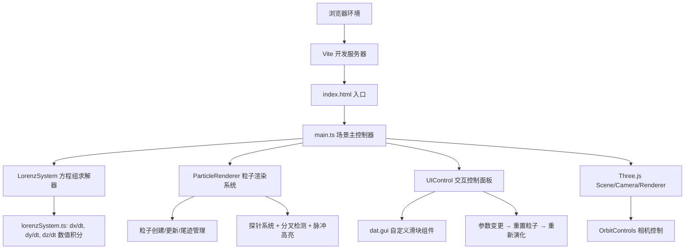

## 1. 架构设计



## 2. 技术描述
- **前端框架**：原生 TypeScript + Three.js（不使用React/Vue，用户明确指定拆分方案）
- **构建工具**：Vite 5.x（含热更新 HMR）
- **3D引擎**：Three.js 0.160+，@types/three 类型定义
- **UI组件**：dat.gui 用于参数滑块（用户指定依赖），自定义CSS覆盖样式
- **数学计算**：原生JS实现龙格-库塔4阶（RK4）数值积分求解洛伦兹微分方程组

## 3. 目录结构与文件职责

| 文件路径 | 职责说明 |
|---------|---------|
| `package.json` | 依赖声明：three, @types/three, vite, typescript, dat.gui；启动脚本 `npm run dev` |
| `vite.config.js` | Vite构建配置，启用HMR热更新，TypeScript转译，优化Three.js分包 |
| `tsconfig.json` | TypeScript严格模式（strict: true），ES模块，目标ES2020 |
| `index.html` | 入口页面，全屏Canvas挂载点，暗色背景，CSS全局样式重置 |
| `src/main.ts` | 核心入口：Scene/Camera/Renderer初始化，OrbitControls绑定，动画循环，窗口resize |
| `src/lorenzSystem.ts` | 洛伦兹方程封装：σ=10, ρ=28, β=8/3默认值，RK4积分器，粒子状态管理 |
| `src/particleRenderer.ts` | 粒子系统：800+粒子BufferGeometry，速度插值着色，20帧尾迹LineSegments，探针Mesh，脉冲Sprite |
| `src/uiControl.ts` | UI控制：右下角浮动面板DOM构建，三个滑块事件绑定，左侧信息面板，参数变更回调 |

## 4. 核心算法与数据结构

### 4.1 洛伦兹方程求解器（lorenzSystem.ts）
```typescript
// 粒子状态结构体
interface ParticleState {
  x: number; y: number; z: number;
  vx: number; vy: number; vz: number;  // 上一步速度，用于颜色映射
  trail: { x: number; y: number; z: number }[];  // 尾迹点队列
}

// 经典洛伦兹方程
dx/dt = σ * (y - x)
dy/dt = x * (ρ - z) - y
dz/dt = x * y - β * z

// RK4积分：时间步长 dt = 0.005，每帧积分3次以保证轨迹平滑
step(state: ParticleState, dt: number, sigma: number, rho: number, beta: number): ParticleState
```

### 4.2 粒子渲染系统（particleRenderer.ts）
- **粒子几何**：THREE.Points + BufferGeometry，position属性 Float32Array(800*3)
- **粒子材质**：THREE.PointsMaterial，size: 3.5, vertexColors: true, transparent: true, blending: AdditiveBlending
- **尾迹渲染**：每条轨迹维护20个点的环形缓冲区，LineSegments + BufferGeometry动态更新
- **颜色映射**：速度模长 v = √(vx²+vy²+vz²) 归一化映射到 #4B0082 → #FF8C00 渐变色谱
- **探针系统**：两个初始探针（红色#FF4444 / 蓝色#4444FF），SphereGeometry + MeshBasicMaterial + emissive发光
- **分叉检测**：每10帧计算探针粒子对的欧氏距离，当距离超过阈值（>5）且上一帧<阈值时触发脉冲
- **脉冲高亮**：THREE.RingGeometry + 自定义ShaderMaterial，uniforms.time驱动半径+透明度动画

### 4.3 UI控制系统（uiControl.ts）
- **DOM结构**：右下角panel (260px, #1E1E2E, opacity 0.92, border-radius 12px, border 1px #3A3A5C)
- **滑块组件**：自定义input[type=range]样式，轨道4px #2A2A3E，thumb 12px #6C63FF
- **参数范围**：σ[5,15 step 0.1]，ρ[20,35 step 0.1]，β[2,5 step 0.1]
- **左侧信息面板**：渐变半透明背景，项目标题"气象蝴蝶效应 🦋"，洛伦兹方程公式说明
- **事件绑定**：slider input事件 → debounce(16ms) → 调用particleRenderer.resetParticles(params)

## 5. 性能优化策略

| 优化项 | 具体方案 |
|-------|---------|
| **粒子几何** | 单个BufferGeometry管理所有粒子，每帧只更新position attribute的needsUpdate |
| **尾迹优化** | 尾迹使用环形缓冲区（Array + head指针），避免数组splice |
| **计算节流** | RK4积分每帧执行3次子步(dt=0.005)，保证平滑同时控制计算量 |
| **渲染状态** | 粒子AdditiveBlending + depthWrite=false，减少深度排序开销 |
| **垃圾回收** | 粒子池复用，重置时不重建BufferGeometry，仅重写数据 |
| **帧率目标** | requestAnimationFrame + deltaTime，保证30FPS+，低性能设备自动降帧 |
