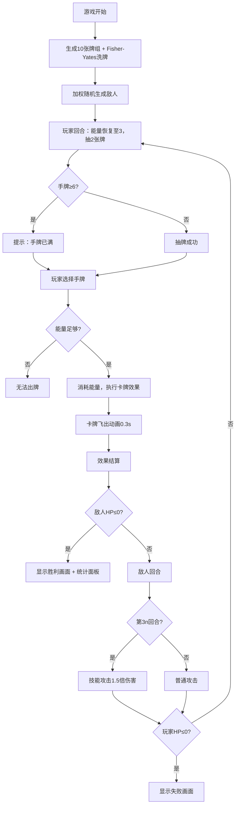

## 1. 产品概述

卡牌战斗模拟器是一款面向独立游戏设计者的回合制卡牌战斗原型工具，用于快速测试不同职业卡牌组合对随机怪物的战斗平衡性。玩家通过打出战士、法师、盗贼三类职业卡牌，应对随机生成的敌人，实时观察伤害输出、护盾回复等数值变化，从而验证卡牌设计是否平衡。

- 目标用户：独立游戏设计者、桌游/卡牌游戏原型开发者
- 核心价值：零配置快速启动战斗模拟，提供详细的战斗统计面板辅助平衡性调整

## 2. 核心功能

### 2.1 功能模块

| 模块 | 职责 | 数据流向 |
|------|------|----------|
| 卡牌管理模块（CardManager） | 加载模板、初始化牌组、洗牌、抽牌、维护手牌与弃牌堆 | 读取cardTemplates.json → 生成牌组 → 响应BattleEngine抽牌请求 → 返回手牌状态 |
| 战斗逻辑模块（BattleEngine） | 回合流转、卡牌效果结算、敌人生成、胜负判定 | 接收CardManager抽牌结果和玩家选择 → 计算效果 → 更新实体状态 → 返回战斗日志和状态 |

### 2.2 页面详情

| 页面名称 | 模块名称 | 功能描述 |
|----------|----------|----------|
| 游戏主界面 | 玩家信息区 | 左上角显示玩家生命值（红色#E74C3C）和能量值（蓝色#3498DB），字体monospace 20px，带图标 |
| 游戏主界面 | 敌人区域 | 中央偏上，背景#0F3460，圆角12px，显示敌人名称、生命值血条（宽100%、高10px、绿到红渐变、动画0.3s ease），敌人占宽300px高200px |
| 游戏主界面 | 手牌区域 | 底部200px高，背景半透明#1A1A2E80，横向排列最多6张手牌，卡片间距12px，卡片宽120px高180px圆角8px背景#2D2D3F带职业色边框 |
| 游戏主界面 | 操作区 | 底部"结束回合"和"出牌"按钮，回合信息显示 |
| 游戏主界面 | 战斗结算 | 胜利：绿色渐变背景+"战斗胜利！"文案+0.5s淡入+统计面板（卡牌数、回合数、总伤害）；失败：红色渐变+"战斗失败"+"重新开始"按钮 |

## 3. 核心流程

玩家进入游戏 → 系统从15张卡牌模板中随机选取10张生成牌组并洗牌（Fisher-Yates） → 随机生成一个敌人（加权随机，5种模板） → 玩家回合开始：能量恢复至3点，自动抽2张牌（手牌上限6，超出提示"手牌已满"） → 玩家选择手牌（选中上浮10px、边框#FFD700、0.2s动画） → 点击"出牌"消耗能量并执行效果（卡牌飞出动画0.3s缩放为0） → 效果结算：战士=直接伤害x，法师=伤害x且有30%双倍，盗贼=伤害x并抽1牌 → 检测敌人是否死亡 → 敌人回合：造成攻击力伤害，每3回合技能攻击1.5倍 → 检测玩家是否死亡 → 循环至战斗结束

## 4. 用户界面设计

### 4.1 设计风格

- **主色调**：深蓝底色（#1A1A2E / #16213E / #0F3460）搭配金色（#FFD700）高亮
- **职业色**：战士红#E74C3C、法师紫#9B59B6、盗贼绿#2ECC71
- **按钮风格**：圆角矩形，金色描边出牌按钮，深色背景结束回合按钮
- **字体**：全局monospace，数值显示20px，卡牌文字14px
- **布局**：居中游戏区域1000×600px，上方敌人、下方手牌、左上角状态
- **动画**：卡牌选中上浮+边框高亮、出牌飞出缩放、血条渐变动画、结算淡入

### 4.2 页面设计概述

| 页面名称 | 模块名称 | UI元素 |
|----------|----------|--------|
| 游戏主界面 | 玩家信息区 | 红色❤️生命值 + 蓝色⚡能量值，monospace 20px，左上角固定 |
| 游戏主界面 | 敌人区域 | 深蓝#0F3460背景卡片300×200px，圆角12px，底部血条渐变色0.3s ease |
| 游戏主界面 | 手牌区域 | 半透明底栏200px高，卡牌120×180px圆角8px #2D2D3F背景，职业色3px边框，选中上浮10px #FFD700边框0.2s |
| 游戏主界面 | 操作按钮 | 金色"出牌"按钮 + 深色"结束回合"按钮，居中排列 |
| 游戏主界面 | 胜利画面 | 绿色渐变全屏覆盖，"战斗胜利！"大字0.5s淡入，统计面板居中 |
| 游戏主界面 | 失败画面 | 红色渐变全屏覆盖，"战斗失败"大字，"重新开始"按钮 |

### 4.3 响应式适配

- 桌面优先（≥768px）：游戏区域1000×600px居中
- 移动端（<768px）：手牌卡片宽度缩为80px、高度不变，游戏区域宽度100%、边距8px

### 4.4 性能约束

- 卡牌动画帧率≥50fps
- 状态更新响应≤20ms
- 洗牌算法≤1ms（10张牌）
