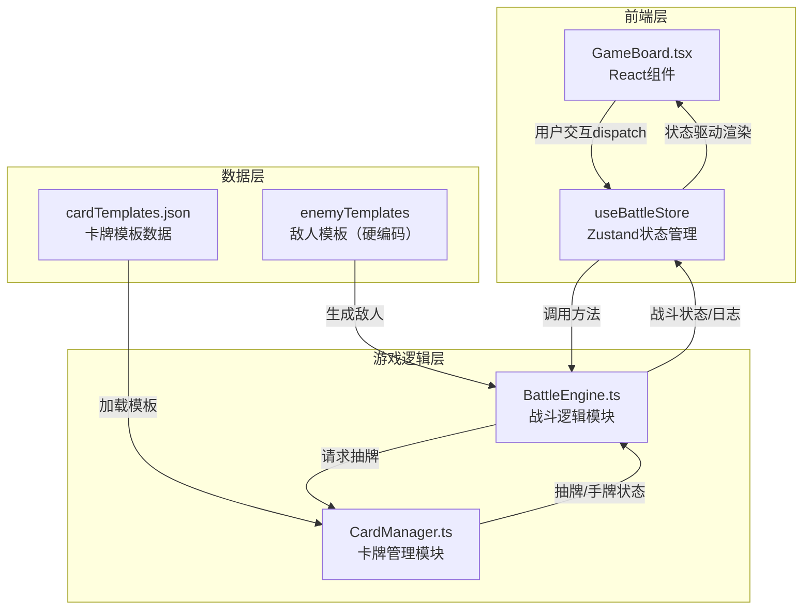

## 1. 架构设计



**数据流向总结**：
1. `cardTemplates.json` → `CardManager` 加载模板生成牌组
2. 用户交互 → `GameBoard` dispatch action → `Zustand Store` → 调用 `BattleEngine` 方法
3. `BattleEngine` → 请求 `CardManager` 抽牌 → 计算效果 → 更新状态 → 写回 `Store`
4. `Store` 状态变化 → `GameBoard` 重新渲染

## 2. 技术说明

- **前端框架**：React 18 + TypeScript（严格模式）
- **构建工具**：Vite + @vitejs/plugin-react，开发服务器端口3000
- **状态管理**：Zustand（轻量级，无boilerplate）
- **样式方案**：CSS Modules + CSS变量（深色主题变量统一管理）
- **动画方案**：CSS transition + keyframes（出牌飞出、选中上浮、血条渐变等）
- **卡牌效果策略模式**：使用策略对象映射 effectType → 效果执行函数，避免switch/if-else
- **敌人生成算法**：加权随机（累加权重 + Math.random选择）
- **洗牌算法**：Fisher-Yates（O(n)原地交换）
- **ID生成**：uuid

## 3. 路由定义

| 路由 | 用途 |
|------|------|
| / | 游戏主界面（单页应用，无路由切换） |

## 4. 文件结构与调用关系

```
project/
├── index.html                          # 入口HTML
├── package.json                        # 依赖与脚本
├── vite.config.js                      # Vite配置
├── tsconfig.json                       # TypeScript配置
└── src/
    ├── main.tsx                        # React入口，挂载App
    ├── App.tsx                         # 根组件，渲染GameBoard
    ├── data/
    │   └── cardTemplates.json          # 卡牌模板数据源（3职业×5张=15张）
    ├── game/
    │   ├── CardManager.ts              # 卡牌管理模块（洗牌/抽牌/手牌维护）
    │   ├── BattleEngine.ts             # 战斗逻辑模块（回合/效果/胜负）
    │   └── strategies.ts              # 卡牌效果策略映射（strategy pattern）
    ├── store/
    │   └── useBattleStore.ts           # Zustand store定义
    ├── components/
    │   └── GameBoard.tsx               # 主游戏界面组件
    └── styles/
        └── game.css                    # 全局样式与CSS变量
```

**调用关系**：
- `GameBoard.tsx` ←读取→ `useBattleStore.ts`（状态驱动渲染 + dispatch交互）
- `useBattleStore.ts` →创建→ `BattleEngine` + `CardManager` 实例
- `BattleEngine` →调用→ `CardManager.drawCards()` 获取抽牌结果
- `BattleEngine` →调用→ `strategies[effectType]()` 执行卡牌效果
- `CardManager` →读取→ `cardTemplates.json` 初始化牌组

## 5. 核心数据类型定义

```typescript
// 卡牌模板
interface CardTemplate {
  id: string;
  name: string;
  class: "warrior" | "mage" | "rogue";
  cost: number;
  effectType: "damage" | "shield" | "heal" | "draw";
  value: number;
}

// 战斗中的卡牌实例
interface BattleCard extends CardTemplate {
  uid: string; // 唯一实例ID（uuid）
}

// 敌人模板
interface EnemyTemplate {
  name: string;
  hp: number;
  attack: number;
  weight: number; // 生成权重
  skillName: string;
}

// 战斗中的敌人实例
interface Enemy extends EnemyTemplate {
  currentHp: number;
  maxHp: number;
}

// 玩家状态
interface PlayerState {
  hp: number;
  maxHp: number;
  energy: number;
  maxEnergy: number;
  shield: number;
}

// 战斗阶段
type BattlePhase = "player_turn" | "enemy_turn" | "victory" | "defeat";

// 战斗状态
interface BattleState {
  player: PlayerState;
  enemy: Enemy | null;
  hand: BattleCard[];
  deck: BattleCard[];
  discard: BattleCard[];
  selectedCardIndex: number | null;
  phase: BattlePhase;
  turn: number;
  logs: string[];
  stats: { cardsUsed: number; totalDamage: number };
}
```

## 6. 策略模式设计

```typescript
// strategies.ts
type EffectContext = {
  player: PlayerState;
  enemy: Enemy;
  cardValue: number;
  cardClass: string;
  drawFn: (count: number) => BattleCard[];
};

type EffectResult = {
  damage?: number;
  shield?: number;
  heal?: number;
  drawnCards?: BattleCard[];
  log: string;
};

const strategies: Record<string, (ctx: EffectContext) => EffectResult> = {
  damage: (ctx) => {
    let dmg = ctx.cardValue;
    let log = "";
    if (ctx.cardClass === "mage" && Math.random() < 0.3) {
      dmg *= 2;
      log = `法师双倍伤害！造成${dmg}点伤害`;
    } else if (ctx.cardClass === "rogue") {
      const drawn = ctx.drawFn(1);
      log = `盗贼造成${dmg}点伤害并抽1张牌`;
      return { damage: dmg, drawnCards: drawn, log };
    } else {
      log = `造成${dmg}点伤害`;
    }
    return { damage: dmg, log };
  },
  shield: (ctx) => ({ shield: ctx.cardValue, log: `获得${ctx.cardValue}点护盾` }),
  heal: (ctx) => ({ heal: ctx.cardValue, log: `回复${ctx.cardValue}点生命` }),
  draw: (ctx) => {
    const drawn = ctx.drawFn(ctx.cardValue);
    return { drawnCards: drawn, log: `抽${ctx.cardValue}张牌` };
  },
};
```
