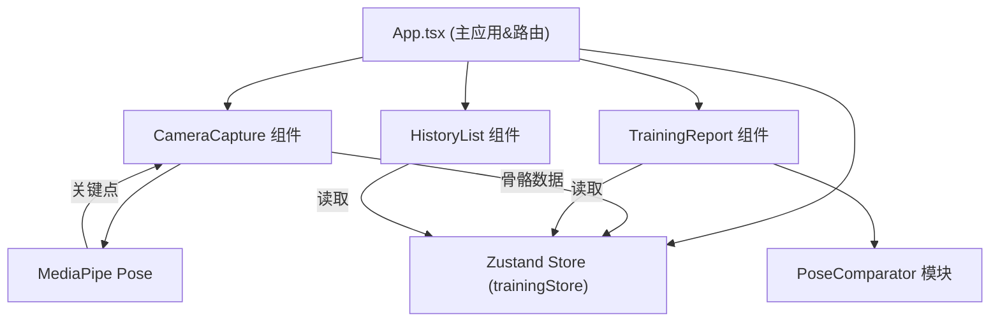

## 1. 架构设计



## 2. 技术描述

- **前端框架**：React 18 + TypeScript
- **构建工具**：Vite 5
- **状态管理**：Zustand 4
- **姿态检测**：@mediapipe/pose + @mediapipe/camera_utils
- **路由方案**：React Router DOM 6（轻量单页应用路由）
- **唯一ID**：uuid
- **样式方案**：纯 CSS + CSS Modules，无外部UI库
- **数据持久化**：localStorage 存储历史记录

## 3. 路由定义

| 路由 | 用途 |
|------|------|
| /training | 训练页面（摄像头录制+实时骨骼检测） |
| /report | 训练报告页面（评分+热力图+逐帧回放） |
| /history | 历史记录页面（按日期分组的记录列表） |
| /settings | 设置页面 |

## 4. 数据模型

### 4.1 骨骼关键点数据结构

```typescript
interface Landmark {
  x: number;      // 归一化x坐标 (0-1)
  y: number;      // 归一化y坐标 (0-1)
  z: number;      // 深度坐标
  visibility: number;  // 可见度置信度
}

interface FrameData {
  frameIndex: number;
  timestamp: number;
  landmarks: Landmark[];  // 33个关键点
}
```

### 4.2 训练记录数据结构

```typescript
interface TrainingRecord {
  id: string;
  actionName: string;      // 动作名称：深蹲/俯卧撑/引体向上
  duration: number;        // 录制时长（秒）
  totalScore: number;      // 综合评分 0-100
  frames: FrameData[];     // 骨骼帧序列
  deviationMap: DeviationMap;  // 各部位偏差数据
  createdAt: number;       // 创建时间戳
}
```

### 4.3 偏差热力图数据

```typescript
interface DeviationData {
  bodyPart: string;
  deviationPercent: number;  // 偏差百分比
  severity: 'good' | 'warning' | 'danger';
}

type DeviationMap = Record<string, DeviationData>;
```

## 5. 核心模块说明

### 5.1 PoseComparator 姿态对比算法

- 输入：用户骨骼帧序列 + 标准参考骨骼模型
- 输出：综合评分 + 各部位偏差热力图
- 算法：关键点欧氏距离归一化 → 部位加权平均 → 偏差百分比映射
- 性能要求：单帧对比 ≤ 20ms

### 5.2 CameraCapture 摄像头组件

- 集成 MediaPipe Pose 模型
- 30fps 骨骼检测刷新率
- Canvas 绘制半透明骨骼叠加层
- 端到端延迟优化 ≤ 150ms

### 5.3 trainingStore 状态管理

- 录制状态：idle / recording / paused
- 当前帧骨骼数据
- 历史记录列表
- 报告数据缓存

## 6. 文件组织

```
src/
├── App.tsx              # 主应用组件，布局+路由
├── main.tsx             # 入口文件
├── index.css            # 全局样式
├── stores/
│   └── trainingStore.ts # Zustand状态管理
├── components/
│   ├── CameraCapture.tsx   # 摄像头+骨骼检测
│   ├── TrainingReport.tsx  # 训练报告
│   ├── HistoryList.tsx     # 历史记录列表
│   ├── Sidebar.tsx         # 左侧导航栏
│   └── RecordButton.tsx    # 录制按钮
├── calculators/
│   └── PoseComparator.ts   # 姿态对比算法
├── data/
│   └── referencePoses.json # 标准参考骨骼数据
└── types/
    └── index.ts            # 类型定义
```
