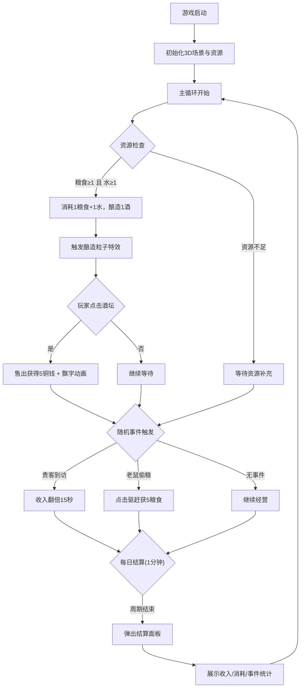

## 1. 产品概述

古风酒馆模拟经营网页游戏——以等距3D场景呈现古代酒馆经营体验，解决传统放置类游戏缺乏即时互动与视觉反馈、经营过程过于抽象的问题。目标用户为喜欢古风文化、休闲经营类游戏的玩家。

## 2. 核心功能

### 2.1 功能模块

1. **主游戏画面**：等距视角3D酒馆场景，含吧台、方桌座椅、酒架、掌柜角色动画、粒子特效
2. **右侧工具栏**：雇佣伙计/升级酒具/酿造配方三个升级按钮，含等级与描述
3. **资源循环系统**：自动酿造（粮食+水→酒）、点击售酒获铜钱、飘字动画、顶部状态栏滚动数字
4. **随机事件系统**：贵客到访/老鼠偷粮等事件，横幅通知动画
5. **每日结算报告**：1分钟=1天周期，全屏结算面板含柱状图统计

### 2.2 页面详情

| 页面名称 | 模块名称 | 功能描述 |
|----------|----------|----------|
| 主游戏画面 | 等距3D场景 | Three.js渲染的酒馆3D场景，含木制吧台(#8B4513)、四张方桌(#D2691E)与座椅、酒架区域(#A0522D/#8B0000交替酒坛)、暖黄色点光源(强度1.2, 色温3000K)、掌柜角色(#C0392B长袍)倒酒动画(4秒周期)、360度旋转(阻尼0.05)、缩放(3-15单位) |
| 主游戏画面 | 右侧工具栏 | 宽260px，半透明#2C3E5040背景，毛玻璃blur(8px)，圆角12px 0 0 12px，三个按钮(220x48px, #E67E22, 粗体16px白色, 圆角8px)，悬浮亮度1.1+阴影，点击缩放0.95(0.15s ease-out)，等级显示(Lv.1, #F1C40F)，描述(#BDC3C7, 12px) |
| 主游戏画面 | 顶部状态栏 | #2C3E50背景，100%宽，60px高，固定定位z-index=100，显示铜钱/粮食/水数量，数字滚动切换效果(旧数字向上翻出，新数字从下方翻入，0.3s ease) |
| 主游戏画面 | 酿造粒子特效 | 酒坛冒泡粒子，10颗，3-6px随机大小，#D35400，上升0.5单位/秒 |
| 主游戏画面 | 售酒飘字动画 | 铜钱图标从点击位置上浮60px，透明度1→0，1.2s |
| 主游戏画面 | 随机事件 | 每60-120秒触发，加权随机；贵客到访(金色华服客人，15秒停留，售酒收入翻倍)、老鼠偷粮(右下角老鼠动画，点击驱赶获5粮食) |
| 主游戏画面 | 事件横幅通知 | 屏幕 中央弹出，#8E44ADCC背景，圆角8px，左右滑入0.5s ease-out，5秒后右滑消失 |
| 主游戏画面 | 每日结算面板 | 全屏弹窗，#1A1A2ECC背景，圆角16px，缩放0→1(0.4s ease-out)，Canvas柱状图(#E74C3C→#F39C12渐变)，关闭按钮(32px白色圆形#E74C3C背景)，渐隐0.3s |

## 3. 核心流程

## 4. 用户界面设计

### 4.1 设计风格

- **主色调**：#8B4513(深木色)和#D2691E(浅木色)
- **辅色调**：#800000(深红桌布)和#F1C40F(金色文字)
- **文字颜色**：#2C3E50(深色)和#FFFFFF(白色)
- **背景深色**：#1A1A2E
- **按钮风格**：圆角8px，暖橙色#E67E22，悬浮亮度提升+阴影扩展，点击缩放反馈
- **字体**：衬线体为主，营造古风氛围
- **布局风格**：3D场景全屏沉浸，右侧工具栏固定，顶部状态栏固定
- **整体氛围**：温暖古风酒馆，暖黄色灯光，木质纹理

### 4.2 页面设计概览

| 页面名称 | 模块名称 | UI元素 |
|----------|----------|--------|
| 主游戏画面 | 3D场景 | 等距视角，暖黄点光源，木质纹理场景，掌柜角色动画，酒坛粒子特效 |
| 主游戏画面 | 顶部状态栏 | 深色背景条，铜钱/粮食/水图标+滚动数字 |
| 主游戏画面 | 右侧工具栏 | 毛玻璃半透明面板，三个升级按钮，等级金色文字，灰色描述 |
| 主游戏画面 | 事件横幅 | 紫色半透明横幅，滑入动画，事件描述文字 |
| 主游戏画面 | 结算面板 | 深色半透明全屏遮罩，居中面板，Canvas柱状图，关闭按钮 |

### 4.3 响应式适配

- **桌面端(≥1024px)**：完整布局，右侧工具栏260px宽固定
- **平板端(768-1023px)**：右侧工具栏调整为底部横向卷轴
- **手机端(<768px)**：工具栏折叠为底部浮动按钮

### 4.4 3D场景指导

- **环境氛围**：温暖古风酒馆，暖黄色调，色温3000K
- **灯光设置**：暖黄色点光源，强度1.2，色温3000K，模拟室内烛光效果
- **相机设置**：等距视角，鼠标拖拽360度旋转(阻尼0.05)，滚轮缩放(3-15单位)
- **构图与焦点**：吧台居中，掌柜角色在吧台后方，酒架在背景，桌椅分布前方
- **交互动画**：掌柜倒酒动作(酒杯右向左抬起再放下，4秒周期)，酒坛冒泡粒子
- **性能预算**：粒子总数≤200时保持60FPS，主线程空闲时间≤80ms
