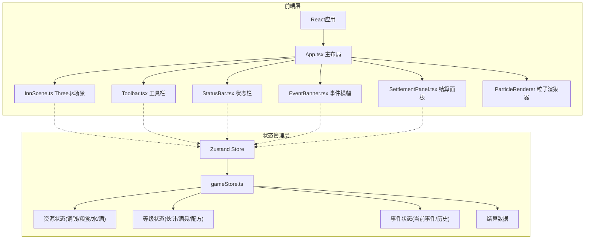

## 1. 架构设计



## 2. 技术说明

- **前端框架**：React 18 + TypeScript
- **构建工具**：Vite + @vitejs/plugin-react
- **3D渲染**：Three.js（等距视角场景、灯光、相机、几何体与材质）
- **状态管理**：Zustand（共享游戏状态）
- **粒子系统**：自定义Canvas粒子渲染器（独立模块，用于酿造冒泡和飘字特效）
- **样式方案**：CSS Modules / 内联样式（古风定制样式）
- **无后端**：纯前端应用，所有数据存储在Zustand store中

## 3. 路由定义

| 路由 | 用途 |
|------|------|
| / | 主游戏页面，包含3D场景、工具栏、状态栏、事件系统和结算面板 |

## 4. 数据模型

### 4.1 Zustand Store 数据模型

```typescript
interface GameState {
  coins: number;
  grain: number;
  water: number;
  wine: number;
  hireLevel: number;
  utensilLevel: number;
  recipeLevel: number;
  currentEvent: GameEvent | null;
  eventHistory: EventRecord[];
  dayIncome: number;
  dayGrainUsed: number;
  dayWaterUsed: number;
  dayEvents: number;
  brewingTimer: number;
  dayTimer: number;
  eventTimer: number;
  actions: {
    brew: () => void;
    sellWine: () => void;
    upgradeHire: () => void;
    upgradeUtensil: () => void;
    upgradeRecipe: () => void;
    triggerEvent: (event: GameEvent) => void;
    dismissEvent: () => void;
    chaseMouse: () => void;
    settleDay: () => void;
    tick: (delta: number) => void;
  };
}

interface GameEvent {
  type: 'noble_guest' | 'mouse_steal';
  startTime: number;
  duration: number;
}

interface EventRecord {
  type: string;
  timestamp: number;
  result: string;
}
```

## 5. 文件结构

```
├── package.json
├── vite.config.js
├── tsconfig.json
├── index.html
├── src/
│   ├── main.tsx
│   ├── App.tsx
│   ├── store/
│   │   └── gameStore.ts
│   ├── scene/
│   │   └── InnScene.ts
│   ├── components/
│   │   ├── Toolbar.tsx
│   │   ├── StatusBar.tsx
│   │   ├── EventBanner.tsx
│   │   ├── SettlementPanel.tsx
│   │   └── ParticleRenderer.ts
│   └── styles/
│       └── app.css
```
