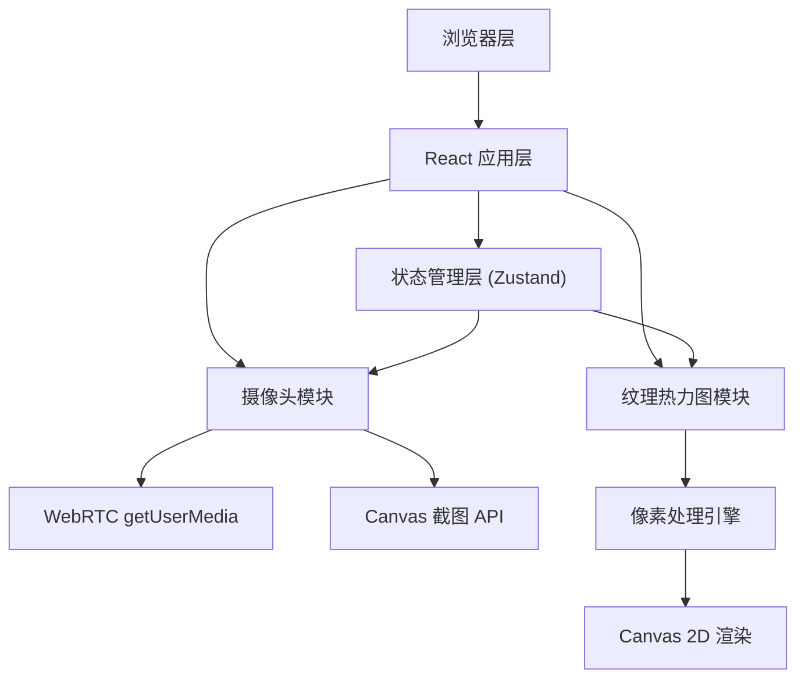

## 1. 架构设计



## 2. 技术描述
- 前端：React 18 + TypeScript + Vite
- 状态管理：Zustand
- 样式：原生 CSS（CSS Modules / 内联样式，不使用 Tailwind，按用户指定精确颜色值）
- 摄像头：WebRTC navigator.mediaDevices.getUserMedia
- 图像处理：Canvas 2D API（getImageData / putImageData）
- 依赖：react, react-dom, typescript, vite, @vitejs/plugin-react, zustand, uuid
- 初始化工具：Vite (react-ts 模板)

## 3. 路由定义
| 路由 | 用途 |
|------|------|
| / | 主页，包含摄像头预览与纹理热力图工作区 |

## 4. 文件结构
```
auto9/
├── package.json
├── vite.config.js
├── tsconfig.json
├── index.html
└── src/
    ├── App.tsx
    ├── store.ts
    ├── types.ts
    └── modules/
        ├── camera/
        │   ├── CameraModule.tsx
        │   └── cameraUtils.ts
        └── texture/
            ├── TextureModule.tsx
            └── textureEngine.ts
```

## 5. 模块职责
- **App.tsx**：主布局，左右/上下分栏，引入 CameraModule 和 TextureModule
- **store.ts**：Zustand store，管理 capturedImage、sensitivity、wrinkleStats
- **types.ts**：类型定义（WrinkleData、WrinkleStats 等接口）
- **CameraModule.tsx**：摄像头视频预览、控制按钮UI、抓拍逻辑
- **cameraUtils.ts**：getUserMedia 封装、停止流、canvas 截图工具函数
- **TextureModule.tsx**：渲染原图+热力图、滑杆UI、统计信息、下载导出、加载动画
- **textureEngine.ts**：灰度计算、褶皱强度映射、敏感度应用、Canvas 热力图绘制算法
