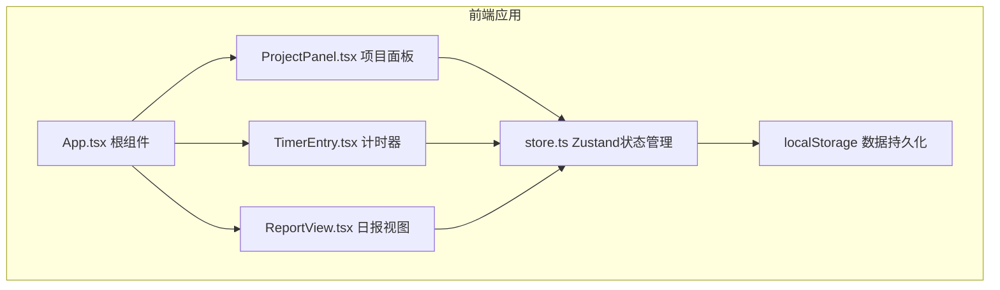

## 1. 架构设计



## 2. 技术描述

- **前端框架**：React 18 + TypeScript
- **构建工具**：Vite
- **状态管理**：Zustand
- **数据持久化**：localStorage
- **唯一ID生成**：uuid
- **样式方案**：CSS Modules / 内联样式（按需求指定颜色）
- **开发模式**：纯前端，无后端依赖

## 3. 数据模型

### 3.1 项目 (Project)

| 字段 | 类型 | 说明 |
|------|------|------|
| id | string | 项目唯一ID |
| name | string | 项目名称 |
| color | string | 项目主题色（左侧边框色） |
| entries | TimeEntry[] | 工时记录列表 |

### 3.2 工时记录 (TimeEntry)

| 字段 | 类型 | 说明 |
|------|------|------|
| id | string | 记录唯一ID |
| description | string | 任务描述 |
| startTime | number | 开始时间（时间戳） |
| endTime | number | 结束时间（时间戳） |
| duration | number | 时长（分钟） |
| tag | string | 标签（开发/会议/文档） |

### 3.3 计时状态 (TimerState)

| 字段 | 类型 | 说明 |
|------|------|------|
| isRunning | boolean | 是否正在计时 |
| startTime | number | null | 当前计时开始时间 |

## 4. 状态管理 (Zustand Store)

### 4.1 State

- `projects: Project[]` - 项目列表
- `currentProjectId: string` - 当前选中项目ID
- `timer: TimerState` - 计时器状态
- `showReport: boolean` - 是否显示日报
- `reportContent: string` - 日报内容

### 4.2 Actions

- `setCurrentProject(projectId: string)` - 切换当前项目
- `startTimer()` - 开始计时
- `stopTimer()` - 停止计时
- `addEntry(projectId: string, entry: Omit<TimeEntry, 'id'>)` - 添加工时记录
- `generateReport(projectId: string)` - 生成日报
- `sendBill(projectId: string)` - 发送账单
- `loadFromStorage()` - 从localStorage加载
- `saveToStorage()` - 保存到localStorage

## 5. 项目文件结构

```
├── package.json
├── vite.config.js
├── tsconfig.json
├── index.html
└── src/
    ├── main.tsx
    ├── App.tsx
    ├── store.ts
    ├── ProjectPanel.tsx
    ├── TimerEntry.tsx
    └── ReportView.tsx
```

## 6. 性能优化

- **列表渲染**：使用React.memo优化列表项重渲染
- **计时器动画**：使用transform实现脉动动画，避免重排
- **数据持久化**：防抖保存到localStorage，避免频繁写入
- **初始加载**：100条记录加载时间控制在200ms以内
