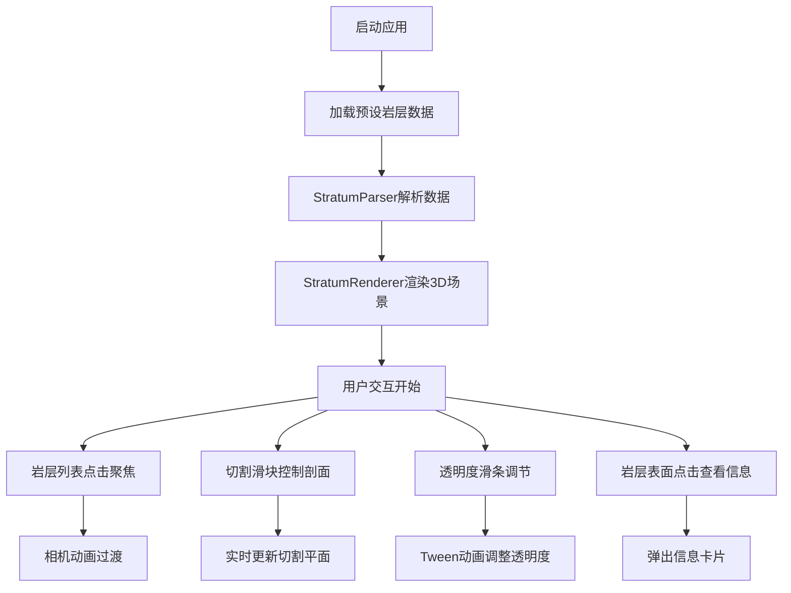

## 1. 产品概述
交互式3D地质剖面查看器，用于可视化地下岩层的三维结构，通过切割和透明度控制来观察内部地质构造。面向地质研究人员、学生和工程技术人员，提供直观的3D交互式体验。

## 2. 核心功能

### 2.1 用户角色
| 角色 | 注册方式 | 核心权限 |
|------|----------|----------|
| 普通用户 | 无需注册 | 查看3D地质模型、交互操作、控制切割与透明度 |

### 2.2 功能模块
1. **3D地质场景展示**：多层岩层堆叠可视化，带自然噪声形变
2. **岩层列表交互**：左侧面板展示层名，点击聚焦对应岩层
3. **切割模式**：滑块控制全局剖面切割深度，展示内部截面
4. **透明度调节**：每层独立透明度滑条，实时反馈
5. **岩层信息展示**：点击岩层表面弹出信息卡片

### 2.3 页面详情
| 页面名称 | 模块名称 | 功能描述 |
|----------|----------|----------|
| 主场景 | 3D视口 | 展示3D岩层模型，支持旋转、缩放、点击交互 |
| 主场景 | 左侧控制面板 | 岩层列表、透明度滑条、切割深度控制、重置视角按钮 |
| 主场景 | 信息卡片 | 显示岩层详细信息（名称、深度、密度、矿物组成） |

## 3. 核心流程
用户打开应用 → 加载预设6层岩层数据 → 3D场景渲染堆叠岩层 → 用户可自由旋转缩放视角 → 点击左侧岩层列表聚焦对应层 → 拖动切割滑块观察内部结构 → 调整各层透明度 → 点击岩层表面查看详细信息

## 4. 用户界面设计

### 4.1 设计风格
- 主色调：深蓝灰基调（#0B0E17 ~ #1A1F30）
- 强调色：蓝色（#3B82F6）
- 岩层颜色：泥土#8B5E3C、砂岩#D2B48C、石灰岩#C0C0C0、页岩#696969、花岗岩#808080、玄武岩#2F4F4F
- 按钮样式：圆角6px，悬停变暗，点击缩放反馈
- 面板样式：左侧面板260px宽，背景#1E293B，圆角0 10px 10px 0
- 字体：现代无衬线字体，清晰易读

### 4.2 页面设计概述
| 页面名称 | 模块名称 | UI元素 |
|----------|----------|--------|
| 主场景 | 3D视口 | Three.js渲染画布、暗色渐变背景、网格辅助线、方向光 |
| 主场景 | 左侧控制面板 | 岩层列表项（颜色标识+名称+透明度滑条）、切割深度滑块、重置视角按钮 |
| 主场景 | 信息卡片 | 圆角8px，半透明深色背景，白色文字，阴影 |

### 4.3 响应性
桌面端优先，自适应窗口大小，3D视口随容器尺寸变化。

### 4.4 3D场景指引
- 环境：暗色渐变背景，营造科技感与探索氛围
- 灯光：两盏方向光（强度0.8和0.5）+ 环境光（强度0.3）
- 相机：默认位置(0, 8, 12)看向原点，OrbitControls控制，阻尼0.1，缩放范围3-25
- 材质：每层使用MeshStandardMaterial，反射率0.3，粗糙度0.7，程序生成噪点条纹纹理
- 动画：相机过渡0.5秒，透明度变化0.2秒Tween动画
- 交互：点击岩层弹出信息卡片，切割滑块实时更新剖面
