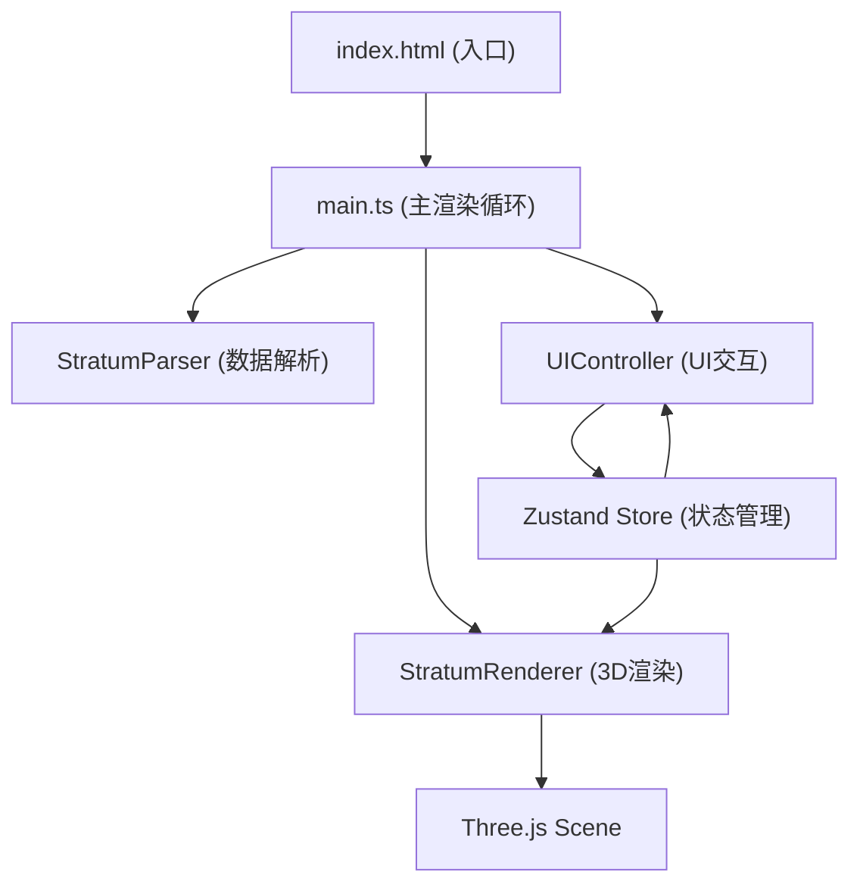

## 1. 架构设计



## 2. 技术描述
- 前端框架：TypeScript + Vanilla (无React/Vue，直接DOM操作)
- 3D引擎：Three.js @latest
- 构建工具：Vite @latest
- 状态管理：Zustand @latest
- 动画库：@tweenjs/tween.js @latest
- 类型定义：@types/three @latest

## 3. 模块职责划分

| 模块 | 文件 | 职责 |
|------|------|------|
| 主入口 | src/main.ts | 初始化所有模块，启动渲染循环，协调各模块通信 |
| 数据解析 | src/stratumParser.ts | 解析JSON格式岩层数据，提供类型定义和预设数据 |
| 3D渲染 | src/stratumRenderer.ts | Three.js场景管理，岩层几何体生成，材质纹理，切割平面，相机控制，点击检测 |
| UI控制 | src/uiController.ts | DOM UI渲染，用户交互事件，岩层列表，滑条控制，信息卡片 |
| 状态管理 | Zustand Store | 全局状态：选中岩层、切割深度、各层透明度、相机状态 |

## 4. 文件结构

```
d:\Pro\tasks\auto93/
├── package.json
├── vite.config.js
├── tsconfig.json
├── index.html
└── src/
    ├── main.ts
    ├── stratumParser.ts
    ├── stratumRenderer.ts
    └── uiController.ts
```

## 5. 数据模型

### 5.1 岩层数据结构

```typescript
interface StratumData {
  id: string;
  name: string;
  thickness: number;
  color: string;
  density: number;
  minerals: string;
  textureType: 'noise' | 'stripes' | 'mixed';
}

interface ParsedStratum extends StratumData {
  index: number;
  depthStart: number;
  depthEnd: number;
  yPosition: number;
}
```

### 5.2 应用状态 (Zustand Store)

```typescript
interface AppState {
  strata: ParsedStratum[];
  selectedStratumId: string | null;
  cutDepth: number; // 0-100
  stratumOpacities: Record<string, number>; // 0-100
  cameraTarget: { position: THREE.Vector3; target: THREE.Vector3 } | null;
  setSelectedStratum: (id: string | null) => void;
  setCutDepth: (depth: number) => void;
  setStratumOpacity: (id: string, opacity: number) => void;
  setCameraTarget: (pos: THREE.Vector3, target: THREE.Vector3) => void;
}
```
