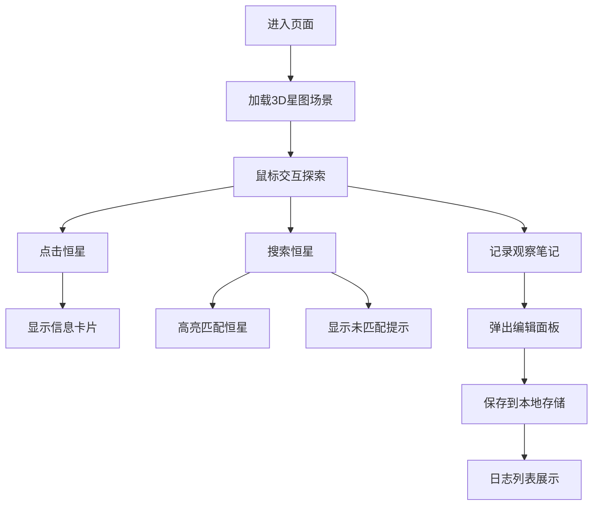

## 1. 产品概述

星图导航者是一款基于Web的3D恒星系统探索工具，用户可以在浏览器中加载并探索三维恒星系统，从任意视角观察星群的位置、亮度和光谱信息，并支持记录观察笔记。

- 主要用途：天文爱好者、学生和教育工作者提供沉浸式的恒星系统可视化探索体验
- 目标用户：天文爱好者、学生、教育工作者

## 2. 核心 Features

### 2.1 用户角色

| 角色 | 注册方式 | 核心权限 |
|------|----------|----------|
| 普通用户 | 无需注册 | 浏览3D星图、搜索恒星、查看恒星详情、记录观察笔记 |

### 2.2 功能模块

1. **3D星图场景**：200颗恒星三维可视化、自由视角控制、恒星交互选择
2. **恒星信息展示**：点击恒星显示详情卡片、光谱类型颜色编码
3. **恒星搜索**：中文关键词搜索、高亮定位、未匹配提示
4. **观察日志**：创建笔记、本地存储、日志列表、时间倒序排列

### 2.3 页面详情

| 页面名称 | 模块名称 | 功能描述 |
|-----------|----------|----------|
| 主页面 | 3D星图场景 | 全屏3D恒星系统可视化，鼠标拖拽旋转、右键平移、滚轮缩放 |
| 主页面 | 左侧控制面板 | 搜索栏输入中文关键词，快速定位并高亮恒星 |
| 主页面 | 右侧信息卡片 | 显示选中恒星的名称、光谱类型、亮度、距离、温度等信息 |
| 主页面 | 底部日志面板 | 观察日志创建、编辑、保存和展示 |

## 3. 核心流程

用户进入页面后，首先看到全屏3D星图场景，可以通过鼠标交互探索星群。用户可以：
1. 拖拽旋转视角、滚轮缩放、右键平移
2. 点击任意恒星查看详细信息
3. 在左侧搜索栏输入恒星名称进行搜索
4. 点击底部记录按钮创建观察笔记
5. 查看和管理已保存的观察日志

## 4. 用户界面设计

### 4.1 设计风格

- **主色调**：深空黑 (#0B0C10)、深空蓝灰 (#1F2833)、青绿点缀 (#45A29E)、亮青 (#66FCF1)
- **光谱类型颜色**：O型蓝色 (#9BB9FF)、B型蓝白 (#AAC9FF)、A型白色 (#D8E0FF)、F型黄白 (#FFEDC3)、G型黄色 (#FFE66D)、K型橙色 (#FFB347)、M型红色 (#FF6B6B)
- **按钮风格**：圆形、悬停缩放、点击反馈
- **字体**：现代无衬线字体，科幻风格
- **布局**：卡片式布局，毛玻璃效果，圆角设计
- **图标风格**：简约线性图标，科幻感

### 4.2 页面设计概述

| 页面名称 | 模块名称 | UI 元素 |
|-----------|----------|---------|
| 主页面 | 3D星图场景 | 全屏黑色深空渐变背景、发光粒子恒星、柔和光晕、平滑相机控制、点击高亮动画 |
| 主页面 | 左侧控制面板 | 宽度280px、毛玻璃背景、左侧渐变边框、搜索栏聚焦发光效果 |
| 主页面 | 右侧信息卡片 | 宽度300px、毛玻璃效果、圆角12px、边框半透明、内边距15px |
| 主页面 | 底部日志面板 | 高度200px、可折叠、顶部阴影、日志卡片悬停上浮 |
| 主页面 | 记录按钮 | 48x48px圆形、青绿色背景、悬停缩放1.1 |

### 4.3 响应式设计

- **桌面端** (≥768px)：左侧控制面板280px、右侧信息卡300px、底部日志区域200px
- **移动端** (<768px)：侧边栏变为顶部下拉菜单、底部日志区域高度缩小至120px
- **触摸优化**：支持触摸滑动旋转、双指缩放

### 4.4 3D场景设计

- **环境**：全屏黑色深空渐变背景 (#0B0C10到#1F2833)
- **光照**：自发光粒子，无需额外光源
- **相机设置**：透视相机，初始距离50单位，缩放范围10-100单位
- **相机运动**：鼠标拖拽旋转（阻尼0.1）、右键平移（速度0.5）、滚轮缩放
- **构成**：200颗恒星散布在直径100单位的球体空间内
- **交互**：点击恒星高亮（外发光放大1.5倍，透明度0.8持续0.5秒）、搜索结果黄色圆环标记（半径15px，脉冲动画0.6s周期）
- **后期处理**：Canvas绘制径向渐变光晕效果
- **性能**：帧率保持在50fps以上，恒星粒子数不超过500
