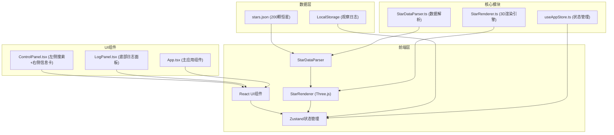

## 1. 架构设计



## 2. 技术描述

- **前端框架**: React 18 + TypeScript 5
- **构建工具**: Vite 5
- **3D渲染**: Three.js 0.160
- **状态管理**: Zustand 4
- **动画库**: @tweenjs/tween.js 18
- **样式方案**: CSS-in-JS (styled-components) + CSS Variables
- **本地存储**: localStorage

## 3. 目录结构

```
auto94/
├── public/
│   └── stars.json          # 200颗恒星模拟数据
├── src/
│   ├── UI/
│   │   ├── ControlPanel.tsx    # 左侧搜索栏+右侧信息卡
│   │   └── LogPanel.tsx        # 底部观察日志组件
│   ├── store/
│   │   └── useAppStore.ts      # Zustand全局状态
│   ├── StarDataParser.ts       # 星表数据解析模块
│   ├── StarRenderer.ts         # Three.js 3D渲染模块
│   ├── App.tsx                 # 主应用组件
│   ├── main.tsx                # 应用入口
│   └── index.css               # 全局样式
├── index.html              # 入口HTML
├── vite.config.js          # Vite配置
├── tsconfig.json           # TypeScript配置
└── package.json            # 项目依赖
```

## 4. 核心模块说明

### 4.1 StarDataParser 模块

**职责**: 将JSON星表数据转换为Three.js场景可用的属性数组

**核心方法**:
- `parseStars(jsonData: StarData[]): ParsedStar[]` - 解析原始数据
- `getSpectralColor(type: string): string` - 根据光谱类型获取颜色
- `getStarSize(magnitude: number): number` - 根据星等计算粒子大小

### 4.2 StarRenderer 模块

**职责**: Three.js场景管理、粒子系统创建、交互处理

**核心功能**:
- `init(container: HTMLElement): void` - 初始化场景
- `createStarSystem(stars: ParsedStar[]): void` - 创建粒子系统
- `handleClick(event: MouseEvent): void` - 处理恒星点击
- `highlightStar(index: number): void` - 高亮指定恒星
- `searchHighlight(name: string): number | null` - 搜索并高亮恒星
- `animate(): void` - 渲染循环

### 4.3 useAppStore 状态管理

**状态定义**:
```typescript
interface AppState {
  selectedStar: StarData | null;
  logs: LogEntry[];
  searchKeyword: string;
  searchResult: number | null;
  setSelectedStar: (star: StarData | null) => void;
  addLog: (log: Omit<LogEntry, 'id' | 'timestamp'>) => void;
  deleteLog: (id: string) => void;
  setSearchKeyword: (keyword: string) => void;
  setSearchResult: (result: number | null) => void;
}
```

## 5. 数据模型

### 5.1 恒星数据模型

```typescript
interface StarData {
  id: string;
  name: string;           // 中文名称
  nameEn: string;         // 英文名称
  spectralType: string;   // 光谱类型: O/B/A/F/G/K/M
  magnitude: number;      // 星等 (0-6)
  luminosity: number;     // 亮度 (太阳光度)
  temperature: number;    // 表面温度 (K)
  distance: number;       // 距中心距离 (单位)
  position: {             // 三维坐标
    x: number;
    y: number;
    z: number;
  };
}
```

### 5.2 观察日志模型

```typescript
interface LogEntry {
  id: string;
  title: string;
  content: string;
  starName?: string;      // 关联的恒星名称
  timestamp: number;      // 创建时间戳
}
```

### 5.3 解析后恒星数据

```typescript
interface ParsedStar {
  position: [number, number, number];
  color: string;
  size: number;
  data: StarData;
}
```

## 6. 性能优化策略

1. **粒子系统优化**: 使用单个Points对象渲染所有恒星，避免大量Mesh
2. **光晕效果**: Canvas预生成渐变纹理，复用为粒子材质
3. **视锥剔除**: Three.js内置视锥剔除，只渲染可见区域
4. **帧率控制**: requestAnimationFrame自动适配屏幕刷新率
5. **粒子数量限制**: 最多500颗恒星，确保低端设备流畅
6. **事件委托**: 单个射线检测处理所有恒星点击
7. **状态优化**: Zustand浅层比较，避免不必要重渲染

## 7. 关键技术实现

### 7.1 发光粒子材质
```typescript
// 使用PointsMaterial + Canvas纹理实现发光效果
const material = new THREE.PointsMaterial({
  size: 4,
  vertexColors: true,
  transparent: true,
  opacity: 0.9,
  blending: THREE.AdditiveBlending,
  depthWrite: false,
  map: glowTexture,
});
```

### 7.2 相机控制
- 使用自定义OrbitControls实现阻尼旋转
- 支持鼠标左键旋转、右键平移、滚轮缩放
- 缩放限制: 10-100单位

### 7.3 搜索算法
```typescript
// 中文前缀匹配 + 拼音模糊匹配
function searchStars(keyword: string): number | null {
  const lower = keyword.toLowerCase();
  return stars.findIndex(s => 
    s.name.includes(keyword) ||
    s.nameEn.toLowerCase().includes(lower)
  );
}
```
