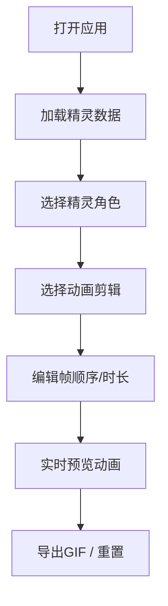

## 1. 产品概述

像素精灵动画工坊是一款面向插画师和游戏开发者的像素精灵动画编辑工具，支持将像素角色设定快速转化为动态游戏精灵，并在网页上实时预览行走、跳跃和攻击等动作循环。

- 核心价值：降低像素动画制作门槛，提供直观的帧管理和动画编辑体验
- 目标用户：插画师、独立游戏开发者、像素艺术爱好者

## 2. 核心功能

### 2.1 功能模块

1. **精灵帧管理模块**：导入像素精灵图，按固定尺寸分割为帧序列，支持多精灵切换
2. **动画编辑模块**：创建动画剪辑（待机、行走、跳跃、攻击），调整每帧时长，拖拽重排帧顺序
3. **实时预览模块**：Canvas上循环播放动画，支持播放/暂停/单步，显示当前帧信息

### 2.2 页面详情

| 页面名称 | 模块名称 | 功能描述 |
|---------|---------|---------|
| 主界面 | 顶部工具栏 | 精灵选择器、导出GIF按钮、重置动画按钮 |
| 主界面 | 左侧预览区 | Canvas画布、缩放控制、播放控制条、快捷键提示 |
| 主界面 | 右侧编辑面板 | 动画列表、时间轴、帧缩略图、帧时长编辑 |

## 3. 核心流程

用户打开应用 → 自动加载预设精灵数据 → 选择精灵角色 → 选择动画剪辑 → 编辑帧顺序和时长 → 实时预览动画 → 导出/重置

## 4. 用户界面设计

### 4.1 设计风格

- **主题**：暗色主题（背景#121212，字体#E0E0E0）
- **主色调**：紫色#6C63FF（强调色）
- **功能色**：绿色#4CAF50（导出）、红色#F44336（重置）
- **按钮风格**：圆角4px，悬停微上浮效果（transform: translateY(-1px)，0.15s ease）
- **字体**：等宽字体用于帧编号，无衬线字体用于界面文本
- **布局**：左右分栏布局，左侧预览区弹性宽度，右侧编辑面板固定320px

### 4.2 页面设计概述

| 页面名称 | 模块名称 | UI元素 |
|---------|---------|--------|
| 主界面 | 顶部工具栏 | 下拉选择器、按钮组、阴影效果 |
| 主界面 | 预览画布 | 棋盘格背景、网格辅助线、像素放大显示 |
| 主界面 | 播放控制条 | 播放/暂停按钮、单步按钮、帧编号、速度选择 |
| 主界面 | 动画列表 | 动画项、展开/收起、总览栏 |
| 主界面 | 时间轴 | 帧缩略图、拖拽排序、时长输入框 |

### 4.3 响应式

- 桌面端优先设计，最小宽度960px
- 预览区最小宽度640px，编辑面板固定320px
- Canvas保持1:1比例，最大600x600px

### 4.4 动画与交互

- 精灵切换：淡出淡入动画（0.3s，ease-in-out）
- 帧拖拽：半透明拖动副本跟随鼠标，释放后0.2s重排动画
- 按钮交互：悬停上浮、按下凹陷、0.1s过渡
- 快捷键提示：无操作5秒后淡出（0.5s）
- 加载状态：旋转圆圈指示器（24px，#6C63FF）
