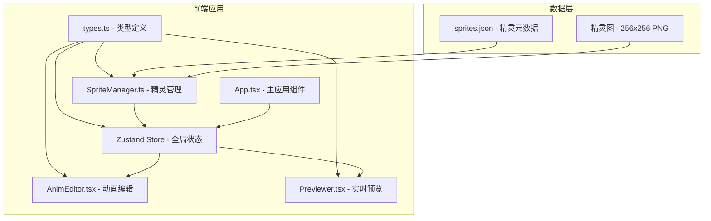

## 1. 架构设计



## 2. 技术描述

- **前端框架**：React 18 + TypeScript
- **构建工具**：Vite 5 + @vitejs/plugin-react
- **状态管理**：Zustand
- **动画库**：@tweenjs/tween.js
- **图形渲染**：Canvas 2D API
- **样式方案**：原生CSS + CSS变量

## 3. 目录结构

```
src/
├── types.ts          # 类型定义（精灵帧、动画剪辑、精灵元数据）
├── SpriteManager.ts  # 精灵管理（加载JSON、分割帧、输出帧数组）
├── store.ts          # Zustand全局状态管理
├── App.tsx           # 主应用组件
├── AnimEditor.tsx    # 动画编辑面板组件
├── Previewer.tsx     # 实时预览组件
└── index.css         # 全局样式
public/
├── sprites.json      # 精灵元数据
└── sprites/          # 精灵图片资源
```

## 4. 数据模型

### 4.1 核心类型定义

```typescript
interface Frame {
  index: number;
  x: number;
  y: number;
  width: number;
  height: number;
  image: HTMLImageElement;
}

interface AnimationClip {
  id: string;
  name: string;
  direction: 'up' | 'down' | 'left' | 'right';
  action: 'idle' | 'walk' | 'jump' | 'attack';
  frames: { frameIndex: number; duration: number }[];
}

interface SpriteMetadata {
  id: string;
  name: string;
  imageUrl: string;
  frameWidth: number;
  frameHeight: number;
  columns: number;
  rows: number;
  animations: AnimationClip[];
}
```

### 4.2 数据流

1. **SpriteManager** 加载 sprites.json 和精灵图片，分割为 Frame[]
2. **Zustand Store** 存储当前精灵、当前动画、播放状态、帧数据
3. **AnimEditor** 从 Store 读取帧数据和动画列表，编辑后写回 Store
4. **Previewer** 从 Store 读取当前动画和播放状态，通过 Canvas 绘制

## 5. 模块职责

| 模块 | 职责 | 输入 | 输出 |
|-----|------|------|------|
| types.ts | 定义数据结构 | - | 被所有模块引用 |
| SpriteManager.ts | 加载JSON、分割精灵图 | JSON路径、图片URL | Frame[] |
| store.ts | 全局状态管理 | 动作/状态变更 | 状态订阅 |
| AnimEditor.tsx | 动画列表、帧排序、时长编辑 | Frame[], AnimationClip[] | 更新后的AnimationClip[] |
| Previewer.tsx | Canvas绘制、播放控制 | AnimationClip, 当前帧 | 播放状态反馈 |
| App.tsx | 组合模块、布局管理 | - | 完整应用界面 |

## 6. 性能优化

- Canvas 采用 nearest-neighbor 插值保持像素清晰
- 使用 requestAnimationFrame 实现60fps动画
- 精灵图预加载，切换时异步加载显示loading
- 帧数据缓存，避免重复分割
- 拖拽操作使用 CSS transform 提升性能
