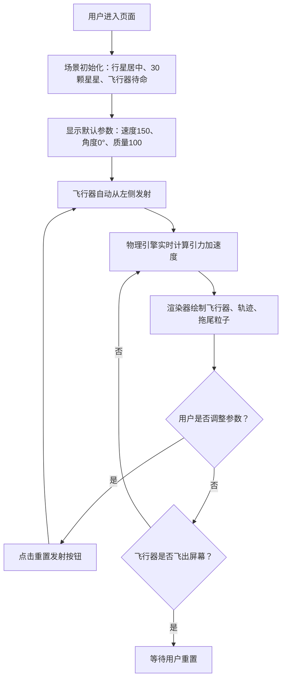

## 1. 产品概述

行星引力弹弓效应模拟器是一个基于 2D Canvas 的交互式物理模拟应用，用于直观展示大质量天体对小质量飞行器的引力偏转与加速过程。用户可以通过调整初始参数（速度、角度、行星质量）来观察不同的飞行轨迹，从而理解引力弹弓效应的物理原理。

### 1.1 目标用户
- 学生和教育工作者：用于物理教学和学习
- 航天爱好者：了解引力助推原理
- 普通用户：体验交互式物理模拟

### 1.2 产品价值
- 以可视化方式直观呈现抽象的物理概念
- 交互式参数调节让用户能探索各种物理场景
- 实时数据反馈帮助理解引力作用机制

---

## 2. 核心功能

### 2.1 功能模块清单

1. **主模拟场景**：全屏 Canvas 星空背景，行星与飞行器的实时物理模拟
2. **参数控制面板**：右侧吸附式控制面板，调节速度、角度、行星质量
3. **实时数据面板**：左上角显示当前速度、距离、轨道类型
4. **粒子系统**：飞行器拖尾粒子效果
5. **视觉增强系统**：闪烁星星、行星自转亮斑、光晕效果

### 2.2 页面详情

| 页面名称 | 模块名称 | 功能描述 |
|---------|---------|---------|
| 主页面 | 全屏 Canvas 场景 | 深色星空背景 (#060D17)，中央行星，飞行器从左侧发射 |
| 主页面 | 右侧控制面板 | 三个滑块（速度50-300、角度-90°~90°、行星质量50-200）+ 重置按钮 |
| 主页面 | 左上角参数面板 | 实时显示当前速度、距离行星距离、轨道类型 |
| 主页面 | 视觉效果层 | 30颗随机闪烁星星、行星自转角速度0.5°/s、光晕 |

---

## 3. 核心流程

### 3.1 主用户流程



### 3.2 逃逸速度判断流程

```mermaid
flowchart TD
    A["每帧物理更新"] --> B["计算当前速度 v"]
    B --> C["计算当前距离 r"]
    C --> D["计算逃逸速度 vesc = sqrt(2GM/r)"]
    D --> E{"v > vesc ?"}
    E -->|是 且 未提示过| F["显示"弹弓加速成功"淡入提示"]
    E -->|否| G["继续模拟"]
    F --> G
```

---

## 4. 用户界面设计

### 4.1 设计风格

- **设计主题**：深色科幻风格（深空探索）
- **主色调**：深蓝 #0B132B（背景基色）
- **强调色**：橙黄 #FF8C00（行星、按钮、滑块）
- **辅助色**：
  - 青色 #00FFFF（速度显示）
  - 黄色 #FFFF00（距离显示）
  - 粉色 #FF69B4（轨道类型）
  - 绿色 #00FF88（成功提示）
  - 天蓝 #00BFFF（轨迹线）

- **按钮风格**：圆角 8px，橙色填充，悬停变亮 #FFA500，点击缩放 0.95
- **面板风格**：毛玻璃效果（backdrop-filter: blur(8px)），半透明深色背景 #1A1A2E80
- **字体**：无衬线系统字体，数据数值 13px，提示文字 24px

### 4.2 页面布局

```
┌───────────────────────────────────────────────────────────┐
│ ┌──────────────┐                                    ┌─────┐ │
│ │  实时参数面板 │                                    │ 控  │ │
│ │  速度: xxx    │                                    │ 制  │ │
│ │  距离: xxx    │                                    │ 面  │ │
│ │  轨道: xxx    │                                    │ 板  │ │
│ └──────────────┘                                    │     │ │
│                                                     │速度:│ │
│                      ╭───────╮                      │角度:│ │
│                      │ 行星  │                      │质量:│ │
│                      ╰───────╯                      │     │ │
│                             ～～轨迹～～            │重置 │ │
│   ○飞行器───────────────→                         │     │ │
│                                                     └─────┘ │
│                                                           │
│              "弹弓加速成功" （达到逃逸速度时显示）           │
└───────────────────────────────────────────────────────────┘
```

### 4.3 响应式设计

- **设计策略**：桌面优先（Desktop-first）
- **最小宽度**：1024px
- **布局保持**：右侧控制面板固定 280px 宽度，Canvas 区域自适应剩余空间

### 4.4 动画与过渡

- 数值变化：0.2s transition 过渡
- 成功提示：0.5s 淡入动画
- 按钮交互：悬停变亮，点击缩放 0.95
- 星星闪烁：2-4秒随机周期
- 行星亮斑自转：0.5°/秒
