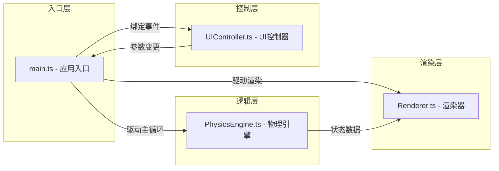

## 1. 架构设计

本项目采用纯前端 Canvas 2D 渲染架构，模块间职责清晰分离：



### 1.1 模块职责

| 模块 | 职责 | 输入 | 输出 |
|-----|-----|-----|-----|
| main.ts | 应用入口、主循环调度、状态管理 | 用户事件、DOM | 帧更新指令 |
| PhysicsEngine.ts | 引力计算、轨道积分、逃逸速度判定 | 位置、速度、质量参数 | 新状态、轨道类型 |
| Renderer.ts | 星空、行星、飞行器、轨迹、粒子绘制 | 物理状态、时间 | Canvas 像素输出 |
| UIController.ts | 控制面板事件绑定、数值更新 | DOM 事件 | 参数回调 |

---

## 2. 技术选型说明

- **前端框架**：无（原生 TypeScript + DOM + Canvas 2D）
- **构建工具**：Vite 5.x（ES模块输出）
- **语言**：TypeScript 5.x（严格模式 strict: true）
- **包管理**：npm

### 2.1 依赖清单

| 包名 | 版本 | 用途 |
|-----|-----|-----|
| typescript | ^5.4.0 | 类型系统 |
| vite | ^5.2.0 | 开发服务器与构建 |

---

## 3. 文件结构

```
auto97/
├── .trae/documents/
│   ├── PRD-行星引力弹弓模拟器.md
│   └── 技术架构-行星引力弹弓模拟器.md
├── index.html           # 入口 HTML
├── package.json         # 依赖与脚本
├── tsconfig.json        # TS 配置（严格模式）
├── vite.config.js       # Vite 配置（ES模块输出）
└── src/
    ├── main.ts          # 应用入口：Canvas初始化、主循环、UI绑定
    ├── PhysicsEngine.ts # 物理引擎：引力、轨道积分、逃逸判断
    ├── Renderer.ts      # 渲染器：星空、行星、飞行器、轨迹、粒子
    └── UIController.ts  # UI控制器：滑块事件、数值显示、重置
```

---

## 4. 核心数据结构

### 4.1 物理状态类型（PhysicsEngine.ts）

```typescript
export interface Vec2 {
  x: number;
  y: number;
}

export interface SpacecraftState {
  position: Vec2;
  velocity: Vec2;
}

export interface PlanetState {
  position: Vec2;
  mass: number;   // 引力参数 GM（已归一化）
  radius: number; // 视觉半径
}

export type OrbitType = 'elliptical' | 'hyperbolic' | 'parabolic';

export interface SimulationConfig {
  initialSpeed: number;    // 初始速度 50-300 px/s
  launchAngle: number;     // 发射角度 -90~90 度
  planetMass: number;      // 行星质量 50-200
}
```

### 4.2 渲染数据类型（Renderer.ts）

```typescript
export interface TrailPoint extends Vec2 {
  alpha: number; // 渐隐透明度
}

export interface Particle {
  position: Vec2;
  velocity: Vec2;
  life: number;    // 剩余寿命 0-1
  maxLife: number; // 初始寿命
}

export interface Star {
  position: Vec2;
  size: number;        // 1-3px
  phase: number;       // 闪烁相位 0-2π
  period: number;      // 周期 2-4秒
}
```

### 4.3 物理常量

| 常量 | 值 | 说明 |
|-----|-----|-----|
| G_EFFECTIVE | 800 | 有效引力常数（已缩放至视觉尺度） |
| DT | 1/60 | 固定时间步长（秒） |
| MAX_TRAIL_POINTS | 3000 | 轨迹点上限 |
| PLANET_RADIUS | 40 | 行星视觉半径（px） |
| SPACECRAFT_RADIUS | 4 | 飞行器半径（px） |

---

## 5. 物理计算规范

### 5.1 引力加速度公式

$$
\vec{a} = -\frac{GM}{r^3} \cdot \vec{r}
$$

其中 $\vec{r}$ 为行星指向飞行器的位置矢量，$r = |\vec{r}|$。

### 5.2 数值积分方法

使用 **半隐式欧拉法（Semi-implicit Euler）**：
1. 先更新速度：$\vec{v}_{n+1} = \vec{v}_n + \vec{a}_n \cdot \Delta t$
2. 再更新位置：$\vec{x}_{n+1} = \vec{x}_n + \vec{v}_{n+1} \cdot \Delta t$

比显式欧拉更稳定，适合保守力场模拟。

### 5.3 逃逸速度判据

$$
v_{esc} = \sqrt{\frac{2GM}{r}}
$$

- 若 $v > v_{esc}$：双曲线轨道（已逃逸）
- 若 $v \approx v_{esc}$（误差 < 1%）：抛物线轨道
- 若 $v < v_{esc}$：椭圆轨道（束缚态）

### 5.4 边界处理

- 飞行器飞出 Canvas 范围后不再重置，等待用户手动"重置发射"
- 碰撞检测：若距离 < 行星半径，标记为撞击并停止更新

---

## 6. 渲染规范

### 6.1 绘制顺序（z 轴由低到高）

1. **背景层**：纯色填充 #060D17
2. **星空层**：30 颗闪烁星星（sin 调制透明度）
3. **轨迹层**：半透明曲线 #00BFFF80，线宽 2px
4. **行星层**：径向渐变 #FF8C00 → #FF4500 + 30px 外光晕 + 自转角亮斑
5. **粒子层**：拖尾粒子（根据寿命渐隐）
6. **飞行器层**：白色圆形 + 高光

### 6.2 性能优化

- 轨迹点超过 3000 时丢弃最早的点（数组 shift / 环形缓冲）
- 粒子系统控制最大粒子数（建议 ≤ 200）
- 使用 `requestAnimationFrame` 驱动，与物理步长解耦（固定 60Hz 物理更新）

---

## 7. 性能指标

| 指标 | 目标值 |
|-----|-------|
| 渲染帧率 | 稳定 60 FPS |
| 物理更新率 | 60 Hz（固定步长） |
| 轨迹点上限 | 3000 |
| 最大粒子数 | 200 |
| 首屏加载 | < 1s（纯前端无资源加载） |
