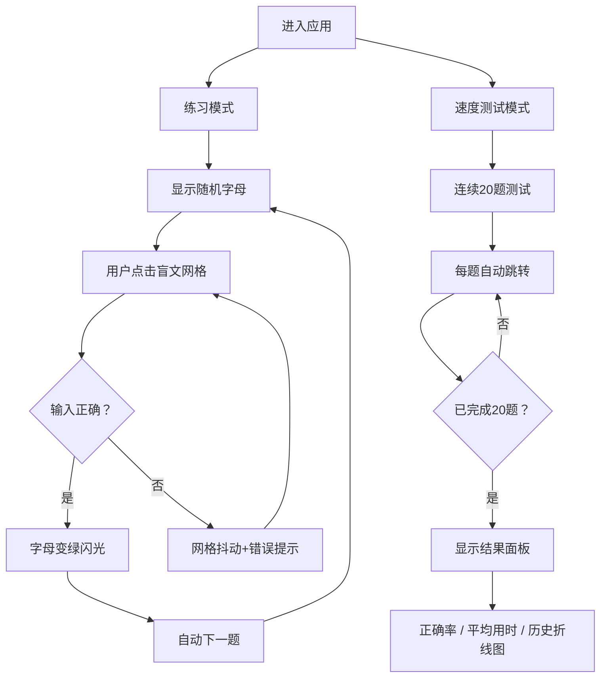

## 1. 产品概述

交互式盲文学习与打字练习应用，通过视觉和触觉反馈（屏幕模拟）帮助用户学习盲文点位排列规则，支持听写练习和打字速度测试。

- 主要用途：帮助初学者通过可视化方式学习盲文6点位系统，掌握英文字母与数字的盲文表示
- 目标用户：盲文初学者、特殊教育教师、对盲文感兴趣的普通用户
- 产品价值：将抽象的盲文点位转化为直观的交互式学习体验，降低学习门槛

## 2. 核心功能

### 2.1 功能模块

1. **盲文点阵网格**：2列3行共6个可交互圆点，支持点击切换凸起/凹陷状态
2. **练习模式**：随机展示字母，用户点击网格输入对应盲文，实时反馈正误
3. **速度测试模式**：连续20题测试，统计正确率和平均用时，生成历史成绩折线图
4. **状态管理**：使用 Zustand 管理全局状态（当前题目、得分、历史记录等）
5. **响应式布局**：桌面端左右分栏，移动端垂直堆叠

### 2.2 页面详情

| 页面名称 | 模块名称 | 功能描述 |
|-----------|-------------|---------------------|
| 主页面 | 盲文网格区域 | 6点盲文点阵交互组件，支持点击切换状态，带弹性动画 |
| 主页面 | 模式切换标签 | 练习/测试两种模式切换，带下划线滑动动画 |
| 主页面 | 题目展示区 | 显示当前随机字母，正确时变绿闪光，错误时网格抖动 |
| 主页面 | 数据统计区 | 正确率、平均用时、得分显示 |
| 主页面 | 历史成绩图 | SVG 折线图展示历史测试正确率趋势 |
| 主页面 | 底部状态栏 | 进度、得分、计时器信息 |

## 3. 核心流程

### 练习模式流程
用户进入应用 → 默认练习模式 → 显示随机字母 → 用户点击网格输入盲文 → 判断正误
- 正确：字母变绿闪光 → 自动下一题
- 错误：网格抖动 + 红色提示 → 用户继续调整

### 速度测试模式流程
用户切换到测试模式 → 开始20题连续测试 → 每题自动跳转 → 测试结束 → 显示结果面板（正确率、平均用时、历史折线图）

## 4. 用户界面设计

### 4.1 设计风格

- **设计方向**：清爽教育风格，强调可读性和交互反馈
- **主色调**：蓝色 #4A90D9（知识、专业感）
- **辅助色**：绿色 #00C851（正确反馈）、红色 #FF6B6B（错误提示、折线图）
- **背景色**：浅灰蓝 #F5F7FA（主背景）、#F8F9FA（面板背景）
- **文字色**：#1A1A1A（主文字）、#666（次要文字）
- **圆角**：统一 12px（特殊说明除外）
- **阴影**：统一 #00000010
- **字体**：使用现代无衬线字体，标题清晰醒目

### 4.2 页面设计概述

| 页面名称 | 模块名称 | UI 元素 |
|-----------|-------------|-------------|
| 主页面 | 盲文网格 | 2×3圆点布局，凸起蓝色内阴影，凹陷浅灰缩小，点击弹性动画 |
| 主页面 | 模式标签 | 底部3px蓝色下划线，切换滑动动画0.2s |
| 主页面 | 题目展示 | 48px大号字母，正确时绿色闪光动画 |
| 主页面 | 右侧面板 | 320px宽，圆角16px，阴影 #00000010 |
| 主页面 | 折线图 | SVG 绘制，红色折线，数据点直径6px |
| 主页面 | 状态栏 | 40px高，上边框1px #E0E0E0 |

### 4.3 响应式

- **桌面端（≥768px）**：左侧网格区域 + 右侧面板（320px）并排布局
- **移动端（<768px）**：垂直堆叠，网格区域占满宽度，面板100%宽度且圆角为0，标签字体缩小至14px
- 触摸优化：圆点直径足够大（30px），适合手指点击

### 4.4 动画与交互

- 圆点状态切换：0.15s 弹性过渡（scale 1→0.9→1）
- 正确反馈：背景色闪白动画 0.3s
- 错误反馈：水平位移±5px 抖动 0.2s
- 模式切换：下划线滑动 0.2s
- 错误提示：显示1.5s后消失
