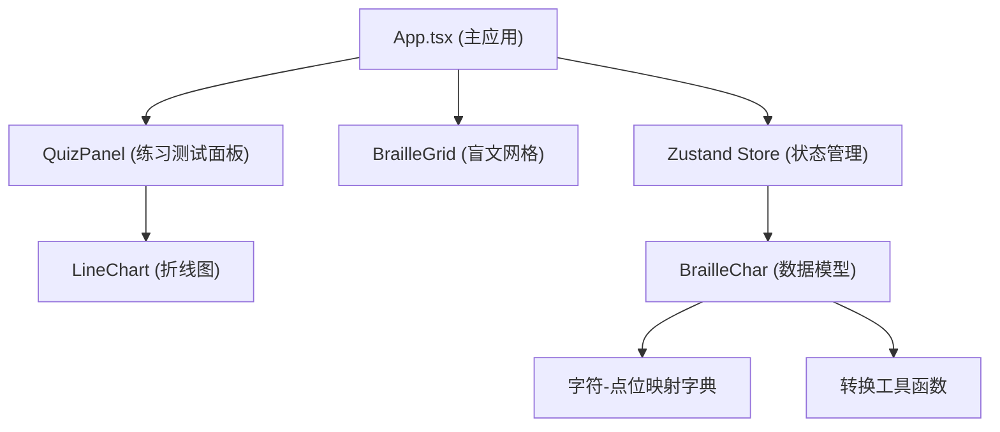

## 1. 架构设计



## 2. 技术描述

- **前端框架**：React 18 + TypeScript
- **构建工具**：Vite + @vitejs/plugin-react
- **状态管理**：Zustand
- **样式方案**：CSS Modules / 内联样式（纯 CSS 实现，无 UI 框架）
- **图表方案**：原生 SVG 绘制折线图
- **动画方案**：CSS transitions + keyframes 动画

## 3. 文件结构

| 文件路径 | 用途 |
|---------|------|
| `package.json` | 项目依赖与脚本配置 |
| `vite.config.js` | Vite 构建配置 |
| `tsconfig.json` | TypeScript 严格模式配置 |
| `index.html` | 入口 HTML 页面 |
| `src/main.tsx` | 应用入口 |
| `src/App.tsx` | 主应用组件，整合网格与面板 |
| `src/BrailleGrid.tsx` | 盲文点阵矩阵组件 |
| `src/BrailleChar.ts` | 盲文字符数据模型与转换函数 |
| `src/QuizPanel.tsx` | 练习与测试面板组件 |
| `src/store/brailleStore.ts` | Zustand 状态管理 |
| `src/components/LineChart.tsx` | SVG 折线图组件 |
| `src/App.css` | 主应用样式 |
| `src/BrailleGrid.css` | 网格组件样式 |
| `src/QuizPanel.css` | 练习面板样式 |

## 4. 数据模型

### 4.1 盲文点位编号

6点位盲文按2列3行排列，点位编号如下：

```
1  4
2  5
3  6
```

每个点位用 1-6 的数字表示，比特串从低位到高位对应点位 1-6。

### 4.2 状态数据定义

```typescript
// 盲文点位状态 (6位，索引0-5对应点位1-6)
type DotsState = boolean[6];

// 游戏模式
type GameMode = 'practice' | 'test';

// 历史记录条目
interface HistoryRecord {
  id: number;
  accuracy: number;      // 正确率 0-100
  avgTime: number;       // 平均用时（秒）
  date: string;
}

// 测试结果
interface TestResult {
  total: number;         // 总题数
  correct: number;       // 正确数
  accuracy: number;      // 正确率
  avgTime: number;       // 平均用时（秒）
}

// Store 状态
interface BrailleState {
  mode: GameMode;
  currentChar: string;
  currentDots: boolean[];
  score: number;
  totalQuestions: number;
  correctCount: number;
  questionStartTime: number;
  history: HistoryRecord[];
  testQuestions: string[];
  testCurrentIndex: number;
  testStartTime: number;
  testResults: TestResult | null;
  showError: boolean;
  errorMessage: string;
}
```

## 5. 核心模块说明

### 5.1 BrailleChar 数据模块

- `brailleMap`: 字符到6位比特串的映射字典（A-Z, 0-9）
- `charToDots(char: string): boolean[]`: 字符转盲文点位数组
- `dotsToChar(dots: boolean[]): string | null`: 点位数组转字符
- `getRandomChar(): string`: 获取随机字符

### 5.2 BrailleGrid 组件

- Props: `dots: boolean[]`, `onDotClick: (index: number) => void`, `shake?: boolean`
- 渲染6个圆点，按2列3行布局
- 支持凸起/凹陷两种状态的视觉效果
- 点击圆点触发 onDotClick 回调，传入点位编号（1-6）

### 5.3 QuizPanel 组件

- 顶部展示当前字符
- 模式切换标签
- 数据统计显示
- SVG 折线图展示历史成绩
- 测试结果面板

### 5.4 Zustand Store

- 管理当前模式、题目、得分、历史记录
- 提供切换模式、提交答案、开始测试等 action
- 练习模式和测试模式的业务逻辑

## 6. 性能要求

- 网格点击响应时间 < 50ms
- 折线图渲染更新频率 ≥ 10fps
- 状态更新使用 React 批量更新机制
- 动画使用 CSS transform/opacity 保证硬件加速
