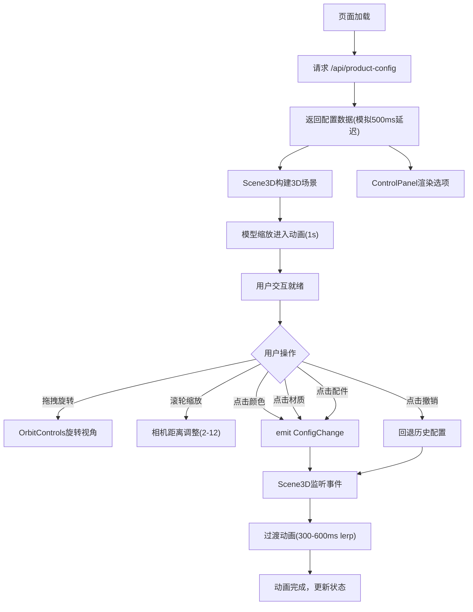
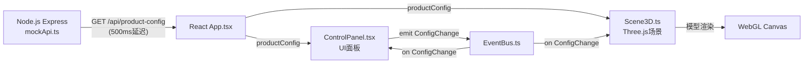

## 1. 产品概述

交互式3D产品配置展示平台，面向品牌发布会场景，允许访客通过Web端360度旋转查看产品模型，并实时切换颜色、材质和配件组合，每次切换触发平滑的渐变过渡动画。
- 目标用户：品牌方（上传配置）、发布会访客（交互查看）
- 核心价值：提供沉浸式产品体验，让用户从任意角度感受产品的颜色、材质和光影效果

## 2. 核心功能

### 2.1 用户角色

| 角色 | 注册方式 | 核心权限 |
|------|----------|----------|
| 品牌方 | 后台管理 | 上传产品模型和配置方案 |
| 访客 | 无需注册 | 旋转查看、切换配置、撤销操作 |

### 2.2 功能模块

1. **3D产品展示页**：Three.js渲染的产品模型、鼠标拖拽旋转、滚轮缩放、光影效果
2. **配置切换面板**：颜色选择、材质选择、配件选择、过渡动画、撤销历史

### 2.3 页面详情

| 页面名称 | 模块名称 | 功能描述 |
|----------|----------|----------|
| 产品展示页 | 3D视口 | 显示产品3D模型，支持鼠标拖拽360度旋转（绕Y轴）、滚轮缩放（距离2-12），相机初始位置(0,2,5)，模型始终居中，投射柔和阴影 |
| 产品展示页 | 导航栏 | 16px高度，深灰色#1A1A2E背景，中央显示"Explorer"粗体24px白色字体 |
| 产品展示页 | 配置面板 | 右侧固定半透明面板(rgba(0,0,0,0.6))，圆角12px，8px窄边框，包含颜色/材质/配件三组选择区域 |
| 产品展示页 | 颜色选择区 | 6个圆形色块(直径40px)，2px白色悬停边框，点击触发模型颜色渐变过渡(300-600ms) |
| 产品展示页 | 材质选择区 | 金属/光亮/哑光三种选项，矩形按钮(60px×36px)，悬停上浮3px并加深背景 |
| 产品展示页 | 配件选择区 | 标准款/豪华款/运动款三种，点击后产品外观增减组件(尾翼、轮毂变化) |
| 产品展示页 | 撤销按钮 | 面板底部，直径36px圆形，背景#555555悬停变#333333，带向左箭头图标，最多5步历史 |

## 3. 核心流程

用户打开页面→加载产品配置数据(API)→渲染默认3D模型(深灰色#333333，粗糙金属)→模型由中心缩放进入(scale 0→1, 1s缓动)→用户通过鼠标拖拽旋转查看→用户点击面板切换颜色/材质/配件→EventBus发送ConfigChange事件→Scene3D接收事件触发过渡动画(300-600ms缓动)→面板按钮显示旋转加载图标→动画完成恢复按钮状态→用户可点击撤销回退至上一配置(最多5步)

## 4. 界面设计

### 4.1 设计风格

- 主色调：暗色系科技感，背景从深蓝#0B0F19到深紫#1B1629渐变
- 点缀色：科技蓝#4A90D9，禁用色#666666
- 按钮风格：矩形按钮悬停上浮3px，点击缩小至0.95倍
- 字体：导航栏24px粗体#FFFFFF，面板内14-16px
- 布局：左侧3D展示区+右侧固定配置面板
- 阴影：产品模型下方投射半透明黑色阴影(模糊半径40px)

### 4.2 页面设计概述

| 页面名称 | 模块名称 | UI元素 |
|----------|----------|--------|
| 产品展示页 | 导航栏 | 深灰#1A1A2E背景，16px高，"Explorer"白色粗体24px居中 |
| 产品展示页 | 3D视口 | 深蓝→深紫渐变背景，中心产品模型，柔和阴影 |
| 产品展示页 | 配置面板 | rgba(0,0,0,0.6)半透明，圆角12px，8px边框(随主题色变化) |
| 产品展示页 | 颜色色块 | 40px直径圆形，2px白色悬停边框，6色排列 |
| 产品展示页 | 材质按钮 | 60px×36px矩形，悬停上浮3px+加深背景 |
| 产品展示页 | 配件按钮 | 矩形选择按钮，选中状态高亮 |
| 产品展示页 | 撤销按钮 | 36px直径圆形，#555555背景，悬停#333333，左箭头图标 |

### 4.3 响应式适配

- 桌面端（≥768px）：3D展示区全屏，配置面板固定右侧
- 移动端（<768px）：配置面板移至底部，宽度100%，高度180px，单行滚动布局，字体缩小至14px，3D展示区占满剩余视口高度

### 4.4 3D场景指引

- 环境：暗色系展厅氛围，深蓝到深紫渐变背景
- 灯光：环境光+方向光+点光源，突出金属材质反射
- 相机：初始位置(0,2,5)，透视相机，FOV 50度
- 交互：OrbitControls实现拖拽旋转和滚轮缩放，旋转范围不限，缩放范围2-12
- 动画：首次加载模型缩放进入(scale 0→1, 1s)，配置切换颜色/材质渐变过渡(300-600ms)
- 后处理：柔和阴影投射
- 性能预算：几何体顶点数不超过20000，帧率不低于50fps

## 5. 数据流向

