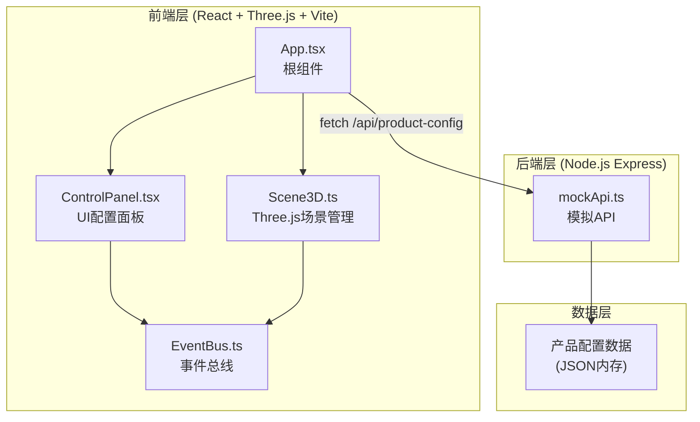
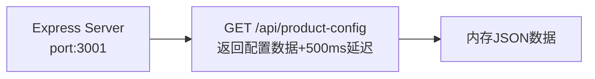

## 1. 架构设计



## 2. 技术说明

- 前端：React@18 + Three.js + TypeScript + Vite
- 初始化工具：Vite手动初始化
- 后端：Express@4 + TypeScript + CORS
- 状态管理：EventBus事件总线 + React useState
- 构建工具：Vite + @vitejs/plugin-react
- 3D渲染：Three.js (MeshStandardMaterial, OrbitControls)
- 动画：手动lerp实现缓动过渡（300-600ms）

## 3. 路由定义

| 路由 | 用途 |
|------|------|
| / | 产品展示页（3D视口 + 配置面板） |

## 4. API定义

### 4.1 GET /api/product-config

**请求**：无参数

**响应类型定义**：

```typescript
interface ProductConfig {
  productName: string;
  colors: Array<{ id: string; name: string; hex: string }>;
  materials: Array<{ id: string; name: string; roughness: number; metalness: number }>;
  accessories: Array<{ id: string; name: string; components: AccessoryComponent[] }>;
  defaultConfig: {
    colorId: string;
    materialId: string;
    accessoryId: string;
  };
}

interface AccessoryComponent {
  type: 'wing' | 'rim' | 'spoiler';
  geometry: 'box' | 'cylinder';
  position: [number, number, number];
  scale: [number, number, number];
  rotation: [number, number, number];
}
```

**响应示例**：模拟500ms延迟后返回完整产品配置对象

### 4.2 ConfigChange 事件（EventBus）

```typescript
interface ConfigChangeEvent {
  type: 'color' | 'material' | 'accessory';
  id: string;
  value: string | number;
}
```

## 5. 服务器架构



## 6. 文件结构及调用关系

```
project/
├── package.json              # 依赖管理，启动脚本
├── index.html                # 入口HTML
├── vite.config.js            # Vite构建配置(代理API到3001)
├── tsconfig.json             # TypeScript严格模式，ES2020
├── server/
│   └── mockApi.ts            # Express服务器，GET /api/product-config
├── src/
│   ├── App.tsx               # 根组件→加载Scene3D和ControlPanel→监听EventBus
│   ├── main.tsx              # React入口，挂载App
│   ├── scene/
│   │   └── Scene3D.ts        # Three.js场景→接收productConfig→构建3D网格→监听ConfigChange→触发lerp过渡动画
│   ├── ui/
│   │   └── ControlPanel.tsx  # React面板→显示选项→用户选择→emit ConfigChange→接收更新
│   └── utils/
│       └── EventBus.ts       # 事件总线→on/off/emit→Scene3D与ControlPanel解耦通信
```

**数据流向**：
1. App.tsx fetch `/api/product-config` → 获得 ProductConfig
2. App.tsx 传递 ProductConfig 给 Scene3D.ts 和 ControlPanel.tsx
3. 用户在 ControlPanel 操作 → emit ConfigChange 到 EventBus
4. Scene3D 监听 ConfigChange → 执行模型属性lerp过渡动画
5. ControlPanel 监听 ConfigChange → 更新UI选中状态
6. 撤销操作 → 从历史栈弹出 → emit 上一配置的 ConfigChange

## 7. 动画实现方案

- **入场动画**：模型 scale 从 Vector3(0,0,0) lerp 到 Vector3(1,1,1)，持续1000ms，使用 easeOutElastic 缓动
- **颜色过渡**：Three.js Color.lerpColors 从旧颜色到新颜色，持续300-600ms，使用 easeInOutCubic 缓动
- **材质过渡**：roughness/metalness 值手动 lerp，持续300-600ms
- **加载指示**：过渡期间按钮显示CSS旋转渐变圆弧动画，周期1s
- **缩放反馈**：按钮点击时 CSS transform: scale(0.95)，0.2s ease transition
