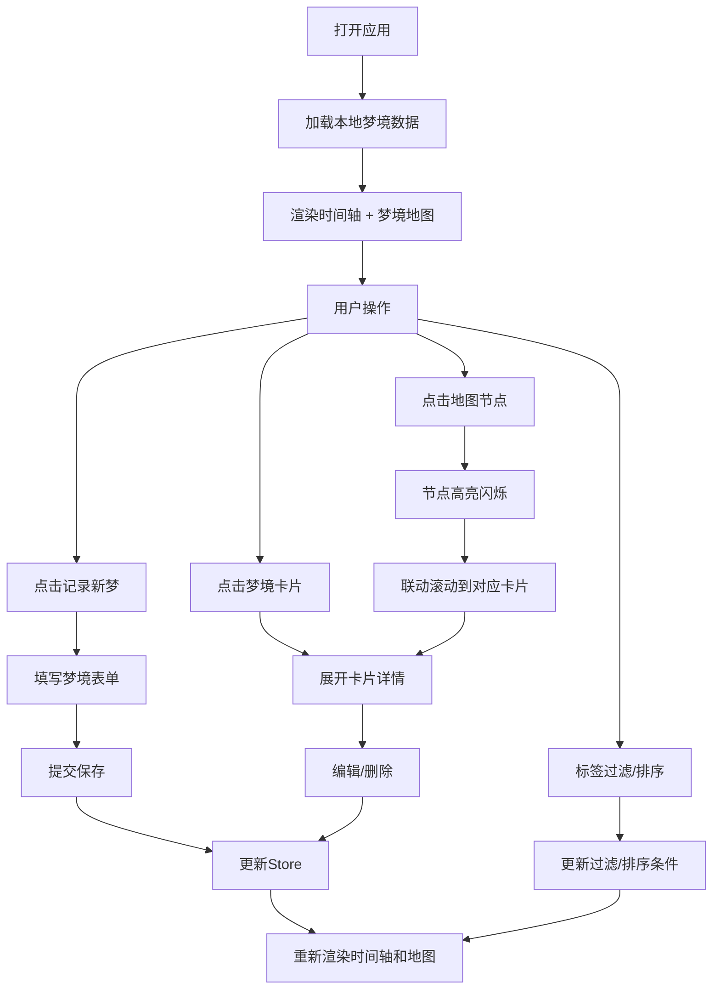

## 1. 产品概述

梦境地图是一款互动式梦境记录与可视化应用，让用户能够以时间轴和关键词标签的方式记录每次梦境的关键元素、情绪和情节片段，并自动生成一张风格化的梦境地图。

- 主要目的：帮助用户记录、整理和可视化梦境内容，通过可视化的方式发现梦境之间的关联和模式
- 目标用户：对梦境记录、心理学、自我探索感兴趣的用户
- 产品价值：将抽象的梦境转化为可视化的地图，提供沉浸式的梦境探索体验

## 2. 核心功能

### 2.1 用户角色

| 角色 | 注册方式 | 核心权限 |
|------|----------|----------|
| 普通用户 | 无需注册，本地存储 | 记录、编辑、删除梦境，查看梦境地图，标签过滤，排序 |

### 2.2 功能模块

1. **梦境时间轴**：按日期排列的梦境卡片列表，支持展开查看详情、编辑、删除
2. **梦境编辑器**：新建/编辑梦境的表单，包含标题、日期、情绪评分、关键词标签、情节文本
3. **梦境地图**：Canvas绘制的力导向布局地图，将梦境可视化为节点，标签关联形成连线
4. **标签过滤**：多标签组合过滤功能，快速筛选特定类型的梦境
5. **排序功能**：支持按情绪评分和日期的升序/降序排列

### 2.3 页面详情

| 页面名称 | 模块名称 | 功能描述 |
|-----------|-------------|---------------------|
| 主页面 | 导航栏 | 应用Logo、"记录新梦"按钮、毛玻璃半透明效果 |
| 主页面 | 梦境时间轴 | 左侧35%宽度，梦境卡片按日期降序排列，支持展开/收起 |
| 主页面 | 梦境地图 | 右侧65%宽度，Canvas力导向布局，节点可交互高亮 |
| 主页面 | 标签过滤栏 | 地图上方，胶囊形标签按钮，支持多选过滤 |
| 主页面 | 排序选择器 | 列表顶部，情绪/日期升序降序切换 |
| 弹窗 | 梦境编辑器 | 表单包含标题、日期、情绪星星评分、标签、情节文本域 |

## 3. 核心流程

### 3.1 主要用户流程

用户打开应用后看到左侧时间轴和右侧梦境地图。用户可以点击"记录新梦"按钮打开编辑器，填写梦境信息后提交，梦境会自动添加到时间轴并在地图上生成节点。用户可以点击时间轴卡片展开查看详情，或点击地图节点高亮并联动滚动到对应卡片。通过标签过滤和排序功能，用户可以快速筛选和整理梦境记录。

### 3.2 流程图

## 4. 用户界面设计

### 4.1 设计风格

- **主色调**：深紫色调暗色系主题
  - 主背景：#0D0D1A（深邃夜空蓝）
  - 卡片背景：#1A1A2E（深蓝紫色）
  - 强调色：#6C5CE7（梦幻紫色）
  - 文字颜色：#E0E0E0（柔和白色）
  - 边框颜色：#2D2D44（暗蓝紫色）

- **按钮风格**：
  - 主按钮：圆角8px，背景#6C5CE7，悬停亮度提升20%
  - 标签按钮：胶囊形状，圆角20px，背景#2D2D44，选中时背景#6C5CE7，0.2s过渡动画

- **字体**：
  - Logo字体：Caveat（手写风格），字号28px
  - 正文字体：系统无衬线字体，清晰易读

- **布局风格**：
  - 左右分栏布局，左侧35%时间轴，右侧65%梦境地图
  - 顶部固定56px高度导航栏，毛玻璃半透明效果
  - 卡片式设计，hover时轻微上移3px，阴影加深

- **动效设计**：
  - 卡片展开：从下向上滑入0.3s ease-out
  - 节点高亮：外发光#FFFFFF，发光半径8px，0.3s闪烁效果
  - 所有交互元素带平滑过渡动画

### 4.2 页面设计概述

| 页面名称 | 模块名称 | UI Elements |
|-----------|-------------|-------------|
| 主页面 | 导航栏 | 毛玻璃半透明背景，手写体Logo，紫色主按钮 |
| 主页面 | 梦境时间轴 | 暗紫色卡片，星星情绪评分，展开动画，编辑/删除按钮 |
| 主页面 | 梦境地图 | Canvas画布，彩色渐变节点，力导向布局，悬停提示 |
| 主页面 | 标签过滤栏 | 胶囊形标签按钮，选中状态过渡动画 |
| 弹窗 | 梦境编辑器 | 星级评分交互，彩色标签胶囊，实时字数统计 |

### 4.3 响应性

- 桌面端优先设计
- 左侧时间轴最小宽度280px
- Canvas画布自适应窗口大小
- 移动端考虑左右分栏改为上下布局

### 4.4 视觉细节

- 节点颜色渐变：从蓝色#4ECDC4（平静，情绪1）→ 黄色#FFE66D（中性，情绪3）→ 红色#FF6B6B（激烈，情绪5）
- 节点半径：情绪评分1-5对应半径25-50px
- 标签颜色：10色预设调色板随机分配
- 工具提示：背景#2D2D44，圆角8px，阴影0 4px 8px rgba(0,0,0,0.3)
