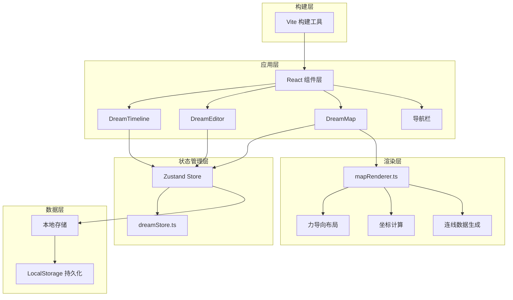

## 1. 架构设计



## 2. 技术栈说明

- **前端框架**：React 18 + TypeScript
- **构建工具**：Vite 5 + @vitejs/plugin-react
- **状态管理**：Zustand 4
- **唯一ID生成**：uuid 9
- **力导向布局**：d3-force 3
- **数据持久化**：LocalStorage API

## 3. 项目结构

```
d:\Pro\tasks\auto100
├── package.json
├── index.html
├── tsconfig.json
├── vite.config.js
└── src/
    ├── main.tsx
    ├── stores/
    │   └── dreamStore.ts
    ├── renderer/
    │   └── mapRenderer.ts
    └── components/
        ├── DreamTimeline.tsx
        ├── DreamEditor.tsx
        └── DreamMap.tsx
        └── Navbar.tsx
```

## 4. 数据模型

### 4.1 类型定义

```typescript
// 梦境记录接口
interface Dream {
  id: string;
  title: string;
  date: string; // YYYY-MM-DD 格式
  emotionRating: 1 | 2 | 3 | 4 | 5;
  tags: Tag[];
  content: string;
  createdAt: number;
}

// 标签接口
interface Tag {
  id: string;
  name: string;
  color: string;
}

// 排序类型
type SortType = 'date-desc' | 'date-asc' | 'emotion-desc' | 'emotion-asc';

// 地图节点
interface MapNode {
  id: string;
  dreamId: string;
  x: number;
  y: number;
  radius: number;
  color: string;
}

// 地图连线
interface MapLink {
  source: string;
  target: string;
  strength: number;
}

// 地图数据
interface MapData {
  nodes: MapNode[];
  links: MapLink[];
}
```

### 4.2 状态管理（dreamStore）

**状态**：
- `dreams: Dream[]` - 所有梦境记录
- `selectedDreamId: string | null` - 当前选中的梦境ID
- `activeTags: string[]` - 当前激活的标签过滤
- `sortType: SortType` - 当前排序方式
- `expandedDreamId: string | null` - 当前展开的梦境卡片ID
- `editorOpen: boolean` - 编辑器是否打开
- `editingDream: Dream | null` - 正在编辑的梦境

**Actions**：
- `addDream(dream: Omit<Dream, 'id' | 'createdAt'>): void`
- `updateDream(id: string, updates: Partial<Dream>): void`
- `deleteDream(id: string): void`
- `toggleTagFilter(tagId: string): void`
- `setSortType(sortType: SortType): void`
- `setSelectedDream(dreamId: string | null): void`
- `setExpandedDream(dreamId: string | null): void`
- `openEditor(dream?: Dream): void`
- `closeEditor(): void`

**计算属性（同步计算，保证<200ms响应）**：
- `filteredAndSortedDreams: Dream[]` - 根据过滤和排序条件计算的列表
- `allTags: Tag[]` - 所有出现过的标签

## 5. 模块职责

### 5.1 dreamStore.ts
- 管理梦境数据的增删改查
- 管理标签过滤和排序逻辑
- 管理UI状态（选中、展开、编辑器状态）
- 同步计算过滤和排序后的列表
- LocalStorage持久化

### 5.2 mapRenderer.ts（纯函数模块）
- 接收梦境列表和画布尺寸
- 使用d3-force计算力导向布局
- 迭代50次后锁定节点位置
- 返回节点坐标和连线数据
- 根据情绪评分计算节点颜色和半径
- 根据标签关联计算连线强度

### 5.3 DreamTimeline.tsx
- 渲染梦境卡片列表
- 按日期降序排列
- 卡片展开/收起动画
- 编辑/删除操作
- 排序选择器

### 5.4 DreamEditor.tsx
- 新建/编辑梦境表单
- 星星情绪评分交互
- 标签输入和管理
- 实时字数统计
- 表单验证

### 5.5 DreamMap.tsx
- Canvas画布渲染
- 节点和连线绘制
- 鼠标交互（悬停、点击）
- 工具提示显示
- 节点高亮闪烁效果
- 标签过滤按钮栏

### 5.6 Navbar.tsx
- 应用Logo展示
- "记录新梦"按钮
- 毛玻璃半透明效果

## 6. 性能优化策略

1. **Canvas渲染优化**：
   - 使用requestAnimationFrame保证帧率
   - 只在数据变化时重绘
   - 离屏缓存静态元素

2. **状态更新优化**：
   - Zustand选择器订阅避免不必要重渲染
   - 过滤和排序在action内同步完成

3. **力导向布局优化**：
   - 预计算50次迭代后锁定位置
   - 避免在动画帧内进行复杂计算

4. **列表渲染优化**：
   - 虚拟化长列表（如需要）
   - React.memo优化子组件

## 7. 关键算法

### 7.1 情绪颜色渐变算法
```typescript
function getEmotionColor(rating: number): string {
  // 1-2: 蓝色到黄色，3-5: 黄色到红色
  // 基于rating在#4ECDC4 → #FFE66D → #FF6B6B之间插值
}
```

### 7.2 力导向布局算法
- 同标签节点间吸引力：正电荷吸引
- 不同标签节点间排斥力：负电荷排斥
- 中心引力：防止节点飞出画布
- 碰撞检测：避免节点重叠
