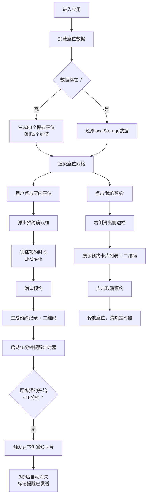

## 1. 产品概述

智选书阁是一个面向在线公共图书馆的座位预约与管理看板应用，旨在解决读者现场排队等候时间过长的问题。读者可提前在线选座、查看实时空位、设置到馆提醒，大幅提升图书馆资源利用效率。

- 核心目标：提供便捷的座位预约服务，减少现场排队，优化图书馆座位资源调度
- 目标用户：所有到馆读者
- 市场价值：提升图书馆运营效率，改善读者到馆体验

## 2. 核心功能

### 2.1 用户角色

| 角色 | 注册方式 | 核心权限 |
|------|----------|----------|
| 普通读者 | 默认进入（模拟登录） | 查看座位分布图、预约座位、取消预约、接收到馆提醒 |

### 2.2 功能模块

1. **座位网格可视化页面**：10x8座位分布图、区域过滤、座位状态展示、点击预约
2. **预约弹窗模块**：时间选择器（1/2/4小时）、确认预约
3. **我的预约侧边栏**：预约列表、二维码凭证、倒计时显示、取消预约
4. **到馆提醒通知**：预约前15分钟弹窗提醒
5. **数据持久化模块**：localStorage存储座位与预约数据

### 2.3 页面详情

| 页面名称 | 模块名称 | 功能描述 |
|----------|----------|----------|
| 主页（座位地图） | 导航栏 | 显示应用名称、用户头像、"我的预约"按钮 |
| 主页（座位地图） | 座位网格区 | 10x8座位分布图，A/B/C三区，按状态着色，点击空闲座位触发预约 |
| 主页（座位地图） | 信息面板区 | 区域统计信息、图例说明 |
| 预约弹窗 | 时间选择器 | 1小时/2小时/4小时按钮组选择 |
| 预约弹窗 | 确认预约 | 提交预约请求，调用seatStore.bookSeat |
| 我的预约侧边栏 | 预约卡片列表 | 展示所有有效预约，包含区域、座位号、时间、倒计时 |
| 我的预约侧边栏 | 二维码凭证 | 每张预约卡片底部展示入场二维码 |
| 我的预约侧边栏 | 取消预约 | 红色按钮取消对应预约 |
| 全局通知 | 到馆提醒 | 右下角滑入通知卡片，3秒后自动消失 |

## 3. 核心流程

用户进入页面后，系统从localStorage加载座位数据（首次则生成模拟数据）。用户浏览座位地图，点击空闲座位后弹出预约确认框，选择时长并确认后生成预约记录与二维码。预约开始前15分钟，系统触发提醒通知。用户可随时通过侧边栏查看/取消预约。

## 4. 用户界面设计

### 4.1 设计风格

- **主色调**：空闲#4ECDC4（青绿）、占用#636E72（深灰）、维修#FF6B6B（珊瑚红）、按钮主色#4ECDC4
- **背景色**：主背景#1A1A2E（深蓝紫）、卡片底色#2D2D44
- **文字色**：主文字#E0E0E0、次文字#A0A0B0
- **整体风格**：深色科技风、毛玻璃效果、圆角卡片、精致阴影
- **按钮样式**：圆角8px、悬停上移1px（0.2s ease）、点击缩放0.95倍（0.1s ease）
- **字体**：无衬线现代字体，标题20px粗体，正文14px常规
- **布局风格**：顶部导航栏固定，主区域左右分栏（座位区flex:3，信息面板flex:1），最大宽度1280px居中
- **图标风格**：使用lucide-react图标库，线性简约风格

### 4.2 页面设计概述

| 页面名称 | 模块名称 | UI元素 |
|----------|----------|--------|
| 主页 | 导航栏 | 高度64px，毛玻璃效果，左侧应用名"智选书阁"（20px粗体#4ECDC4），右侧用户头像（圆形36px#636E72）+预约按钮 |
| 主页 | 座位网格区 | 背景#2D2D44，10x8网格，格子50x50px圆角6px，A/B/C区虚线分隔（1px#636E72间距12px），区域名14px粗体#A0A0B0 |
| 主页 | 信息面板区 | 卡片#2D2D44圆角12px，区域统计、过滤按钮、图例 |
| 预约弹窗 | 模态框 | 宽320px，背景#1E1E2ECC毛玻璃，圆角16px，0.4s fadeIn动画 |
| 预约弹窗 | 时间选择器 | 按钮组，选中背景#4ECDC4白字，圆角8px |
| 预约弹窗 | 确认按钮 | 宽100%，背景#4ECDC4，悬停#6DD5D5 |
| 我的预约侧边栏 | 侧边栏 | 宽300px，背景#1E1E2E，右侧slide-in 0.3s ease |
| 我的预约侧边栏 | 预约卡片 | 宽250px，背景#2D2D44，圆角12px，阴影0 4px 12px rgba(0,0,0,0.25) |
| 我的预约侧边栏 | 取消按钮 | 红色#FF6B6B，悬停#E55A5A |
| 全局通知 | 通知卡片 | 宽280px，背景#2D2D44，阴影0 8px 24px rgba(0,0,0,0.3)，右下角右侧滑入0.5s ease，3秒消失 |

### 4.3 响应式设计

- 桌面端（≥768px）：左右分栏布局，座位区flex:3，信息面板flex:1
- 移动端（<768px）：单列布局，座位网格每排8个，网格间距缩小50%，信息面板移至网格下方
- 所有交互区域最小触控目标44x44px

### 4.4 性能约束

- 座位状态更新（点击/取消）DOM渲染≤50ms
- 使用React.memo + useCallback优化座位格子组件
- 每帧渲染≤16ms（60fps）
- 通知调度器使用setTimeout链式调用（避免setInterval累积误差）
- 二维码生成使用requestIdleCallback避免阻塞交互
