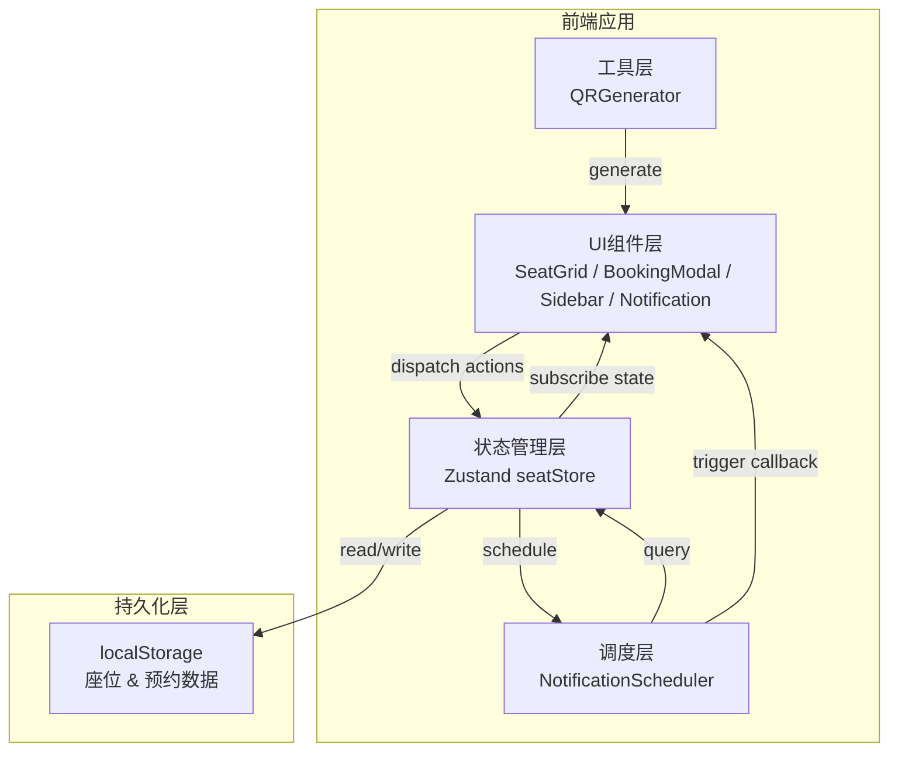

## 1. 架构设计



## 2. 技术描述

- **前端框架**：React 18 + TypeScript
- **构建工具**：Vite 5（开发端口3000）
- **状态管理**：Zustand 4
- **二维码库**：qrcode.react
- **唯一ID**：uuid
- **持久化方案**：浏览器localStorage（自定义中间件）
- **无后端**：纯前端应用，数据本地存储

## 3. 路由定义

本应用为单页应用（SPA），不涉及路由切换，所有功能在一个页面内完成。

| 路由 | 用途 |
|------|------|
| / | 主页面，包含座位地图、预约弹窗、侧边栏、通知系统 |

## 4. 数据模型与类型定义

### 4.1 核心类型

```typescript
// 座位区域
type SeatZone = 'A' | 'B' | 'C';

// 座位状态
type SeatStatus = 'available' | 'occupied' | 'maintenance';

// 座位标签
interface SeatTags {
  windowView?: boolean;  // 窗口位
  powerOutlet?: boolean; // 电源位
  quietZone?: boolean;   // 安静区
}

// 座位
interface Seat {
  id: string;
  seatNumber: string;      // 如 A-01, B-15
  zone: SeatZone;
  row: number;             // 网格行 0-7
  col: number;             // 网格列 0-9
  status: SeatStatus;
  tags: SeatTags;
}

// 预约时长
type BookingDuration = 1 | 2 | 4;

// 预约记录
interface Booking {
  id: string;
  seatId: string;
  seatNumber: string;
  zone: SeatZone;
  userId: string;          // 当前用户模拟ID
  startTime: number;       // 时间戳 ms
  duration: BookingDuration; // 小时
  endTime: number;         // 时间戳 ms
  qrCodeData: string;      // 二维码内容
  reminderSent: boolean;   // 提醒是否已发送
  createdAt: number;
}

// 过滤条件
interface SeatFilter {
  zone: SeatZone | 'all';
  windowView: boolean;
  powerOutlet: boolean;
  quietZone: boolean;
}

// 通知消息
interface NotificationItem {
  id: string;
  bookingId: string;
  message: string;
  seatInfo: string;
  minutesLeft: number;
  createdAt: number;
}
```

### 4.2 数据初始化策略

- **首次加载**：生成80个座位（A区30个、B区30个、C区20个），分布在10x8网格中；随机选择5个座位标记为维修状态
- **数据持久化**：座位状态和预约记录通过zustand persist中间件写入localStorage，key为 `zhixuan-seats` 和 `zhixuan-bookings`

## 5. 项目文件结构

```
auto101/
├── package.json
├── vite.config.js
├── tsconfig.json
├── index.html
└── src/
    ├── main.tsx                    # React入口
    ├── App.tsx                     # 根组件，组合导航+主区域
    ├── index.css                   # 全局样式，CSS变量，动画
    ├── types/
    │   └── index.ts                # 类型定义（Seat, Booking等）
    ├── stores/
    │   └── seatStore.ts            # Zustand状态管理
    ├── renderer/
    │   └── SeatGrid.tsx            # 座位网格渲染组件
    ├── scheduler/
    │   └── NotificationScheduler.ts # 到馆提醒调度器
    ├── utils/
    │   └── QRGenerator.ts          # 二维码生成工具
    └── components/
        ├── Navbar.tsx              # 顶部导航栏
        ├── InfoPanel.tsx           # 右侧信息面板
        ├── BookingModal.tsx        # 预约确认弹窗
        ├── BookingSidebar.tsx      # "我的预约"侧边栏
        ├── BookingCard.tsx         # 预约卡片（含二维码）
        ├── NotificationToast.tsx   # 通知卡片组件
        └── SeatCell.tsx            # 单个座位格子（memo优化）
```

## 6. 模块职责说明

| 模块 | 输入 | 输出 | 核心职责 |
|------|------|------|----------|
| seatStore.ts | 座位点击事件、预约/取消动作 | 座位列表、预约记录、选中座位、过滤条件 | 状态持久化、业务逻辑（预约冲突检测、时间计算） |
| SeatGrid.tsx | seatStore状态、过滤条件 | onSeatClick回调 | 10x8网格渲染、区域分组、视觉着色、交互反馈 |
| NotificationScheduler.ts | 预约列表（订阅） | 触发onReminder回调 | setTimeout链式调度、15分钟前触发、状态标记 |
| QRGenerator.ts | bookingId | 二维码数据字符串 | 生成可被qrcode.react渲染的字符串 |
| BookingModal.tsx | 选中座位、onConfirm/onCancel | 确认预约（时长参数） | 模态框UI、时长选择、确认提交 |
| BookingSidebar.tsx | 预约列表、onCancel | 打开/关闭侧边栏 | 滑出动画、卡片列表渲染、取消按钮 |
| NotificationToast.tsx | 通知消息 | onClose回调 | 右下角滑入动画、3秒自动消失 |
