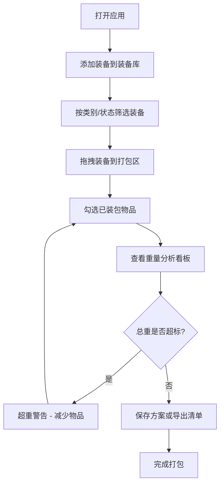

## 1. 产品概述

装备打包大师是一款面向旅行、露营及户外爱好者的可视化装备库存管理与出行打包清单应用。通过直觉式的拖拽交互、实时重量分析和分类色彩系统，解决传统笔记或表格难以直观对比装备重量、分类存储和检查物品重复性的问题，让用户一眼掌握哪些装备已打包、哪些重复、总负重是否超标。

## 2. 核心功能

### 2.1 用户角色

| 角色 | 注册方式 | 核心权限 |
|------|----------|----------|
| 普通用户 | 无需注册 | 装备库管理、打包清单生成、方案保存与导出 |

### 2.2 功能模块

1. **装备库管理页面**：侧边面板添加/筛选装备，卡片式展示
2. **打包清单页面**：中央拖拽式打包区，勾选管理，实时重量统计
3. **重量分析看板**：分类条形图对比，超重警告提示

### 2.3 页面详情

| 页面名称 | 模块名称 | 功能描述 |
|----------|----------|----------|
| 装备库面板 | 添加装备表单 | 输入名称、选择类别（露营/徒步/摄影/急救/衣物）、输入重量（克）、选择状态（已拥有/待购买） |
| 装备库面板 | 装备卡片列表 | 每个装备以卡片展示，左侧类别色条，右侧重量与状态标签，支持按类别和状态筛选，筛选动画0.3s ease渐入渐出 |
| 装备库面板 | 方案列表 | 保存的打包方案展示，点击加载，最多5个方案 |
| 打包区 | 拖放区域 | 从装备库拖入装备，排列为纵向列表，虚线边框drop时变实线高亮 |
| 打包区 | 勾选管理 | 每个条目可勾选，选中后卡片半透明+删除线 |
| 打包区 | 重量累计 | 底部固定区域实时显示已勾选物品总重量 |
| 重量看板 | 分类条形图 | 各类别已装包物品总重量对比，条形宽度比例与最大值对齐 |
| 重量看板 | 超重警告 | 总重超过阈值（默认15kg）时顶部横幅变红并脉冲闪烁提示 |
| 方案持久化 | 保存与加载 | localStorage保存最多5个方案，命名后列表展示，点击加载全部状态 |
| 方案持久化 | 导出清单 | 导出为纯文本"装备名-重量-已勾选"，触发下载 |

## 3. 核心流程

用户打开应用后，首先在左侧装备库面板中添加各类装备（名称、类别、重量、状态），装备以带类别色条的卡片形式展示。用户可通过筛选器快速定位特定类别或状态的装备。接下来，用户将所需装备卡片拖拽至中央打包区域，系统自动排列为纵向列表。在打包区内，用户逐项勾选已实际装入的物品，勾选后卡片变为半透明并加删除线，底部实时累计已勾选物品总重量。右侧重量看板同步展示各类别重量分布的条形图，当总重超过设定阈值时发出超重警告。用户可将当前打包方案保存至本地存储或导出为文本清单。

## 4. 用户界面设计

### 4.1 设计风格

- **主题**：深色科幻风格
- **主背景色**：#0D1321
- **次要背景色**：#1B263B
- **强调色**：#76B5C2
- **文字色**：#E0E1DD
- **类别色条**：露营#F4A261、徒步#E76F51、摄影#2A9D8F、急救#E9C46A、衣物#264653
- **卡片样式**：圆角8px，hover时阴影从无到0 0 8px rgba(118,181,194,0.4)，0.2s ease过渡
- **布局风格**：三栏布局（侧边栏300px + 中央打包区640px + 右侧看板280px）
- **字体**：使用科幻感字体（如 JetBrains Mono / Orbitron 配 Noto Sans SC）

### 4.2 页面设计概览

| 页面名称 | 模块名称 | UI元素 |
|----------|----------|--------|
| 装备库面板 | 添加表单 | 输入框、下拉选择器、添加按钮，背景#1B263B，圆角12px |
| 装备库面板 | 装备卡片 | 宽100%高64px，背景#2D4059，圆角8px，左侧4px类别色条，右侧重量+标签 |
| 装备库面板 | 筛选器 | 类别按钮组+状态下拉，筛选切换卡片0.3s ease渐入渐出 |
| 装备库面板 | 方案列表 | 列表项圆角8px，宽度100%，点击加载 |
| 打包区 | 拖放区域 | 宽640px最小高400px，背景#1E2D42，虚线边框#4A6FA5，drop高亮实线#76B5C2 |
| 打包区 | 勾选项 | Checkbox 20x20px，选中半透明opacity0.5+删除线 |
| 打包区 | 重量显示 | 底部固定，字体#E0E1DD 20px加粗 |
| 重量看板 | 条形图 | 条形高24px，颜色同类别色，数值单位克，宽度比例对齐最大值 |
| 重量看板 | 超重横幅 | 顶部横幅#E63946，0.5s ease-in-out脉冲闪烁 |

### 4.3 响应式设计

- 桌面优先设计，三栏布局
- 视口宽度 < 900px 时，三列变为一列上下排列
- 触摸设备拖拽使用 touch 事件兼容

### 4.4 动效设计

- 卡片hover：阴影0.2s ease过渡
- 拖拽中：被拖拽元素跟随鼠标，透明度0.8，缩放0.95倍
- 筛选动画：卡片渐入渐出0.3s ease
- 超重警告：0.5s ease-in-out脉冲闪烁
- 震动反馈：筛选和保存操作时元素短时偏移1px 50ms
