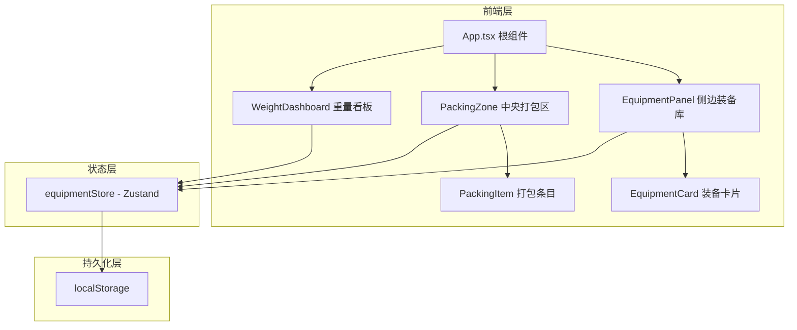
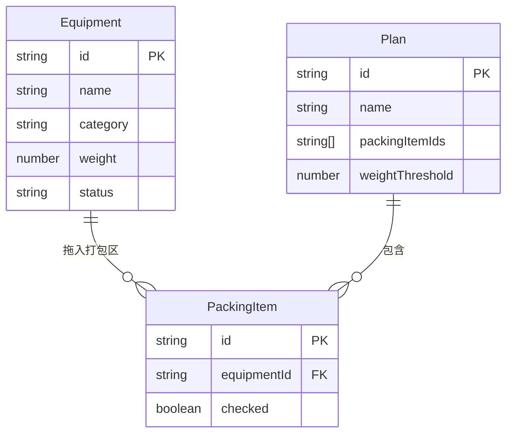

## 1. 架构设计



## 2. 技术说明

- **前端框架**：React 18 + TypeScript
- **构建工具**：Vite
- **状态管理**：Zustand
- **样式方案**：CSS Modules
- **唯一标识**：uuid
- **持久化**：localStorage
- **包管理器**：npm

## 3. 路由定义

本应用为单页面应用，无路由切换。所有功能在同一页面三栏布局中呈现。

| 路径 | 用途 |
|------|------|
| / | 主页面，包含装备库、打包区、重量看板三栏 |

## 4. 数据模型

### 4.1 数据模型定义



### 4.2 类型定义

```typescript
type Category = '露营' | '徒步' | '摄影' | '急救' | '衣物';
type Status = '已拥有' | '待购买';

interface Equipment {
  id: string;
  name: string;
  category: Category;
  weight: number;
  status: Status;
}

interface PackingItem {
  id: string;
  equipmentId: string;
  checked: boolean;
}

interface Plan {
  id: string;
  name: string;
  packingItems: PackingItem[];
  weightThreshold: number;
}
```

### 4.3 Zustand Store 设计

```typescript
interface EquipmentStore {
  equipments: Equipment[];
  packingItems: PackingItem[];
  plans: Plan[];
  filterCategory: Category | null;
  filterStatus: Status | null;
  weightThreshold: number;

  addEquipment: (eq: Omit<Equipment, 'id'>) => void;
  removeEquipment: (id: string) => void;
  addToPacking: (equipmentId: string) => void;
  removeFromPacking: (id: string) => void;
  toggleChecked: (id: string) => void;
  filterByCategory: (cat: Category | null) => void;
  filterByStatus: (status: Status | null) => void;
  savePlan: (name: string) => void;
  loadPlan: (planId: string) => void;
  setWeightThreshold: (threshold: number) => void;
}
```

## 5. 文件结构

```
├── package.json
├── vite.config.js
├── tsconfig.json
├── index.html
└── src/
    ├── stores/
    │   └── equipmentStore.ts
    ├── components/
    │   ├── EquipmentCard.tsx
    │   ├── PackingZone.tsx
    │   └── WeightDashboard.tsx
    ├── hooks/
    │   ├── useDrag.ts
    │   └── useDrop.ts
    ├── App.tsx
    └── App.module.css
```
