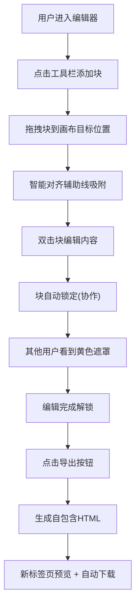

## 1. 产品概述

在线协作简报编辑器，解决团队多人分散编辑图文简报后手动汇总排版效率低下的问题，支持多人实时协作编辑A4简报，最终一键导出为HTML页面。

## 2. 核心功能

### 2.1 功能模块

1. **编辑器主界面**: 工具栏、A4画布、块编辑
2. **协作锁定**: 多用户状态显示、区块锁定
3. **智能对齐**: 拖拽辅助线、自动吸附
4. **导出功能**: HTML导出与下载

### 2.2 页面详情

| 页面名称 | 模块名称 | 功能描述 |
|---------|---------|---------|
| 编辑器主页 | 左侧工具栏 | 添加标题块、文本块、图片块，图标悬停旋转动画 |
| 编辑器主页 | 中央画布 | A4比例画布，网格背景，块拖拽与双击编辑 |
| 编辑器主页 | 协作侧边栏 | 右侧滑入，显示在线用户及编辑中的区块 |
| 编辑器主页 | 导出按钮 | 右下角浮动圆形按钮，一键导出HTML |

## 3. 核心流程

## 4. 用户界面设计

### 4.1 设计风格
- 主背景: #111827 (深色主题)
- 画布背景: 白色
- 工具栏: #1E1E2E
- 主色调: #3B82F6 (蓝色)
- 辅助色: #EF4444 (红色对齐线), #FBBF24 (锁定遮罩), #10B981 (在线状态)
- 文字: #F9FAFB
- 按钮: 圆角设计，渐变背景，点击缩放动画

### 4.2 页面设计概览

| 页面名称 | 模块名称 | UI元素 |
|---------|---------|--------|
| 编辑器主页 | 工具栏 | 固定80px宽，深色背景，白色24px图标，悬停顺时针旋转15度 |
| 编辑器主页 | 画布 | 794px宽，白色背景，#D1D5DB虚线边框，20px间距浅灰网格 |
| 编辑器主页 | 块组件 | 绝对定位，选中时#3B82F6虚线边框，四角缩放把手 |
| 编辑器主页 | 协作侧边栏 | 280px宽，从右侧滑入0.3s，#2D2D44背景，圆角16px 0 0 16px |
| 编辑器主页 | 导出按钮 | 48x48px圆形，渐变蓝色渐变，悬停阴影扩散 |

### 4.3 响应式
- 桌面端(≥1024px): 左侧固定工具栏 + 中央画布 + 右侧协作栏
- 移动端(<1024px): 顶部横向工具栏(高60px)，画布自适应宽度100%
