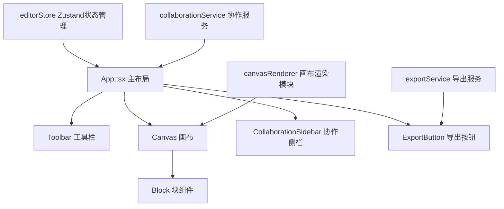

## 1. 架构设计



## 2. 技术说明

- 前端: React 18 + TypeScript + Vite
- 状态管理: Zustand
- 拖拽: 原生拖拽实现（requestAnimationFrame优化性能）
- 唯一ID: uuid

## 3. 目录结构

| 文件路径 | 用途 |
|---------|-----|
| src/main.tsx | React入口 |
| src/App.tsx | 主布局组件 |
| src/stores/editorStore.ts | Zustand全局状态管理 |
| src/components/Toolbar.tsx | 左侧工具栏 |
| src/components/Canvas.tsx | 画布组件 |
| src/components/Block.tsx | 单个块组件 |
| src/services/collaborationService.ts | 协作锁定服务 |
| src/services/exportService.ts | 导出服务 |
| src/renderer/canvasRenderer.ts | 画布渲染模块 |

## 4. 数据模型

### 4.1 Block 数据结构

```typescript
interface Block {
  id: string;
  type: 'title' | 'text' | 'image';
  x: number;
  y: number;
  width: number;
  height: number;
  content: string;
  lockedBy?: string;
}
```

### 4.2 User 数据结构

```typescript
interface User {
  id: string;
  name: string;
  color: string;
  online: boolean;
  editingBlockId?: string;
}
```
