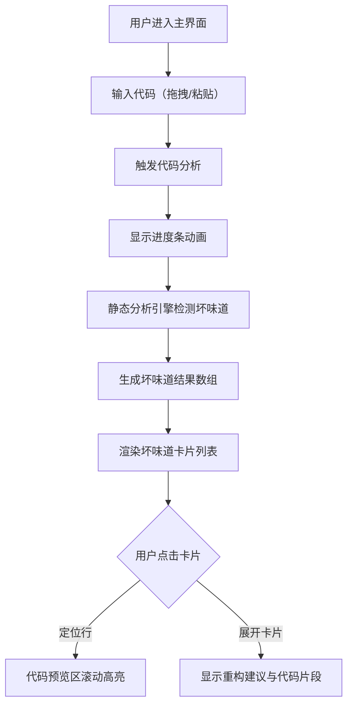

## 1. 产品概述

代码气味辨识盒是一款面向JavaScript开发者的代码质量辅助工具，通过静态分析快速识别代码中的"坏味道"，并以可视化卡片形式直观展示问题位置、严重程度与重构建议，帮助开发者提升代码质量。

- 核心目标：降低代码审查门槛，让开发者在提交代码前即可发现潜在问题
- 目标用户：前端开发者、代码审查员、技术面试官
- 产品价值：将枯燥的代码静态分析转化为直观的视觉化体验，提升重构效率

## 2. 核心功能

### 2.1 用户角色

| 角色 | 注册方式 | 核心权限 |
|------|----------|----------|
| 开发者用户 | 无需注册，直接使用 | 上传代码、查看分析结果、定位代码行 |

### 2.2 功能模块

1. **主界面**：左侧微导航栏、右侧内容区（上传区 + 分析结果区 + 代码预览区）
2. **代码输入模块**：拖拽上传.js文件、粘贴代码文本
3. **代码分析引擎**：检测过长函数、重复代码、过多参数、深层嵌套等坏味道
4. **结果展示模块**：卡片式坏味道列表，支持展开/折叠，颜色编码严重等级
5. **代码预览模块**：带行号的代码展示，点击卡片自动滚动并高亮对应行

### 2.3 页面详情

| 页面名称 | 模块名称 | 功能描述 |
|----------|----------|----------|
| 主界面 | 微导航栏 | 60px固定宽度，品牌图标，页面导航，选中项高亮 |
| 主界面 | 上传区域 | 虚线边框拖拽区，支持粘贴、拖拽、点击上传 |
| 主界面 | 进度条 | 分析过程进度展示，蓝色填充动画 |
| 主界面 | 坏味道卡片列表 | 网格布局卡片，颜色标签，展开动画，重构建议 |
| 主界面 | 代码预览区 | 带行号代码展示，行高亮，滚动联动 |

## 3. 核心流程

用户进入主界面 → 通过拖拽或粘贴输入JavaScript代码 → 触发分析引擎执行静态检测 → 展示分析进度条 → 生成坏味道卡片列表 → 用户点击卡片 → 代码预览区滚动定位并高亮 → 用户展开卡片查看重构建议

## 4. 用户界面设计

### 4.1 设计风格

- **主色调**：深蓝灰暗色主题，层次为 #0F172A（最深）→ #1E293B → #334155（最浅面板）
- **点缀色**：#3B82F6（蓝色，主交互色）、#10B981（绿色，成功/低风险）
- **警示色**：#EF4444（红色，严重）、#F59E0B（橙色，中等）、#10B981（绿色，低危）
- **高亮色**：#FEF08A（黄色，代码行高亮背景）
- **圆角**：卡片/按钮统一 8-12px 圆角
- **阴影**：柔和投影 `0 4px 12px rgba(0,0,0,0.3)`
- **字体**：代码区使用等宽字体（JetBrains Mono / Fira Code），UI区使用现代无衬线字体
- **动效**：所有交互过渡 0.2-0.4s，卡片入场从右侧滑入 0.4s ease，进度条过渡 0.5s ease

### 4.2 页面设计概览

| 页面名称 | 模块名称 | UI元素 |
|----------|----------|--------|
| 主界面 | 微导航栏 | 60px宽 #0F172A背景，白色24x24px图标，选中项#3B82F6高亮条 |
| 主界面 | 上传区域 | 100%宽 200px高，2px dashed #475569，12px圆角，hover/drag时#3B82F6缩放1.01 |
| 主界面 | 进度条 | 6px高，#1E293B背景，#3B82F6填充，0.5s ease过渡 |
| 主界面 | 坏味道卡片 | 320px宽，#334155背景，12px圆角，入场滑入动画，顶部彩色严重度标签 |
| 主界面 | 代码预览区 | 深色背景，等宽字体，行号列，#FEF08A高亮行背景 |

### 4.3 响应式

- **桌面端（>768px）**：左右分栏布局，微导航60px固定，内容区自适应
- **移动端（≤768px）**：上下布局，微导航变为顶部横向导航条，上传区→卡片区→代码区垂直排列
- **触摸优化**：卡片点击区域增大至44px+，按钮最小触摸尺寸

## 4.4 动画细节

- **上传区**：拖拽进入时边框变蓝 + scale(1.01)，0.2s ease
- **分析进度条**：width属性0.5s ease过渡，模拟渐进式填充
- **卡片入场**：transform: translateX(60px) → translateX(0)，opacity: 0→1，0.4s ease，逐卡片延迟
- **卡片展开**：max-height + opacity过渡，0.3s ease
- **代码高亮**：目标行背景色渐变过渡，0.3s ease
