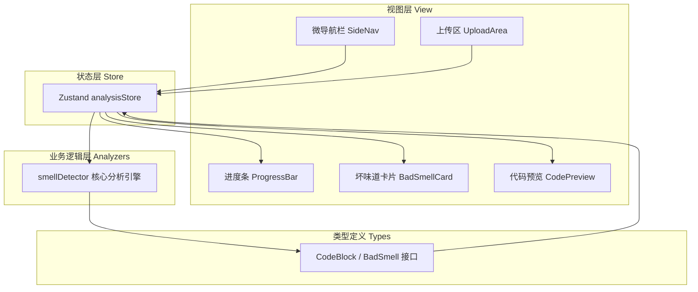

## 1. 架构设计



## 2. 技术描述

- **前端框架**：React 18 + TypeScript 5（严格模式）
- **构建工具**：Vite 5 + @vitejs/plugin-react
- **状态管理**：Zustand 4
- **样式方案**：TailwindCSS 3 + PostCSS + Autoprefixer
- **工具库**：uuid（唯一标识坏味道卡片）
- **代码分析**：自研静态分析模块（正则 + 简单AST遍历），无需外部依赖

## 3. 项目文件结构

```
auto107/
├── index.html              # Vite入口HTML，挂载#root
├── package.json            # 依赖与脚本配置
├── vite.config.js          # Vite配置（React + Tailwind插件）
├── tsconfig.json           # TypeScript严格模式配置
├── tailwind.config.js      # Tailwind自定义主题色
├── postcss.config.js       # PostCSS配置
└── src/
    ├── main.tsx            # React入口
    ├── App.tsx             # 主应用组件，布局组装
    ├── index.css           # 全局样式 + Tailwind指令
    ├── types.ts            # 接口类型定义
    ├── store/
    │   └── analysisStore.ts   # Zustand状态管理
    ├── analyzers/
    │   └── smellDetector.ts   # 坏味道静态分析引擎
    └── components/
        ├── SideNav.tsx        # 左侧微导航
        ├── UploadArea.tsx     # 拖拽/粘贴上传区
        ├── ProgressBar.tsx    # 分析进度条
        ├── BadSmellCard.tsx   # 单个坏味道卡片
        ├── BadSmellList.tsx   # 卡片网格容器
        └── CodePreview.tsx    # 代码预览与行高亮
```

## 4. 类型定义（TypeScript接口）

```typescript
// 代码块位置信息
interface CodePosition {
  startLine: number;
  endLine: number;
  startColumn?: number;
  endColumn?: number;
}

// 坏味道严重程度
type Severity = 'critical' | 'medium' | 'low';

// 单个坏味道
interface BadSmell {
  id: string;           // uuid
  type: string;         // 类型标识：long-function / duplicate-code / too-many-params / deep-nesting
  name: string;         // 显示名称
  severity: Severity;   // 严重程度
  description: string;  // 问题描述
  suggestion: string;   // 重构建议（一行）
  position: CodePosition; // 代码位置
  snippet: string;      // 相关代码片段
}

// 分析状态
type AnalysisStatus = 'idle' | 'analyzing' | 'completed' | 'error';

// 分析结果
interface AnalysisResult {
  status: AnalysisStatus;
  progress: number;     // 0-100
  badSmells: BadSmell[];
  error?: string;
}
```

## 5. Zustand Store 设计

**analysisStore** 状态与操作：

```typescript
interface AnalysisState {
  // 状态
  rawCode: string;              // 原始代码字符串
  fileName: string;             // 文件名（拖拽时）
  analysisResult: AnalysisResult;
  selectedSmellId: string | null;  // 当前选中卡片ID
  expandedSmellIds: Set<string>;   // 展开的卡片ID集合
  activeNav: string;            // 当前导航项

  // 操作
  setRawCode: (code: string, fileName?: string) => void;
  startAnalysis: () => Promise<void>;  // 调用smellDetector
  toggleSmellExpand: (id: string) => void;
  selectSmell: (id: string) => void;
  setActiveNav: (nav: string) => void;
  reset: () => void;
}
```

## 6. 静态分析引擎（smellDetector）策略

| 坏味道类型 | 检测策略 | 判定阈值 |
|-----------|---------|---------|
| **过长函数 (long-function)** | 正则匹配`function`/箭头函数，统计函数体内行数 | 函数体 > 50行触发（严重>80，中等51-80，低≤50可调） |
| **重复代码 (duplicate-code)** | 按行归一化（去空格/注释），滑动窗口比对重复行块 | 连续 ≥ 5行完全重复标记为重复 |
| **过多参数 (too-many-params)** | 正则提取函数参数列表，统计参数个数 | 参数 > 4个（严重>7，中等5-7，低提示） |
| **深层嵌套 (deep-nesting)** | 统计`{}`嵌套层级（if/for/while/try/switch） | 嵌套深度 ≥ 4层（严重≥6，中等4-5） |

分析流程：逐行扫描 → 函数边界识别 → 嵌套栈追踪 → 多维度并行检测 → 聚合结果 → 计算严重度等级

性能优化：代码长度>200行时分片处理，200行以内目标<5秒。
