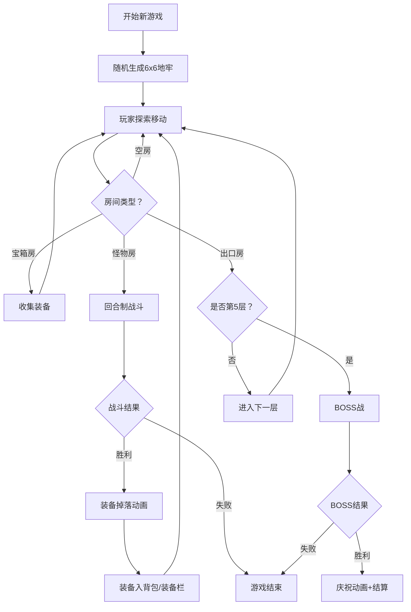

## 1. 产品概述

深渊地牢是一款浏览器端即时生成地牢探险Roguelike游戏，解决传统地牢游戏关卡固定、重复可玩性低的问题。每次开始新游戏时动态生成6x6网格随机地牢，玩家在随机房间布局中探索、收集不同品质装备、与不断变强的怪物战斗，每5层挑战BOSS并获得胜利结算。

- 目标用户：喜欢Roguelike地牢探险的休闲/中度玩家
- 核心价值：无限随机重玩性 + 即时浏览器体验 + 装备收集驱动

## 2. 核心功能

### 2.2 功能模块

1. **游戏主界面**：Canvas游戏画布 + 右侧角色/背包面板 + 战斗覆盖层
2. **地牢探索页面**：6x6随机地牢网格、WASD移动、房间交互

### 2.3 页面详情

| 页面名称 | 模块名称 | 功能描述 |
|---------|---------|---------|
| 游戏主界面 | Canvas画布 | 绘制地牢网格、角色、怪物、粒子特效、星空背景 |
| 游戏主界面 | 角色属性面板 | 攻击力/防御力/生命值/法力值显示，数值变动飘动动画 |
| 游戏主界面 | 装备背包面板 | 4格装备栏（武器/头盔/铠甲/靴子）+ 16格背包，拖拽交换 |
| 游戏主界面 | 战斗覆盖层 | 半透明遮罩、怪物信息、普通攻击/技能攻击按钮 |
| 游戏主界面 | BOSS战 | 红色预警圈、范围攻击机制、3倍血量 |
| 游戏主界面 | 胜利结算 | 粒子爆炸、金色"胜利"文字、数据统计面板 |

## 3. 核心流程

玩家启动游戏 → 系统生成6x6随机地牢 → 玩家WASD移动探索 → 进入宝箱房收集装备 / 进入怪物房触发回合制战斗 → 击败怪物掉落装备（白<蓝<紫<橙）→ 装备拖拽到角色身上增强属性 → 找到出口进入下一层 → 每5层进入BOSS战 → 击败BOSS显示胜利结算动画和数据统计

## 4. 用户界面设计

### 4.1 设计风格

- 主色调：深色科幻风，背景 #0B0C10 → #1F2833 径向渐变
- 强调色：青色 #45A29E / #66FCF1，金色 #FFD700
- 按钮：圆角8px，背景 #45A29E，hover #66FCF1 + 放大1.05倍
- 字体：无衬线字体，标题48px，正文14-16px
- 布局：画布居中占满，右侧固定半透明毛玻璃面板

### 4.2 页面设计概览

| 页面名称 | 模块名称 | UI元素 |
|---------|---------|--------|
| 游戏主界面 | Canvas画布 | 深色渐变背景、闪烁星辰1-3px、深色墙体#2D2D44、浅色地面#4A4A6A |
| 游戏主界面 | 角色面板 | 宽240px半透明#1E1E2ECC、毛玻璃blur(8px)、圆角12px、属性数值飘动动画 |
| 游戏主界面 | 装备区 | 4格装备槽+16格背包、品质颜色边框、拖拽交互、装备闪烁0.3s |
| 游戏主界面 | 战斗层 | 全屏遮罩#000000AA、怪物信息+血条、双按钮（普通/技能） |
| 游戏主界面 | BOSS预警 | 红色脉冲圈直径100px、持续0.8s |
| 游戏主界面 | 胜利结算 | 全屏多色粒子5-15px爆炸2s、金色渐变48px"胜利"文字 |

### 4.3 响应式

- 桌面优先：画布居中 + 右侧面板
- 窄屏（<768px）：画布宽度不小于320px，面板折叠为顶部/底部条
- 所有交互元素支持触摸操作

### 4.4 性能要求

- 目标帧率：60FPS
- 粒子上限：200个，超出自动剔除
- 动画降级：粒子超限时平滑降级效果
