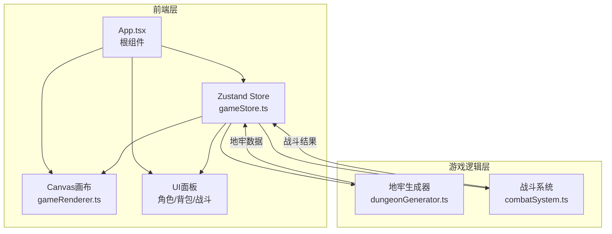

## 1. 架构设计



## 2. 技术说明

- 前端：React 18 + TypeScript + Vite
- 状态管理：Zustand
- 渲染：Canvas 2D API（纯Canvas渲染器，无DOM游戏元素）
- 样式：CSS Modules / 内联样式（面板UI部分）
- 初始化工具：vite-init（react-ts模板）
- 后端：无（纯前端游戏）
- 数据库：无（所有数据运行时生成，状态保存在内存）

## 3. 路由定义

| 路由 | 用途 |
|------|------|
| / | 游戏主页面，包含Canvas画布和所有UI面板 |

## 4. 数据模型

### 4.1 核心类型定义

```typescript
interface Room {
  id: string;
  x: number;
  y: number;
  width: number;
  height: number;
  type: 'empty' | 'chest' | 'monster' | 'exit' | 'boss';
  connections: string[];
  cleared: boolean;
  monster?: Monster;
  loot?: Equipment[];
}

interface Monster {
  name: string;
  hp: number;
  maxHp: number;
  attack: number;
  isBoss: boolean;
  specialSkill?: {
    name: string;
    damage: number;
    cooldown: number;
    currentCooldown: number;
  };
}

interface Equipment {
  id: string;
  name: string;
  slot: 'weapon' | 'helmet' | 'armor' | 'boots';
  quality: 'white' | 'blue' | 'purple' | 'orange';
  attackBonus: number;
  defenseBonus: number;
}

interface Player {
  hp: number;
  maxHp: number;
  mp: number;
  maxMp: number;
  attack: number;
  defense: number;
  x: number;
  y: number;
  equipment: Record<'weapon' | 'helmet' | 'armor' | 'boots', Equipment | null>;
  backpack: Equipment[];
}

interface GameState {
  player: Player;
  dungeon: Room[][];
  currentFloor: number;
  inCombat: boolean;
  currentMonster: Monster | null;
  gameOver: boolean;
  victory: boolean;
  stats: {
    kills: number;
    equipmentCollected: number;
    totalTime: number;
    maxDamage: number;
  };
}
```

## 5. 文件结构

```
├── package.json
├── vite.config.js
├── tsconfig.json
├── index.html
└── src/
    ├── App.tsx                    # 根组件
    ├── main.tsx                   # 入口
    ├── index.css                  # 全局样式
    ├── game/
    │   ├── dungeonGenerator.ts    # 地牢生成算法
    │   └── combatSystem.ts        # 战斗逻辑
    ├── renderer/
    │   └── gameRenderer.ts        # Canvas渲染器
    └── stores/
        └── gameStore.ts           # Zustand状态管理
```

## 6. 模块职责

### dungeonGenerator.ts
- 接收种子值，生成可复现的6x6网格地牢
- 随机生成1-4格大小的房间，保证主路径连通
- 走廊连接相邻房间
- 随机分配房间类型（宝箱/怪物/空/出口）
- 返回 Room[][] 二维数组

### combatSystem.ts
- 处理玩家普通攻击（10-15伤害，1s冷却）
- 处理玩家技能攻击（25-40伤害，消耗25%MP，3s冷却）
- 处理怪物攻击逻辑
- 处理BOSS特殊技能（范围攻击，3回合冷却）
- 计算装备掉落（品质概率：白50%/蓝30%/紫15%/橙5%）
- 返回战斗结果和掉落物品

### gameRenderer.ts
- 纯Canvas渲染器，负责所有游戏画面绘制
- 绘制星空背景（1-3px闪烁星辰）
- 绘制地牢房间（墙体/地面/走廊）
- 绘制角色移动轨迹（淡蓝色#4ECDC4）
- 绘制宝箱房闪光动画（金色#FFD700，0.5s周期）
- 绘制怪物房脉冲光环（红色#FF4757，1s周期）
- 绘制战斗界面（遮罩/血条/按钮）
- 绘制粒子系统（上限200个）
- 绘制装备掉落抛物弧线
- 绘制BOSS预警圈
- 绘制胜利庆祝动画

### gameStore.ts
- Zustand store管理全部游戏状态
- 包含玩家状态、地牢数据、背包、楼层、战斗状态
- 提供action：移动、攻击、装备、进入下一层等
