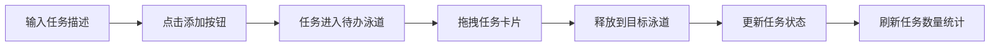

## 1. 产品概述

极简任务板应用，提供看板形式的待办事项管理功能。用户可以通过拖拽方式在三个泳道（待办、进行中、已完成）之间移动任务卡片，实现直观的任务状态管理。

- **主要目的**：提供简洁高效的任务管理工具，帮助用户可视化追踪任务进度
- **目标用户**：需要管理个人或小团队任务的用户
- **产品价值**：通过拖拽交互和直观的视觉反馈，提升任务管理效率和体验

## 2. 核心功能

### 2.1 用户角色
| 角色 | 注册方式 | 核心权限 |
|------|----------|----------|
| 普通用户 | 无需注册，本地使用 | 创建、删除任务，拖拽移动任务 |

### 2.2 功能模块
1. **任务创建模块**：输入框 + 添加按钮，创建新任务
2. **任务看板模块**：三个泳道展示任务，支持拖拽排序
3. **任务卡片模块**：单个任务展示，支持删除操作
4. **状态统计模块**：实时显示各泳道任务数量

### 2.3 页面详情
| 页面名称 | 模块名称 | 功能描述 |
|----------|----------|----------|
| 主页面 | 任务创建区 | 输入任务描述，点击添加按钮创建新任务 |
| 主页面 | 任务看板区 | 三个泳道横向排列，展示不同状态的任务 |
| 主页面 | 任务卡片 | 显示任务描述，支持拖拽移动和删除 |
| 主页面 | 统计显示 | 泳道头部显示任务数量 |

## 3. 核心流程

用户输入任务描述 → 点击添加按钮 → 任务自动进入"待办"泳道 → 拖拽任务卡片到目标泳道 → 任务状态更新 → 实时刷新各泳道任务数量

## 4. 用户界面设计

### 4.1 设计风格
- **主色调**：蓝色系（#3B82F6）作为主色，搭配橙色（#F59E0B）和绿色（#10B981）作为状态色
- **背景色**：#E2E8F0（浅灰蓝），营造清爽专业的视觉感受
- **卡片风格**：圆角卡片设计，左侧彩色竖线标识状态
- **字体**：现代无衬线字体，清晰易读
- **动画**：流畅的过渡动画，提升交互体验

### 4.2 页面设计概述
| 页面名称 | 模块名称 | UI 元素 |
|----------|----------|---------|
| 主页面 | 任务创建区 | 400px 宽输入框 + 圆形添加按钮，居中顶部排列 |
| 主页面 | 任务看板区 | 1200px 宽容器，三等分泳道，白色背景圆角卡片 |
| 主页面 | 任务卡片 | 左侧彩色竖线 + 任务文字 + 右上角删除按钮 |
| 主页面 | 空状态 | 虚线边框矩形 + 灰色提示文字 |

### 4.3 响应式
- 桌面端优先，1200px 固定宽度居中显示
- 任务卡片支持悬停效果和过渡动画
- 拖拽操作流畅，保证 55fps 以上帧率

### 4.4 交互动效
- 添加按钮：点击缩放动画（0.95 → 1.0，150ms）
- 删除按钮：悬停放大（1.2倍，200ms）
- 任务删除：缩小渐隐动画（300ms，ease-out）
- 卡片悬停：阴影过渡变化（200ms）
- 拖拽移动：200ms 缓动动画
