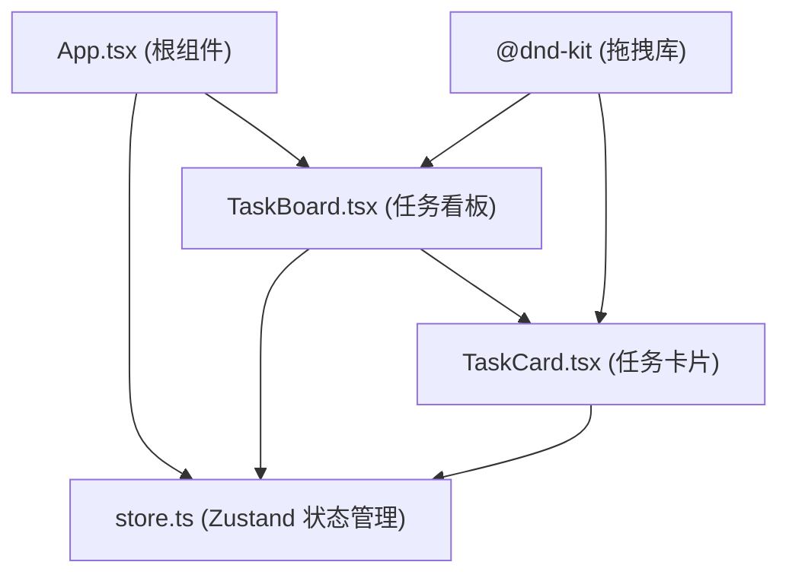

## 1. 架构设计



## 2. 技术描述

- **前端框架**：React@18 + TypeScript
- **构建工具**：Vite
- **状态管理**：Zustand
- **拖拽库**：@dnd-kit/core, @dnd-kit/sortable, @dnd-kit/utilities
- **样式方案**：内联样式 + CSS-in-JS
- **初始化工具**：vite-init

## 3. 项目结构

| 文件/目录 | 用途 |
|-----------|------|
| `package.json` | 项目依赖和脚本配置 |
| `index.html` | 入口 HTML 页面 |
| `vite.config.js` | Vite 构建配置 |
| `tsconfig.json` | TypeScript 配置（严格模式） |
| `src/App.tsx` | 根组件，加载任务板主界面 |
| `src/store.ts` | Zustand 状态管理，定义任务状态和拖拽更新逻辑 |
| `src/TaskBoard.tsx` | 任务看板组件，渲染三个泳道容器和卡片 |
| `src/TaskCard.tsx` | 单个可拖拽的任务卡片组件 |

## 4. 数据模型

### 4.1 任务数据结构

```typescript
interface Task {
  id: string;          // 唯一标识
  description: string; // 任务描述（最大80字符）
  status: 'todo' | 'in-progress' | 'done'; // 任务状态
  createdAt: number;   // 创建时间戳
}
```

### 4.2 状态管理

```typescript
interface TaskStore {
  tasks: Task[];
  addTask: (description: string) => void;
  deleteTask: (id: string) => void;
  moveTask: (taskId: string, targetStatus: string, targetIndex: number) => void;
  getTasksByStatus: (status: string) => Task[];
  getTaskCount: (status: string) => number;
}
```

## 5. 核心功能实现

### 5.1 任务创建
- 使用 `useState` 管理输入框内容
- 点击添加按钮或按回车键创建任务
- 新任务默认状态为 "todo"，自动生成唯一 ID 和时间戳
- 任务描述长度限制为 80 字符

### 5.2 拖拽功能
- 使用 `@dnd-kit/core` 的 `DndContext` 包裹整个看板
- 使用 `@dnd-kit/sortable` 的 `SortableContext` 管理每个泳道内的排序
- 任务卡片使用 `useSortable` hook 实现拖拽
- 拖拽结束后调用 store 的 `moveTask` 方法更新状态

### 5.3 任务删除
- 点击删除按钮触发删除动画
- 使用 CSS 动画实现缩小渐隐效果
- 动画结束后从状态中移除任务

### 5.4 空状态
- 当泳道内任务数量为 0 时显示空状态占位符
- 虚线边框设计，提示文字"暂无任务，拖拽或新建"

## 6. 性能优化

- 使用 Zustand 的选择器优化重渲染
- 拖拽操作使用 CSS transform 保证流畅性
- 任务列表使用 React key 优化列表渲染
- 目标帧率：≥ 55fps
- 状态更新延迟：≤ 16ms
