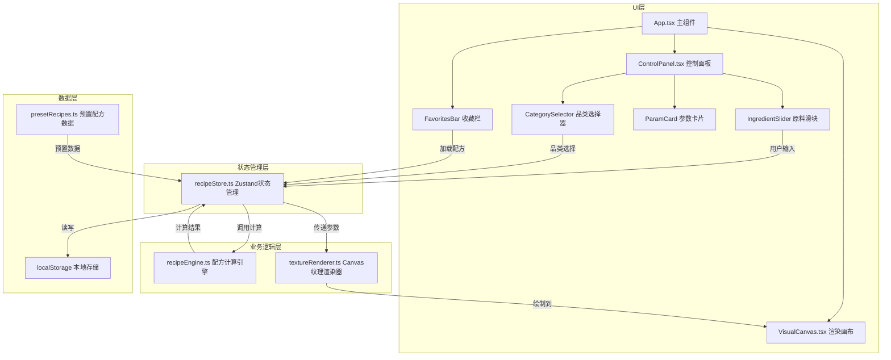

## 1. 架构设计



## 2. 技术选型

- **前端框架**：React 18 + TypeScript 5
- **构建工具**：Vite 5
- **状态管理**：Zustand 4
- **UI渲染**：HTML5 Canvas API
- **图标库**：lucide-react
- **唯一ID**：uuid
- **样式方案**：原生CSS + CSS Variables（无Tailwind，根据用户需求定制）
- **数据存储**：浏览器localStorage

## 3. 项目文件结构

```
d:\Pro\tasks\auto111/
├── package.json                    # 项目依赖与脚本
├── vite.config.js                  # Vite配置
├── tsconfig.json                   # TypeScript配置（strict模式）
├── index.html                      # 入口HTML
└── src/
    ├── main.tsx                    # React入口
    ├── App.tsx                     # 主应用组件
    ├── styles/
    │   └── global.css              # 全局样式与CSS变量
    ├── stores/
    │   └── recipeStore.ts          # Zustand状态管理
    ├── compute/
    │   └── recipeEngine.ts         # 配方计算引擎
    ├── renderer/
    │   └── textureRenderer.ts      # Canvas纹理渲染器
    ├── data/
    │   └── presetRecipes.ts        # 预置配方数据
    ├── components/
    │   ├── ControlPanel.tsx        # 控制面板组件
    │   ├── VisualCanvas.tsx        # 渲染画布组件
    │   ├── CategorySelector.tsx    # 品类选择器组件
    │   ├── IngredientSlider.tsx    # 原料滑块组件
    │   ├── ParamCard.tsx           # 参数卡片组件
    │   └── FavoritesBar.tsx        # 收藏栏组件
    └── types/
        └── recipe.ts               # TypeScript类型定义
```

## 4. 核心模块说明

### 4.1 配方计算引擎 (recipeEngine.ts)

**功能**：根据原料配比计算烘焙关键参数

**输入**：
```typescript
interface IngredientRatio {
  flour: number;      // 面粉比例 0-1
  sugar: number;      // 糖比例 0-1
  butter: number;     // 黄油比例 0-1
  egg: number;        // 鸡蛋比例 0-1
  milk: number;       // 牛奶比例 0-1
}
```

**输出**：
```typescript
interface BakingParams {
  humidity: number;       // 面团湿度 (%) 30-80
  sugarButterRatio: number; // 糖油比 0.3-2.5
  calories: number;       // 预估热量 (千卡/100g)
  cost: number;           // 预估成本 (元/份)
}
```

**计算逻辑**：
- 面团湿度 = (牛奶比例×0.8 + 鸡蛋比例×0.7) × 100
- 糖油比 = 糖比例 / (黄油比例 + 0.001)
- 热量 = Σ(各原料比例 × 单位热量)
- 成本 = Σ(各原料比例 × 单价 × 基准量)

### 4.2 纹理渲染器 (textureRenderer.ts)

**功能**：基于Canvas API绘制热力图和剖面图

**热力图绘制**：
- 256×256像素网格
- 颜色映射：湿度从蓝(#1E40AF)渐变到红(#DC2626)
- 使用Perlin噪声算法生成自然纹理分布

**剖面图绘制**：
- 气孔孔径和密度基于糖油比和湿度随机生成
- 颜色从浅黄(#FFFACD)到深棕(#8B4513)渐变
- 使用圆形裁剪模拟气孔分布

**性能优化**：
- 使用ImageData批量像素操作
- 离屏Canvas预渲染噪声纹理
- requestAnimationFrame控制渲染帧率

### 4.3 状态管理 (recipeStore.ts)

**状态**：
- 当前选中品类
- 原料配比（归一化后）
- 烘焙参数计算结果
- 收藏的配方列表

**Actions**：
- `selectCategory(category)`: 选择品类并加载预置配方
- `updateIngredient(name, value)`: 更新单个原料比例，自动归一化
- `saveRecipe(name)`: 保存当前配方到localStorage
- `loadRecipe(id)`: 从收藏中加载配方
- `deleteRecipe(id)`: 删除收藏的配方

### 4.4 预置配方数据 (presetRecipes.ts)

```typescript
interface PresetRecipe {
  id: string;
  name: string;
  category: 'cake' | 'cookie' | 'bread';
  ingredients: IngredientRatio;
  baseWeight: number; // 基准重量（克）
}
```

## 5. 数据模型

### 5.1 类型定义

```typescript
// 原料类型
type IngredientType = 'flour' | 'sugar' | 'butter' | 'egg' | 'milk';

// 原料配比
interface IngredientRatio {
  flour: number;
  sugar: number;
  butter: number;
  egg: number;
  milk: number;
}

// 烘焙参数
interface BakingParams {
  humidity: number;
  sugarButterRatio: number;
  calories: number;
  cost: number;
}

// 保存的配方
interface SavedRecipe {
  id: string;
  name: string;
  category: string;
  ingredients: IngredientRatio;
  params: BakingParams;
  createdAt: number;
}

// 原料属性配置
interface IngredientConfig {
  name: string;
  color: string;
  unitCalories: number;  // 千卡/100g
  unitPrice: number;     // 元/100g
}
```

## 6. 核心算法

### 6.1 比例归一化算法

当用户调整某个滑块时，其余滑块按比例缩放保证总和为100%：

```typescript
function normalizeRatio(
  ratios: IngredientRatio,
  changedKey: IngredientType,
  newValue: number
): IngredientRatio {
  const newRatios = { ...ratios };
  newRatios[changedKey] = newValue;
  
  const otherKeys = Object.keys(newRatios).filter(k => k !== changedKey) as IngredientType[];
  const otherSum = otherKeys.reduce((sum, k) => sum + newRatios[k], 0);
  const targetSum = 1 - newValue;
  
  if (otherSum > 0) {
    const scale = targetSum / otherSum;
    otherKeys.forEach(k => {
      newRatios[k] = newRatios[k] * scale;
    });
  } else {
    const equalShare = targetSum / otherKeys.length;
    otherKeys.forEach(k => {
      newRatios[k] = equalShare;
    });
  }
  
  return newRatios;
}
```

### 6.2 颜色渐变算法

根据数值在最小值-最大值范围内的位置，计算从绿到黄到红的渐变色：

```typescript
function getGradientColor(value: number, min: number, max: number): string {
  const ratio = Math.max(0, Math.min(1, (value - min) / (max - min)));
  
  if (ratio < 0.5) {
    // 绿到黄
    const t = ratio * 2;
    const r = Math.round(34 + (234 - 34) * t);
    const g = Math.round(197 + (179 - 197) * t);
    const b = Math.round(94 + (8 - 94) * t);
    return `rgb(${r}, ${g}, ${b})`;
  } else {
    // 黄到红
    const t = (ratio - 0.5) * 2;
    const r = Math.round(234 + (239 - 234) * t);
    const g = Math.round(179 + (68 - 179) * t);
    const b = Math.round(8 + (68 - 8) * t);
    return `rgb(${r}, ${g}, ${b})`;
  }
}
```

## 7. 性能优化策略

1. **防抖更新**：滑块输入使用200ms防抖，避免频繁重绘
2. **批量像素操作**：使用ImageData一次性写入热力图像素
3. **离屏渲染**：噪声纹理预渲染到离屏Canvas复用
4. **memo优化**：React组件使用React.memo避免不必要重渲染
5. **requestAnimationFrame**：Canvas渲染使用RAF调度，保持60FPS
6. **localStorage缓存**：收藏列表读取后缓存到内存，避免频繁IO

## 8. 响应式实现

使用CSS媒体查询 + React hooks实现响应式布局：

```css
/* 桌面端 */
@media (min-width: 900px) {
  .app-container {
    display: flex;
    flex-direction: row;
  }
  .control-panel { width: 380px; }
}

/* 移动端 */
@media (max-width: 899px) {
  .app-container {
    display: flex;
    flex-direction: column;
  }
  .control-panel {
    height: 64px;
    overflow: hidden;
    transition: height 0.3s ease;
  }
  .control-panel.expanded {
    height: auto;
  }
}
```
