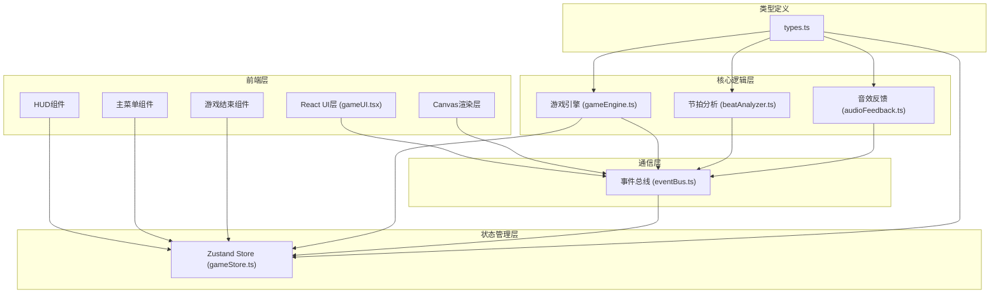
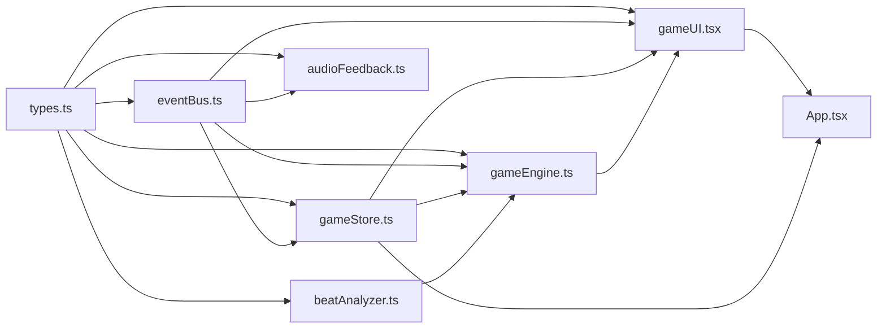

## 1. 架构设计



## 2. 技术描述

- **前端框架**: React@18 + TypeScript
- **构建工具**: Vite@5
- **状态管理**: Zustand@4
- **图形渲染**: HTML5 Canvas API
- **音频处理**: Web Audio API
- **工具库**: uuid
- **样式方案**: 原生CSS + CSS变量

## 3. 文件结构定义

| 文件路径 | 模块名称 | 功能描述 |
|-----------|-------------|---------------------|
| package.json | 项目配置 | 依赖声明、启动脚本 |
| vite.config.js | 构建配置 | React插件配置 |
| tsconfig.json | TypeScript配置 | 严格模式、ESNext模块 |
| index.html | 入口页面 | 标题"节奏格斗"，挂载点 |
| src/main.tsx | 应用入口 | React根组件渲染 |
| src/App.tsx | 主组件 | 游戏状态切换、页面路由 |
| src/types.ts | 类型定义 | Note, Beat, GameState, Character等 |
| src/services/eventBus.ts | 事件总线 | 发布/订阅模式，模块间通信 |
| src/stores/gameStore.ts | 状态管理 | 血量、连击、得分、游戏状态 |
| src/rhythm/beatAnalyzer.ts | 节拍分析 | 从音频提取BPM和节拍时间戳 |
| src/engine/gameEngine.ts | 游戏引擎 | 主循环、音符生成、碰撞检测、角色动画 |
| src/audio/audioFeedback.ts | 音效反馈 | Web Audio API生成击中音效 |
| src/ui/gameUI.tsx | UI组件 | 主菜单、HUD、游戏结束界面 |
| src/ui/components/GameCanvas.tsx | Canvas组件 | 游戏画布渲染 |
| src/ui/components/MainMenu.tsx | 主菜单组件 | 菜单按钮、文件选择器 |
| src/ui/components/HUD.tsx | HUD组件 | 得分、连击、血条显示 |
| src/ui/components/GameOver.tsx | 游戏结束组件 | 结果展示、重新开始 |

## 4. 核心数据结构

```typescript
// 音符类型
interface Note {
  id: string;
  track: number; // 0-3 对应上下左右
  y: number;
  targetY: number;
  speed: number;
  hit: boolean;
  missed: boolean;
  color: string;
}

// 节拍类型
interface Beat {
  timestamp: number;
  track: number;
}

// 角色类型
interface Character {
  x: number;
  y: number;
  height: number;
  width: number;
  color: string;
  isAttacking: boolean;
  attackProgress: number;
  isStunned: boolean;
  stunDuration: number;
}

// 粒子类型
interface Particle {
  x: number;
  y: number;
  vx: number;
  vy: number;
  life: number;
  maxLife: number;
  size: number;
  color: string;
  active: boolean;
}

// 游戏状态
type GameState = 'menu' | 'analyzing' | 'playing' | 'paused' | 'gameover';

// 游戏Store
interface GameStore {
  gameState: GameState;
  score: number;
  combo: number;
  maxCombo: number;
  playerHealth: number;
  enemyHealth: number;
  bpm: number;
  beats: Beat[];
  audioFile: File | null;
  audioBuffer: AudioBuffer | null;
  setGameState: (state: GameState) => void;
  setScore: (score: number) => void;
  addScore: (points: number) => void;
  incrementCombo: () => void;
  resetCombo: () => void;
  setPlayerHealth: (health: number) => void;
  setEnemyHealth: (health: number) => void;
  setBpm: (bpm: number) => void;
  setBeats: (beats: Beat[]) => void;
  setAudioFile: (file: File | null) => void;
  setAudioBuffer: (buffer: AudioBuffer | null) => void;
  resetGame: () => void;
}
```

## 5. 事件总线事件定义

| 事件名称 |  payload类型 | 触发时机 |
|-----------|-------------|---------------------|
| 'audio:uploaded' | File | 用户上传音频文件 |
| 'audio:analyzed' | { bpm: number, beats: Beat[] } | 节拍分析完成 |
| 'game:start' | void | 游戏开始 |
| 'game:over' | { score: number, maxCombo: number } | 游戏结束 |
| 'note:hit' | { track: number, accuracy: number } | 音符击中 |
| 'note:miss' | { track: number } | 音符错过 |
| 'combo:milestone' | { combo: number } | 每5连击 |
| 'player:attack' | { track: number } | 玩家攻击 |
| 'player:stun' | { duration: number } | 玩家硬直 |
| 'enemy:hit' | { damage: number } | 敌人受击 |
| 'player:hit' | { damage: number } | 玩家受击 |
| 'sound:hit' | void | 播放击中音效 |

## 6. 性能优化方案

### 6.1 对象池模式
```typescript
class ParticlePool {
  private pool: Particle[];
  private size: number;

  constructor(size: number) {
    this.size = size;
    this.pool = Array.from({ length: size }, () => ({
      x: 0, y: 0, vx: 0, vy: 0,
      life: 0, maxLife: 1, size: 0, color: '#fff', active: false
    }));
  }

  acquire(): Particle | null {
    return this.pool.find(p => !p.active) || null;
  }

  release(particle: Particle): void {
    particle.active = false;
  }
}
```

### 6.2 碰撞检测优化
- 音符按轨道分组存储，每个轨道独立检测
- 只检测判定线附近±50px范围内的音符
- 时间复杂度：O(1) 每帧（每个按键只检测对应轨道）

### 6.3 渲染优化
- 使用requestAnimationFrame确保60FPS
- 离屏Canvas缓存静态元素（地面、角色剪影）
- 粒子渲染时批量绘制，减少状态切换

## 7. 模块依赖关系


