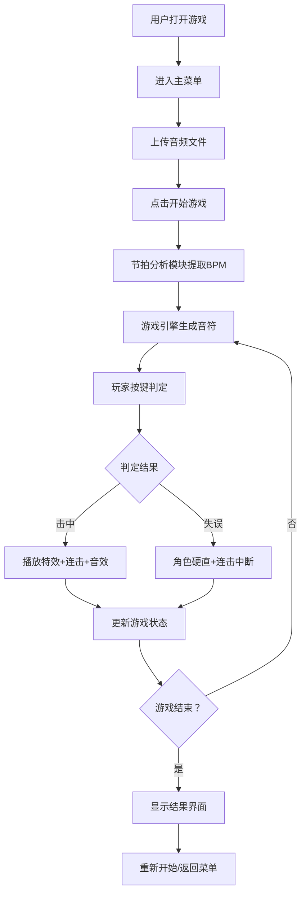

## 1. 产品概述

节奏格斗是一款将音乐节奏与格斗元素结合的网页游戏。玩家通过跟随音乐节拍按下方向键来控制角色攻击和防御，精准击中节拍可以释放华丽连击，失误则会导致角色硬直。

- 主要目的：提供音乐节奏与格斗结合的沉浸式游戏体验
- 目标用户：喜欢音乐游戏和格斗游戏的玩家
- 产品价值：创新的游戏玩法，将节奏游戏的精准度与格斗游戏的爽快感结合

## 2. 核心功能

### 2.2 功能模块

1. **主菜单页面**：游戏开始界面，音频文件上传
2. **游戏对战页面**：2D格斗舞台，音符下落，角色战斗动画
3. **游戏结束界面**：得分展示，重新开始选项

### 2.3 页面详情

| 页面名称 | 模块名称 | 功能描述 |
|-----------|-------------|---------------------|
| 主菜单 | 背景粒子 | 四个角浮动粒子动画，底部上升，周期4s |
| 主菜单 | 菜单按钮 | 开始游戏按钮，hover过渡效果0.3s |
| 主菜单 | 文件选择器 | 上传音频文件，白色虚线边框，hover变实线 |
| 游戏对战 | 2D格斗舞台 | Canvas画布800x500px，渐变地面 |
| 游戏对战 | 角色渲染 | 玩家(蓝色)和敌人(红色)人形剪影，攻击动画 |
| 游戏对战 | 音符系统 | 四轨道菱形音符下落，颜色随节拍变化 |
| 游戏对战 | 判定系统 | 按键检测，精准判定，光晕粒子爆炸 |
| 游戏对战 | 连击系统 | 连击计数，每5连击显示连击动画 |
| 游戏对战 | HUD界面 | 半透明顶部HUD，显示得分、连击、血量 |
| 游戏结束 | 结果展示 | 最终得分，连击数，重新开始按钮 |

## 3. 核心流程

用户打开游戏 → 进入主菜单 → 上传音频文件 → 点击开始游戏 → 节拍分析模块提取BPM → 游戏引擎开始生成音符 → 玩家跟随节拍按键 → 判定击中/失误 → 更新游戏状态 → 播放音效和动画 → 游戏结束显示结果

## 4. 用户界面设计

### 4.1 设计风格

- 主色调：蓝色(#4ECDC4)、紫色(#6C63FF)、红色(#FF6B6B)、黄色(#FFD93D)
- 按钮风格：圆角25px，宽220px高50px，白色背景#6C63FF边框，hover时背景变#6C63FF文字变白色，过渡0.3s ease
- 字体：使用Google Fonts的Orbitron（标题）和Rajdhani（正文）
- 布局：居中卡片式布局，主菜单采用渐变背景
- 视觉元素：毛玻璃效果、光晕粒子、渐变色彩

### 4.2 页面设计概述

| 页面名称 | 模块名称 | UI元素 |
|-----------|-------------|-------------|
| 主菜单 | 背景 | #4ECDC4到#6C63FF渐变，四角浮动粒子(透明度0.3,大小4-8px,周期4s) |
| 主菜单 | 标题 | "节奏格斗"大字，白色描边，居中 |
| 主菜单 | 文件选择器 | 白色虚线边框，圆角8px，hover变实线 |
| 主菜单 | 按钮 | 开始游戏、游戏说明，过渡动画 |
| 游戏对战 | 舞台 | Canvas 800x500px，地面#2B2B44到#1A1A2E渐变 |
| 游戏对战 | 角色 | 玩家蓝色#4ECDC4，敌人红色#FF6B6B，高80px，光晕精灵半径15px |
| 游戏对战 | 音符 | 16x16px菱形，颜色#FFD93D→#FF6B6B渐变 |
| 游戏对战 | HUD | 顶部60px高，背景#00000066，毛玻璃效果，圆角8px |
| 游戏对战 | 判定特效 | 白色光晕粒子12-18个，扩散半径40px，持续0.5s |
| 游戏对战 | 连击动画 | 60px字体，白色红描边2px，向上飘淡出，持续1.2s |
| 游戏结束 | 结果卡片 | 半透明背景，显示最终得分、最高连击 |

### 4.3 响应式

- 桌面端优先设计
- 游戏画布居中显示
- 移动端适配：缩放画布，调整按钮尺寸

### 4.4 性能要求

- 游戏主循环稳定60FPS
- 使用对象池复用粒子对象，避免内存泄漏
- 碰撞检测复杂度O(n)
- 音频分析使用Web Audio API离线处理
