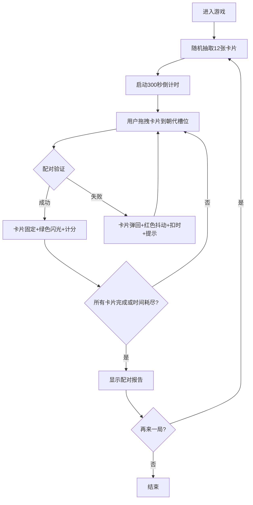

## 1. 产品概述
科技史朝代配对器是一款面向在线教育平台学员的趣味性历史知识练习应用，通过拖拽交互帮助学员巩固中国古代科技成就与历史朝代的对应关系。
- 主要用途：通过游戏化拖拽配对的方式，增强学员对中国古代科技史的记忆与理解
- 目标用户：在线教育平台的历史学习者、对中国古代科技感兴趣的普通用户
- 产品价值：将枯燥的历史知识转化为有趣的互动游戏，提升学习效率与用户粘性

## 2. 核心特性

### 2.1 用户角色
| 角色 | 注册方式 | 核心权限 |
|------|---------|---------|
| 学员用户 | 平台账号登录 | 进入游戏、拖拽配对、查看得分、重玩游戏 |

### 2.2 功能模块
1. **游戏主界面**：顶部导航栏、朝代槽位区、卡片池区、得分统计面板
2. **拖拽配对系统**：卡片拖拽、配对验证、动画反馈、连击计分
3. **计时计分系统**：300秒倒计时、基础得分、连击加成、错误扣分
4. **结果报告系统**：配对详情列表、正确率统计、耗时统计、连击记录

### 2.3 页面详情
| 页面名称 | 模块名称 | 功能描述 |
|---------|---------|---------|
| 游戏主页面 | 顶部导航栏 | 显示游戏标题、实时得分、倒计时（<60秒红色闪烁） |
| 游戏主页面 | 朝代槽位区 | 左侧竖向排列8个朝代槽位，支持拖拽放置，匹配成功绿色闪光 |
| 游戏主页面 | 卡片池区 | 右侧横向滚动展示12张随机科技卡片，支持拖拽操作 |
| 游戏主页面 | 得分统计面板 | 实时显示已配对数、正确率、用时，游戏结束显示完整报告 |
| 游戏主页面 | 重玩按钮 | 游戏结束后点击重新洗牌开始新一局 |

## 3. 核心流程

### 3.1 游戏主流程
用户进入游戏 → 系统随机抽取12张科技卡片（朝代不重复，每朝代最多2张）→ 启动300秒倒计时 → 用户从卡片池拖拽卡片到朝代槽位 → 系统验证配对 → 成功：卡片固定+绿色闪光+得分（含连击加成）；失败：卡片弹回+红色抖动+扣3秒+气泡提示 → 所有卡片配对完成或时间耗尽 → 显示配对报告 → 用户可点击"再来一局"重新开始

## 4. 用户界面设计

### 4.1 设计风格
- **主色调**：米黄色 #F5E6CA → #E8D5B7 径向渐变背景，深棕色 #4A3B32 文字
- **辅助色**：朝代卡片渐变 #A8D8EA → #F7DC6F，成功反馈绿色 #27AE60，失败反馈红色 #C0392B
- **按钮风格**：圆角12px，悬停轻微上浮，过渡动画 0.3s ease
- **字体**：衬线体 Georgia，增强复古感
- **布局风格**：左右分栏（左侧40%朝代槽位，右侧60%卡片池），桌面端为主
- **图标风格**：简洁复古风，使用衬线元素装饰

### 4.2 页面设计概览
| 页面名称 | 模块名称 | UI元素 |
|---------|---------|---------|
| 游戏主页面 | 顶部导航栏 | 半透明毛玻璃背景 rgba(255,255,240,0.7)，blur(8px)，高度60px，左侧标题右侧得分+倒计时 |
| 游戏主页面 | 朝代槽位区 | 8个竖向排列槽位，每个高80px，圆角12px，背景#D4C1A7，文字#4A3B32，高亮边框提示可放置 |
| 游戏主页面 | 卡片池区 | 横向滚动容器，卡片120x80px，圆角12px，间距16px，悬停上浮+阴影，拖拽半透明 |
| 游戏主页面 | 得分统计面板 | 显示配对数、正确率、用时，游戏结束展示完整报告列表 |

### 4.3 响应式设计
- **桌面端**（≥768px）：左右分栏布局，左侧40%，右侧60%
- **移动端**（<768px）：上下分栏布局，卡片缩放至90%，触摸优化拖拽体验

### 4.4 动画效果
- 卡片悬停：轻微上浮（transform: translateY(-3px)）+ 阴影加深
- 拖拽中：半透明（opacity: 0.7）跟随鼠标
- 配对成功：槽位绿色闪光动画（0.5s）
- 配对失败：卡片红色抖动动画（0.3s）+ 气泡提示（2s自动消失）
- 倒计时<60s：文字红色闪烁动画
- 全局过渡：transition: all 0.3s ease
