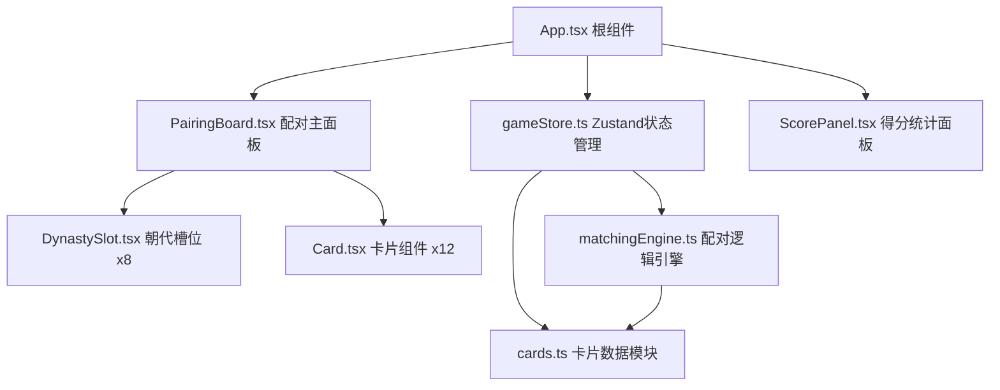

## 1. 架构设计



## 2. 技术说明
- **前端框架**：React 18 + TypeScript
- **构建工具**：Vite + @vitejs/plugin-react
- **状态管理**：Zustand
- **辅助工具**：uuid（生成唯一ID）
- **初始化方式**：Vite React TypeScript 模板
- **后端**：无（纯前端应用，数据内置）
- **数据存储**：内存状态（Zustand store）

## 3. 模块职责定义
| 模块路径 | 职责 |
|---------|------|
| src/data/cards.ts | 20张预设科技成就卡片数据，提供getShuffledCards()随机抽取12张 |
| src/engine/matchingEngine.ts | validateMatch()配对验证、calculateScore()计分、generateReport()生成统计报告 |
| src/stores/gameStore.ts | 管理待配对卡片、已配对结果、得分、计时器、连击状态，提供dispatch配对动作 |
| src/components/Card.tsx | 单个卡片渲染与拖拽源，含标题、描述、朝代渐变背景、悬停/拖拽动画 |
| src/components/DynastySlot.tsx | 朝代槽位渲染与拖放目标，高亮提示、成功/失败动画 |
| src/components/PairingBoard.tsx | 左右分栏布局，协调卡片池与朝代槽位，监听拖拽事件 |
| src/components/ScorePanel.tsx | 实时得分、倒计时、正确率展示，游戏结束报告 |
| src/App.tsx | 根组件，编排布局、状态连接、事件分发 |

## 4. 数据模型

### 4.1 卡片数据模型
```typescript
interface TechCard {
  id: string;
  title: string;
  description: string;
  dynasty: string;
  dynastyId: string;
  bgColor: string;
}
```

### 4.2 朝代数据模型
```typescript
interface Dynasty {
  id: string;
  name: string;
  bgColor: string;
}
```

### 4.3 配对结果模型
```typescript
interface MatchResult {
  cardId: string;
  dynastyId: string;
  success: boolean;
  timestamp: number;
}
```

### 4.4 游戏状态模型
```typescript
interface GameState {
  cards: TechCard[];
  pairedCards: Map<string, string>; // cardId -> dynastyId
  score: number;
  combo: number;
  maxCombo: number;
  timeRemaining: number;
  isPlaying: boolean;
  isFinished: boolean;
  totalAttempts: number;
  successfulAttempts: number;
}
```

### 4.5 游戏报告模型
```typescript
interface GameReport {
  totalScore: number;
  correctCount: number;
  totalCount: number;
  accuracy: number;
  timeUsed: number;
  maxCombo: number;
  details: Array<{
    cardTitle: string;
    targetDynasty: string;
    placedDynasty: string;
    correct: boolean;
  }>;
}
```

## 5. 核心接口定义

### cards.ts
```typescript
export function getShuffledCards(): TechCard[];
```

### matchingEngine.ts
```typescript
export function validateMatch(cardId: string, dynastyId: string): boolean;
export function calculateScore(combo: number, difficulty?: string): number;
export function generateReport(
  pairedCards: Map<string, string>,
  cards: TechCard[],
  score: number,
  totalAttempts: number,
  successfulAttempts: number,
  timeUsed: number,
  maxCombo: number
): GameReport;
```

### gameStore.ts (actions)
```typescript
interface GameActions {
  startGame(): void;
  attemptMatch(cardId: string, dynastyId: string): boolean;
  tickTimer(): void;
  resetGame(): void;
}
```
