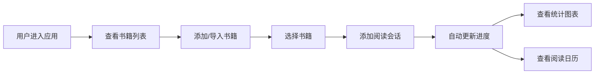

## 1. 产品概述

阅读洞察仪是一款帮助用户在浏览器中可视化分析个人阅读习惯的Web应用。用户可以通过导入阅读记录或手动录入，系统自动生成多维度的阅读数据分析和统计图表。

- **核心价值**：解决手动记录阅读进度和分析偏好费时费力的问题
- **目标用户**：有阅读习惯、希望追踪和优化阅读效率的个人用户
- **产品定位**：轻量级、数据驱动的个人阅读数据分析工具

## 2. 核心功能

### 2.1 功能模块

1. **书籍管理模块**：书籍列表展示、手动添加书籍、CSV导入阅读记录
2. **阅读会话记录模块**：添加阅读会话、自动更新阅读进度
3. **数据统计仪表盘**：每日阅读页数趋势、阅读偏好雷达图、时段阅读时长柱状图、连续阅读热力图
4. **阅读日历视图**：按月展示阅读天数、点击查看当日详情

### 2.2 页面详情

| 页面名称 | 模块名称 | 功能描述 |
|---------|---------|---------|
| 主页面 | 书籍列表面板 | 左侧可折叠面板，展示书籍卡片列表，支持添加/导入 |
| 主页面 | 书籍详情区 | 右侧主区域，展示选中书籍的详细信息和阅读记录 |
| 主页面 | 会话记录表单 | 毛玻璃风格表单，添加阅读会话（日期、页数、时长） |
| 主页面 | 统计仪表盘 | 四个可视化图表：折线图、雷达图、柱状图、热力图 |
| 主页面 | 日历热力图 | 月视图日历网格，展示每日阅读页数，支持点击查看详情 |

## 3. 核心流程

**主要用户流程**：
1. 用户首次进入应用，可手动添加书籍或导入CSV格式的阅读记录
2. 用户选择一本书后，在详情区添加阅读会话记录
3. 系统根据所有阅读会话自动计算并生成多维度统计图表
4. 用户可通过日历视图快速浏览每日阅读情况，点击查看详细记录

## 4. 用户界面设计

### 4.1 设计风格

- **主色调**：深色主题，主背景#0F3460，卡片背景#16213E
- **强调色**：#E94560（标题、数值、交互元素）、#4ECDC4（图表辅助色）
- **次要文字**：#A0A0B0
- **布局风格**：左右分栏布局，左侧书籍列表（250px），右侧主内容区
- **卡片风格**：圆角8px，左侧色条标识，底部进度条
- **动效风格**：淡入动画0.3s ease，骨骼屏加载动画，toast提示滑入滑出

### 4.2 页面设计概述

| 页面名称 | 模块名称 | UI元素 |
|---------|---------|-------|
| 主页面 | 书籍列表面板 | 深色背景卡片、左侧色条、进度条、折叠按钮 |
| 主页面 | 添加书籍弹窗 | 毛玻璃背景、圆角16px、底部入场动画 |
| 主页面 | 会话记录表单 | 半透明毛玻璃、#E94560边框、圆角12px |
| 主页面 | 统计仪表盘 | 四个图表卡片、淡入切换、骨骼屏加载 |
| 主页面 | 日历热力图 | 月网格布局、颜色渐变填充、详情弹窗 |

### 4.3 响应式设计

- **桌面端**：左右分栏布局，左侧固定250px宽度
- **平板/移动端**（<768px）：左侧面板变为顶部下拉菜单
- **触控优化**：按钮和可点击区域适配触控操作

### 4.4 交互细节

- 折叠按钮：40x40px圆形，#E94560背景，hover缩放1.1倍
- Toast提示：从下方滑入，停留2s后滑出
- 图表切换：淡入动画0.3s ease
- 加载状态：灰色脉冲骨骼屏动画1.5s无限循环
- 日历格子：阅读>50页有颜色填充，点击弹出详情
