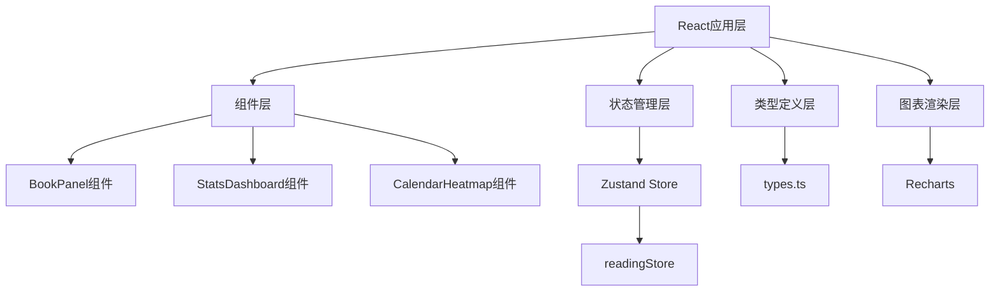

## 1. 架构设计



## 2. 技术描述

- **前端框架**：React@18 + TypeScript
- **构建工具**：Vite
- **状态管理**：Zustand
- **图表库**：Recharts
- **样式方案**：TailwindCSS@3
- **唯一标识**：uuid

## 3. 目录结构

```
src/
├── components/
│   ├── BookPanel.tsx
│   └── Charts/
│       ├── StatsDashboard.tsx
│       └── CalendarHeatmap.tsx
├── stores/
│   └── readingStore.ts
├── types.ts
├── index.tsx
└── App.tsx
```

## 4. 数据模型

### 4.1 类型定义

```typescript
interface Book {
  id: string;
  title: string;
  author: string;
  totalPages: number;
  coverColor: string;
  sessions: Session[];
}

interface Session {
  id: string;
  bookId: string;
  date: string;
  startPage: number;
  endPage: number;
  duration: number; // 分钟
}

interface ChartData {
  dailyPages: { date: string; pages: number }[];
  radarData: { dimension: string; value: number }[];
  timeSlots: { slot: string; duration: number }[];
  heatmapData: { date: string; pages: number }[];
}
```

### 4.2 Store 设计

**readingStore 提供的能力：**
- books: Book[] - 书籍列表
- selectedBookId: string | null - 当前选中书籍
- addBook(book: Omit<Book, 'id' | 'sessions'>): void - 添加书籍
- deleteBook(id: string): void - 删除书籍
- addSession(session: Omit<Session, 'id'>): void - 添加阅读会话
- importCSV(data: string): void - 导入CSV数据
- getStats(): ChartData - 计算统计数据
- getBookProgress(bookId: string): number - 获取书籍阅读进度

## 5. 组件设计

### 5.1 BookPanel 组件

- 书籍列表展示
- 添加书籍弹窗（毛玻璃风格）
- CSV导入功能
- 折叠/展开控制
- 书籍卡片渲染（色条、进度条）

### 5.2 StatsDashboard 组件

- 折线图：每日阅读页数趋势
- 雷达图：阅读偏好五维度
- 柱状图：各时段阅读时长
- 热力图：连续阅读天数
- 骨骼屏加载状态
- 淡入切换动画

### 5.3 CalendarHeatmap 组件

- 月视图日历网格
- 每日阅读页数显示
- 颜色渐变填充
- 点击详情弹窗

## 6. 性能要求

- 图表渲染响应时间 ≤ 300ms
- 连续滚动页面帧率 ≥ 45fps
- 使用 useMemo 缓存计算结果
- 图表数据按需计算
