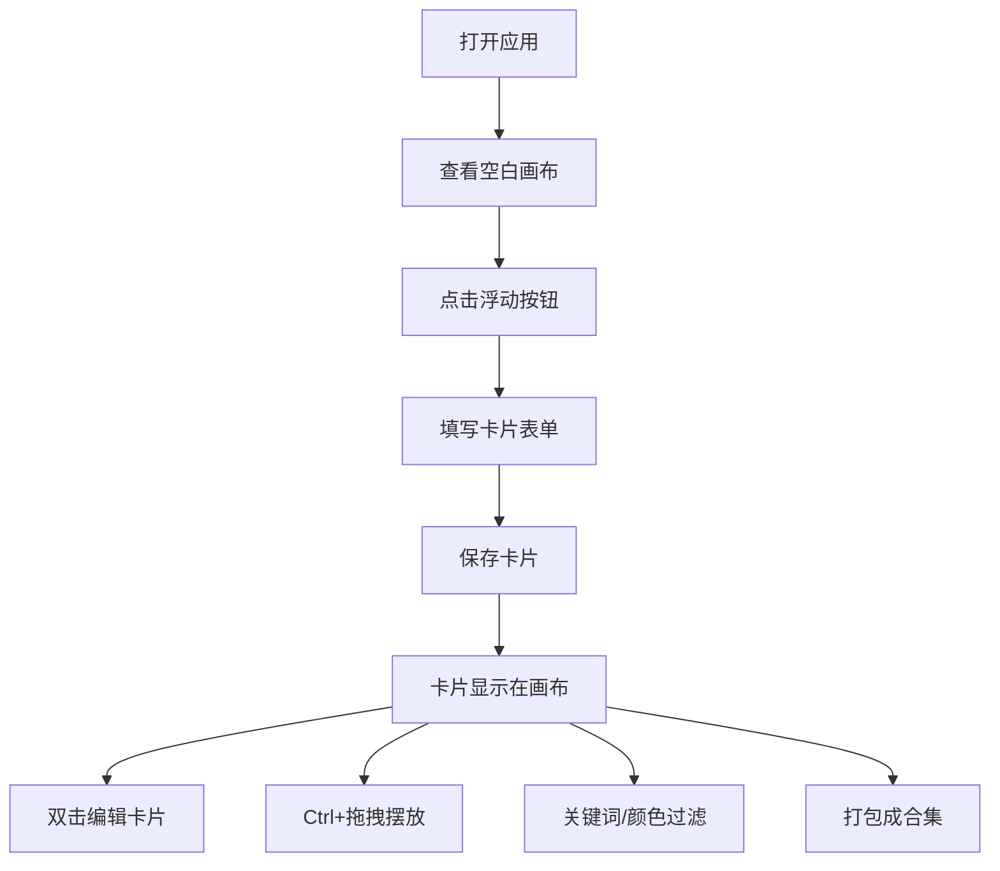

## 1. 产品概述

灵感速写板是一款创意捕捉工具，让用户像使用电子便利贴一样快速记录一闪而过的灵感。通过无限画布、颜色标签、关键词过滤等功能，帮助用户高效地整理和回顾创意。

- **目标用户**：创意工作者、设计师、产品经理、学生等需要快速记录灵感的人群
- **核心价值**：零门槛捕捉创意，可视化整理思路，轻松回顾和打包灵感合集

## 2. 核心功能

### 2.1 功能模块

1. **无限画布**：支持缩放、平移、无限滚动的创意空间
2. **卡片管理**：创建、编辑、删除、拖拽摆放灵感卡片
3. **标签系统**：6种预设颜色标签，支持快速分类和筛选
4. **关键词搜索**：通过关键词快速定位相关卡片
5. **合集打包**：将多张卡片打包成合集，便于后续回顾整理
6. **智能吸附**：卡片拖拽时自动吸附对齐，保持画布整洁

### 2.2 页面详情

| 页面名称 | 模块名称 | 功能描述 |
|-----------|-------------|---------------------|
| 主界面 | 无限画布 | 展示所有卡片，支持缩放(0.5x-2x)和平移，卡片按创建时间自动排列 |
| 主界面 | 浮动按钮 | 左上角圆形按钮，点击弹出新建卡片表单 |
| 主界面 | 侧边过滤面板 | 关键词搜索输入框 + 颜色标签筛选按钮 |
| 卡片组件 | 卡片交互 | 悬停上浮效果、双击编辑、Ctrl+拖拽自由摆放 |
| 卡片组件 | 颜色标签 | 左上角20x20px色块，右下角点击可切换6种预设颜色 |
| 表单弹窗 | 新建/编辑卡片 | 居中模态框，包含标题、正文、颜色、关键词输入 |

## 3. 核心流程

### 3.1 用户主流程
1. 用户打开应用，看到空白画布和左上角浮动按钮
2. 点击浮动按钮，弹出新建卡片表单
3. 填写标题、正文，选择颜色标签，输入关键词
4. 保存后卡片出现在画布上，按创建时间排列
5. 双击卡片进入编辑模式，可修改内容和颜色
6. 按住Ctrl键拖拽卡片到任意位置，卡片自动吸附对齐
7. 使用侧边面板搜索关键词或点击颜色标签过滤卡片
8. 选中多张卡片打包成合集，便于后续回顾

### 3.2 流程图

## 4. 用户界面设计

### 4.1 设计风格
- **整体风格**：干净极简，留白充足，如同空白速写本
- **主色调**：#6C63FF（品牌紫）作为主色，搭配6种活泼的标签色
- **背景色**：#F9F9FB（画布背景），#FFFFFF（卡片和面板背景）
- **文字色**：#2D2D2D（标题），正文默认
- **字体**：Inter 无衬线字体
- **圆角**：卡片16px，面板12px，色块4px，浮动按钮50%
- **阴影**：卡片默认0 2px 12px rgba(0,0,0,0.08)，悬停0 6px 20px rgba(0,0,0,0.12)
- **过渡**：所有可交互元素0.2s ease过渡

### 4.2 颜色标签系统
| 颜色 | 色值 |
|------|------|
| 玫红 | #FF658B |
| 橙黄 | #FFB84D |
| 青蓝 | #4ECDC4 |
| 品牌紫 | #6C63FF |
| 淡紫 | #A29BFE |
| 粉红 | #FD79A8 |

### 4.3 页面设计概述

| 页面名称 | 模块名称 | UI 元素 |
|-----------|-------------|-------------|
| 主界面 | 无限画布 | #F9F9FB背景，自适应填充，最小宽度1280px |
| 主界面 | 浮动按钮 | 直径56px，#6C63FF背景，白色24x24px加号图标，左上角定位 |
| 主界面 | 侧边面板 | 宽240px，#FFFFFF背景，圆角12px，左侧或右侧定位 |
| 卡片组件 | 卡片容器 | 宽220px，#FFFFFF背景，圆角16px，悬停上浮4px加深阴影 |
| 卡片组件 | 颜色色块 | 20x20px，圆角4px，左上角定位，点击可切换颜色 |
| 卡片组件 | 标题 | 16px加粗，#2D2D2D |
| 卡片组件 | 正文 | 14px，行高1.6，占满剩余高度 |
| 表单弹窗 | 模态框 | 宽400px，#FFFFFF背景，圆角20px，居中显示，半透明遮罩#00000040 |

### 4.4 响应式设计
- **设计原则**：桌面优先，最小宽度1280px
- **大屏适配**：画布自适应填充剩余空间
- **触控优化**：支持触屏拖拽和双指缩放
- **性能优化**：使用虚拟列表优化100+卡片渲染，保持60fps

### 4.5 交互动效
- **卡片悬停**：上移4px，阴影加深，0.2s ease
- **卡片拖拽**：Ctrl+拖拽自由摆放，吸附时0.1s动画
- **画布缩放**：Shift+鼠标滚轮，0.5x-2x范围，文字模糊减轻
- **颜色切换**：色块和边框色同步变化，平滑过渡
- **表单弹出**：遮罩淡入，模态框缩放淡入
