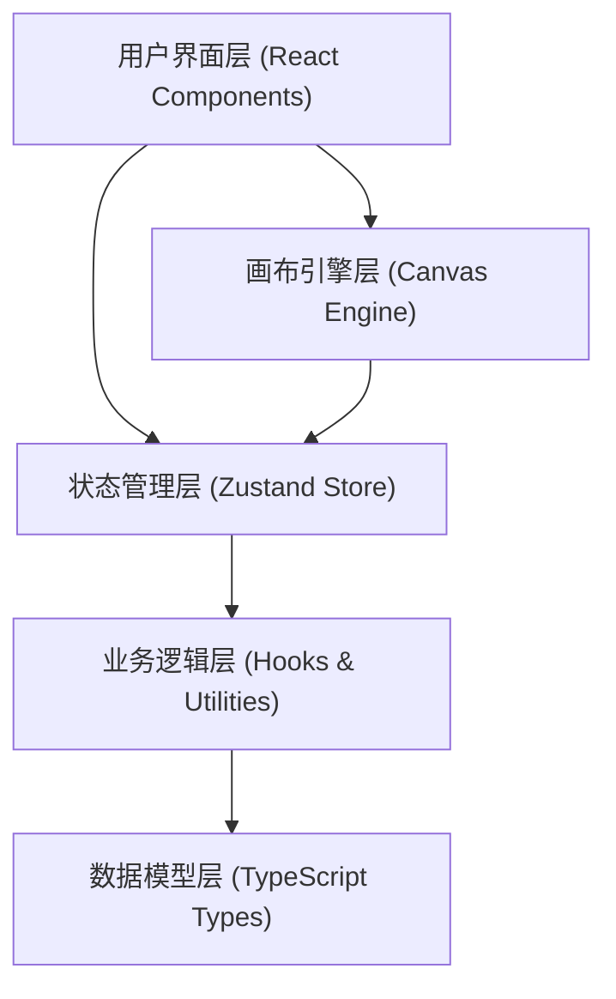

## 1. 架构设计



## 2. 技术描述

### 2.1 前端技术栈
- **框架**: React 18 + TypeScript
- **构建工具**: Vite 5
- **状态管理**: Zustand 4
- **虚拟列表**: @tanstack/react-virtual 3
- **唯一ID**: uuid
- **样式方案**: CSS Modules + CSS Variables
- **图标**: lucide-react

### 2.2 核心依赖版本
- react: ^18.2.0
- react-dom: ^18.2.0
- zustand: ^4.5.0
- @tanstack/react-virtual: ^3.0.0
- uuid: ^9.0.0
- typescript: ^5.3.0
- vite: ^5.0.0
- @vitejs/plugin-react: ^4.2.0
- lucide-react: ^0.300.0

### 2.3 项目目录结构
```
src/
├── components/
│   ├── Card.tsx           # 单张卡片组件
│   └── CardForm.tsx       # 新建/编辑卡片表单
├── data/
│   └── cardStore.ts       # Zustand 状态管理
├── engine/
│   └── canvasEngine.ts    # 画布交互引擎
├── types/
│   └── card.ts            # TypeScript 类型定义
├── App.tsx                # 主应用组件
├── main.tsx               # 应用入口
└── index.css              # 全局样式
```

## 3. 模块职责

### 3.1 类型定义 (src/types/card.ts)
```typescript
interface Card {
  id: string;
  title: string;
  body: string;
  color: string;
  keywords: string[];
  x: number;
  y: number;
  createdAt: number;
}

interface CardCollection {
  id: string;
  name: string;
  cardIds: string[];
  createdAt: number;
}

interface CanvasState {
  scale: number;
  offsetX: number;
  offsetY: number;
}
```

### 3.2 状态管理 (src/data/cardStore.ts)
- **卡片管理**: addCard, updateCard, deleteCard
- **过滤功能**: filterByKeyword, filterByColor
- **合集功能**: packCards, createCollection, deleteCollection
- **状态查询**: getFilteredCards, getCollections

### 3.3 画布引擎 (src/engine/canvasEngine.ts)
- **useCanvasTransform**: 处理画布缩放、平移
- **useDragAdoption**: 处理卡片拖拽、吸附逻辑
- **collisionDetection**: 碰撞检测算法
- **snapToGrid**: 网格吸附计算

### 3.4 组件层
- **App.tsx**: 主布局，组合画布和侧边面板
- **Card.tsx**: 卡片渲染，处理双击编辑、拖拽、颜色切换
- **CardForm.tsx**: 模态框表单，新建/编辑卡片

## 4. 性能优化方案

### 4.1 渲染性能
- 使用 `@tanstack/react-virtual` 实现虚拟列表，只渲染视口内卡片
- 卡片组件使用 `React.memo` 避免不必要重渲染
- 使用 `useCallback` 缓存事件处理函数
- 拖拽操作使用 `requestAnimationFrame` 确保60fps

### 4.2 交互优化
- 缩放时使用 CSS `transform: scale()` 启用 GPU 加速
- 拖拽时使用 `will-change: transform` 提示浏览器优化
- 缩放时调整文字渲染策略减轻模糊

### 4.3 状态更新
- Zustand 状态细粒度订阅，避免全局重渲染
- 使用 Immer 风格的不可变更新（Zustand 内置支持）
- 批量更新多个卡片位置时使用单一次 setState

## 5. 关键实现要点

### 5.1 画布坐标系
- 世界坐标: 卡片的实际存储位置 (x, y)
- 屏幕坐标: 通过 scale 和 offset 转换后的显示位置
- 转换公式: `screenX = worldX * scale + offsetX`

### 5.2 卡片吸附算法
- 检测拖拽卡片与其他卡片的边缘距离
- 当距离 < 8px 时触发吸附
- 吸附动画使用 CSS transition 0.1s 平滑过渡

### 5.3 颜色系统
- CSS 变量定义预设颜色
- 卡片边框色与背景色同步变化
- 颜色选择器动态生成6种预设选项

### 5.4 自动布局
- 新建卡片按创建时间排列
- 采用瀑布流或网格布局（用户可切换）
- 支持手动拖拽后脱离自动布局
