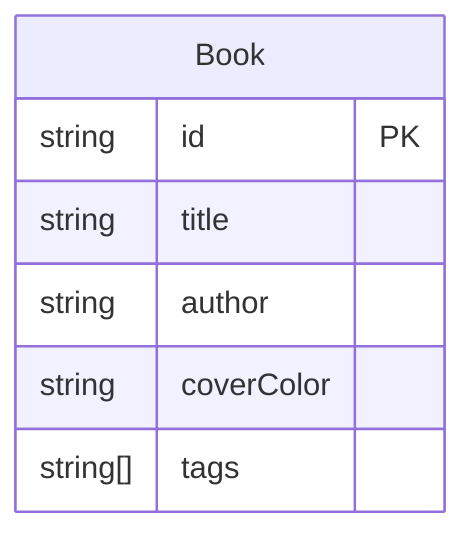

## 1. 架构设计

```mermaid
flowchart TD
    "前端应用 (React + TypeScript + Vite)" --> "状态管理 (Zustand)"
    "状态管理 (Zustand)" --> "bookStore (书籍列表/添加/删除/交换)"
    "前端应用 (React + TypeScript + Vite)" --> "组件层"
    "组件层" --> "App.tsx (主布局/拖拽状态)"
    "组件层" --> "BookCard.tsx (卡片渲染/拖拽/删除)"
    "bookStore (书籍列表/添加/删除/交换)" --> "booksData.json (初始数据)"
```

## 2. 技术说明

- 前端：React 18 + TypeScript + Vite
- 初始化工具：vite-init (react-ts 模板)
- 状态管理：Zustand
- 样式：Tailwind CSS
- 唯一ID：uuid
- 后端：无
- 数据库：无，使用 JSON 文件作为初始数据源

## 3. 路由定义

| 路由 | 用途 |
|------|------|
| / | 书架主页，包含所有功能 |

单页应用，无需路由。

## 4. 数据模型

### 4.1 数据模型定义



### 4.2 数据定义

```typescript
interface Book {
  id: string;
  title: string;
  author: string;
  coverColor: string;
  tags: string[];
}
```

## 5. 文件结构

```
├── package.json
├── vite.config.ts
├── tsconfig.json
├── index.html
├── src/
│   ├── main.tsx
│   ├── App.tsx
│   ├── components/
│   │   └── BookCard.tsx
│   ├── stores/
│   │   └── bookStore.ts
│   └── data/
│       └── booksData.json
```

## 6. 核心模块职责

### 6.1 bookStore.ts
- 管理书籍列表状态
- addBook：添加书籍
- removeBook：删除书籍
- swapBooks：交换书籍位置（拖拽后更新）
- setBooks：设置完整书籍列表（拖拽插入时使用）

### 6.2 App.tsx
- 读取 bookStore 数据
- 管理搜索过滤逻辑（防抖300ms）
- 管理标签筛选状态
- 管理拖拽状态（拖拽源、目标位置）
- 渲染搜索栏、标签栏、书架网格、添加按钮、添加弹窗

### 6.3 BookCard.tsx
- 接收书籍数据 props
- 渲染封面颜色、书名、作者
- 支持拖拽手柄（dragStart/dragEnd 事件）
- 删除按钮（调用 store 的 removeBook）
- 显示标签描边高亮（根据选中标签）

## 7. 性能约束

- 拖拽交换位置更新：16ms 内完成（60fps）
- 搜索过滤：300ms 防抖响应
- 使用 CSS transition 而非 JS 动画保证拖拽流畅性
