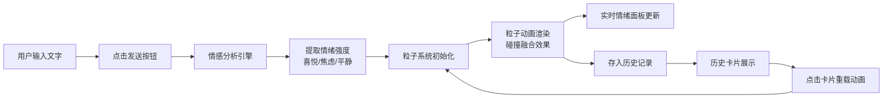

## 1. 产品概述
情绪回声是一款将文字情感可视化的交互应用，用户输入心情描述后，系统通过情感分析提取情绪关键词，将其转化为动态粒子动画，让抽象的情绪变得可见、可触。
- 核心价值：为用户提供情绪的可视化表达与记录，通过艺术化的粒子效果帮助用户感知和回顾自己的情感状态
- 目标用户：所有希望通过视觉方式表达和记录内心情绪的用户

## 2. 核心功能

### 2.1 用户角色
无需注册，所有用户直接使用全部功能。

### 2.2 功能模块
1. **主界面**：输入区、粒子画布、历史记录区
2. **情感分析引擎**：基于规则的关键词匹配与强度计算
3. **粒子动画系统**：Canvas驱动的多情绪粒子碰撞融合效果
4. **实时情绪面板**：主导情绪显示 + 三色弧形占比条
5. **历史记录管理**：最近6次分析的卡片式展示与重载

### 2.3 页面详情
| 页面名称 | 模块名称 | 功能描述 |
|-----------|-------------|---------------------|
| 主界面 | 输入区 | 80%宽度文本域（最大300字）+ 渐变圆形发送按钮 + 环绕进度环 |
| 主界面 | 粒子画布 | 极深炭灰背景+底部光晕，300-800个粒子的动态碰撞融合动画 |
| 主界面 | 情绪面板 | 右上角半透明卡片显示主导情绪名称与强度，三色弧形占比条 |
| 主界面 | 历史记录区 | 底部横向滚动卡片，展示最近6次分析，含缩略图、时间戳、主导情绪 |

## 3. 核心流程
用户在输入框中输入心情描述文字 → 点击发送按钮 → 系统触发情感分析 → 提取喜悦/焦虑/平静三种情绪的强度值 → 根据情绪配置生成粒子系统 → 粒子从底部升起、碰撞融合形成动态色彩 → 右上角实时显示主导情绪与占比 → 自动将本次分析存入历史记录 → 用户可点击历史卡片重载对应动画

## 4. 用户界面设计
### 4.1 设计风格
- **主色调**：极深炭灰#111118背景，暗色科技风格
- **情绪色**：喜悦暖橙#FF8C00、焦虑紫灰#8B7DA6、平静湖蓝#40E0D0
- **辅助色**：#1E1E28（卡片背景）、#3A3A4A（边框）、#E0E0E8（文字）、#888（次要文字）
- **按钮**：圆形渐变按钮，带白色外发光，hover亮度提升
- **字体**：现代无衬线字体，正文16px，标题18px，次要12px
- **布局**：Flex上下结构，顶部输入区、中部画布（占满剩余空间）、底部历史区
- **动效**：粒子正弦飘动、碰撞色彩融合、进度环旋转、卡片hover微交互

### 4.2 页面设计概览
| 页面名称 | 模块名称 | UI元素 |
|-----------|-------------|-------------|
| 主界面 | 输入区 | 居中80%宽度文本域、12px圆角、1px边框、渐变圆形发送按钮、环绕旋转进度环 |
| 主界面 | 粒子画布 | #111118背景、底部120px半透明白色光晕、彩色粒子向上飘动融合 |
| 主界面 | 情绪面板 | 右上角#1E1E28半透明卡片、12px圆角、三色弧形占比条（8px宽、半径60px） |
| 主界面 | 历史记录区 | #1A1A22背景、16px圆角、横向滚动卡片（140×160px）、六边形缩略图 |

### 4.3 响应式
- 桌面端优先设计
- 移动端（≤768px）：历史记录卡片竖向排列、画布最小高度降为300px、输入框宽度改为95%
- 触摸设备优化：按钮最小触控区域44px

### 4.4 性能指标
- 粒子动画帧率稳定55FPS以上
- 内存占用不超过80MB
- 粒子数量平滑过渡（每帧增减≤20个）
