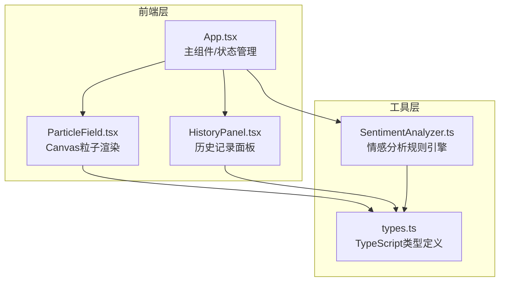

## 1. 架构设计


## 2. 技术说明
- **前端框架**：React 18 + TypeScript 5 + Vite 5
- **构建工具**：Vite 5 + @vitejs/plugin-react 4
- **渲染技术**：HTML5 Canvas API + requestAnimationFrame
- **状态管理**：React Hooks (useState, useEffect, useRef)
- **样式方案**：内联CSS-in-JS + CSS变量（无需额外UI库）
- **无后端、无数据库**：历史记录存储于React内存状态中

## 3. 模块文件结构
| 文件路径 | 作用 |
|---------|------|
| `/package.json` | 项目依赖与启动脚本 |
| `/index.html` | Vite入口HTML |
| `/vite.config.js` | Vite配置（React插件） |
| `/tsconfig.json` | TypeScript配置（strict模式，esnext目标） |
| `/src/types.ts` | Emotion、HistoryRecord类型接口 |
| `/src/SentimentAnalyzer.ts` | 基于规则的情感分析函数 |
| `/src/ParticleField.tsx` | Canvas粒子动画组件 |
| `/src/HistoryPanel.tsx` | 历史记录卡片面板 |
| `/src/App.tsx` | 主应用组件（输入、状态、布局） |

## 4. 核心数据模型

### 4.1 类型定义
```typescript
interface Emotion {
  name: '喜悦' | '焦虑' | '平静';
  color: string;
  intensity: number; // 0-5
}

interface HistoryRecord {
  id: string;
  timestamp: number;
  inputText: string;
  emotions: Emotion[];
  thumbnailData: string; // 缩略图dataURL
}
```

## 5. 关键算法说明

### 5.1 情感分析规则引擎
- 维护三类情绪关键词库（喜悦/焦虑/平静），每个关键词带权重
- 对输入文本进行关键词匹配，累计出现次数×权重 = 原始强度
- 归一化到0-5区间，保留小数点后1位

### 5.2 粒子系统核心
- 粒子池：使用数组维护，按情绪强度分配数量比例
- 运动：y坐标匀速上移 + x坐标正弦波叠加
- 碰撞检测：空间网格划分优化，邻近粒子<30px时线性色彩混合
- 生命周期：融合粒子8-12秒后缩小消散
- 性能：FPS通过时间差（deltaTime）控制，粒子增减每帧≤20

### 5.3 缩略图生成
- 离屏canvas绘制六边形（60×60px）
- 按情绪比例填充三色扇形区域
- 转为dataURL存入历史记录
