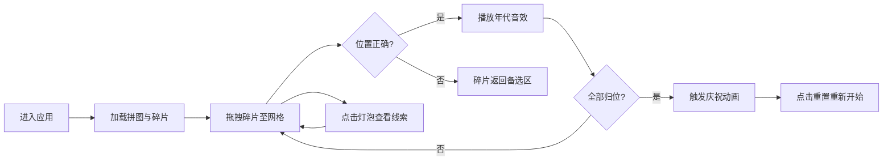

## 1. 产品概述

时光拼图店是一款为城市记忆博物馆打造的沉浸式线上互动应用，用户通过组合不同年代的城市老照片、街道声音和方言口述，拼凑出自己未曾经历的旧时光。

- 目标用户：博物馆参观者、城市文化爱好者、怀旧人群
- 产品价值：以互动拼图形式让用户体验城市历史变迁，增强文化沉浸感

## 2. 核心功能

### 2.1 功能模块

1. **年代拼图系统**：3x3网格拼图，拖拽碎片至对应年代槽位
2. **年代线索提示**：点击灯泡图标查看当前年代的三条文字线索
3. **城市声音播放**：碎片归位时触发对应年代的城市环境音
4. **拼图完成庆祝动画**：全部归位后的金色渐变与粒子特效

### 2.2 页面详情

| 页面名称 | 模块名称 | 功能描述 |
|---------|---------|---------|
| 主页面 | 顶部标题栏 | 显示应用图标、标题、进度百分比 |
| 主页面 | 拼图网格区 | 3x3网格，接收拖拽碎片，背景#2D2D44 |
| 主页面 | 碎片备选区 | 混合排列未放置的碎片，背景#3D3D5C |
| 主页面 | 线索提示按钮 | 黄色灯泡脉冲动画，点击弹出线索卡片 |
| 主页面 | 音频播放器 | 播放当前年代城市声音，播放时按钮旋转 |
| 主页面 | 重置按钮 | 重置拼图状态重新开始 |

## 3. 核心流程

用户进入应用 → 自动加载3x3拼图与混合碎片 → 拖拽碎片至网格 → 正确放置触发年代音效 → 点击灯泡查看线索辅助判断 → 全部碎片归位 → 触发庆祝动画 → 可点击重置重新体验

## 4. 用户界面设计

### 4.1 设计风格

- 主色调：深色复古蓝灰系（#1E1E2E、#2D2D44、#3D3D5C）
- 年代色：1980年代暖橙#F4A261、1990年代米黄#E76F51、2000年代青绿#2A9D8F
- 强调色：金色#FFD700、暖棕#8B4513
- 按钮风格：圆角设计，拖拽阴影效果
- 字体：现代无衬线字体，标题16px字重600
- 布局：左右分栏（桌面）/上下堆叠（移动端<768px）

### 4.2 页面设计概览

| 页面名称 | 模块名称 | UI元素 |
|---------|---------|---------|
| 主页面 | 顶部标题栏 | 60px高，背景#0F172A，相机图标+进度百分比 |
| 主页面 | 拼图网格区 | 3x3网格，每个槽位64x64px，间距8px，圆角4px |
| 主页面 | 碎片备选区 | 碎片混合排列，拖拽时半透明+阴影 |
| 主页面 | 线索卡片 | 320px宽，白色背景，圆角16px，阴影0 4px 12px |
| 主页面 | 灯泡按钮 | 直径48px，圆形，#FFD166背景，脉冲光效1s周期 |

### 4.3 响应式

- 桌面端：左右分栏布局，左侧拼图区，右侧备选区
- 移动端（<768px）：上下堆叠布局，拼图区在上，备选区在下
- 触摸优化：拖拽区域适配手指操作，增加热区

### 4.4 动画与特效

- 碎片拖拽：CSS transition 0.3s ease-in-out，跟随阴影
- 碎片正确放置：渐入音效（音量fade in/out）
- 灯泡提示：黄色脉冲光效（1s周期）
- 完成庆祝：网格背景#8B4513→#FFD700渐变，碎片1.2倍放大+360°旋转（1s），闪光粒子散落（2s后消失）
- 音频播放按钮：transform: rotate(360deg) 持续2s旋转动画
