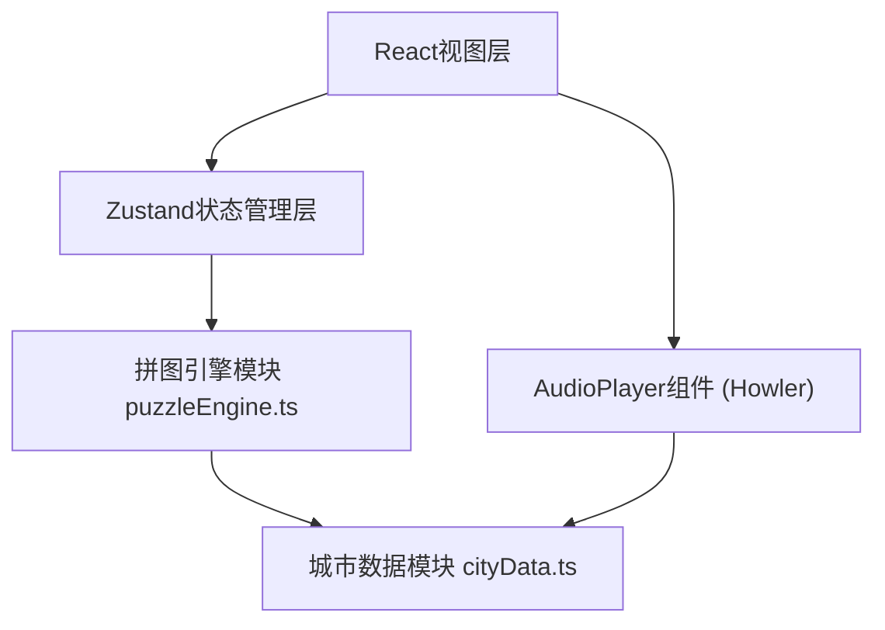

## 1. 架构设计



## 2. 技术说明

- 前端框架：React@18 + TypeScript
- 构建工具：Vite
- 状态管理：Zustand
- 音频处理：howler
- ID生成：uuid
- 初始化工具：vite-init

## 3. 文件结构

```
d:\Pro\tasks\auto121\
├── package.json
├── vite.config.js
├── tsconfig.json
├── index.html
└── src/
    ├── data/
    │   └── cityData.ts          # 城市年代数据模块
    ├── engine/
    │   └── puzzleEngine.ts      # 拼图逻辑引擎模块
    ├── components/
    │   ├── PuzzleBoard.tsx      # 拼图网格组件
    │   └── AudioPlayer.tsx      # 音频播放组件
    └── App.tsx                  # 主应用组件
```

## 4. 模块职责

### 4.1 城市数据模块 (src/data/cityData.ts)
- 存储各年代（1980s、1990s、2000s）的城市线索、照片描述、音频路径
- 导出接口：`getDecadeData(decade)`、`getClueList(decade)`
- 为拼图引擎提供线索数据

### 4.2 拼图引擎模块 (src/engine/puzzleEngine.ts)
- 管理拼图状态：网格布局、已放置碎片、未锁定碎片
- 核心方法：`initializePuzzle()`、`placeFragment()`、`checkCompletion()`
- 调用城市数据模块获取线索
- 输出拼图进度与提示文本

### 4.3 视图组件
- **PuzzleBoard.tsx**：渲染3x3网格，处理鼠标拖拽事件，显示年代标签
- **AudioPlayer.tsx**：播放按钮，Howler驱动音频播放，旋转动画
- **App.tsx**：主组件，管理全局阶段（解锁/拼合/完成），重置按钮

## 5. 数据模型

### 5.1 类型定义

```typescript
type Decade = '1980s' | '1990s' | '2000s';

interface Fragment {
  id: string;
  decade: Decade;
  label: string;
  description: string;
  gridPosition: number; // 0-8 目标网格位置
}

interface PuzzleState {
  fragments: Fragment[];
  placedFragments: Record<number, Fragment>; // key: gridPosition
  unplacedFragments: Fragment[];
  currentDecade: Decade;
  progress: number; // 0-100
  phase: 'unlock' | 'assembling' | 'completed';
}

interface DecadeData {
  decade: Decade;
  color: string;
  clues: string[];
  audioPath: string;
  fragments: { label: string; description: string }[];
}
```

## 6. 性能约束

- 拖拽帧率：≥30fps（使用CSS transform而非top/left）
- 音频预加载：最大同时加载3个音频文件
- 音频播放延迟：≤200ms
- 动画驱动：CSS transition（0.3s ease-in-out）或 requestAnimationFrame
